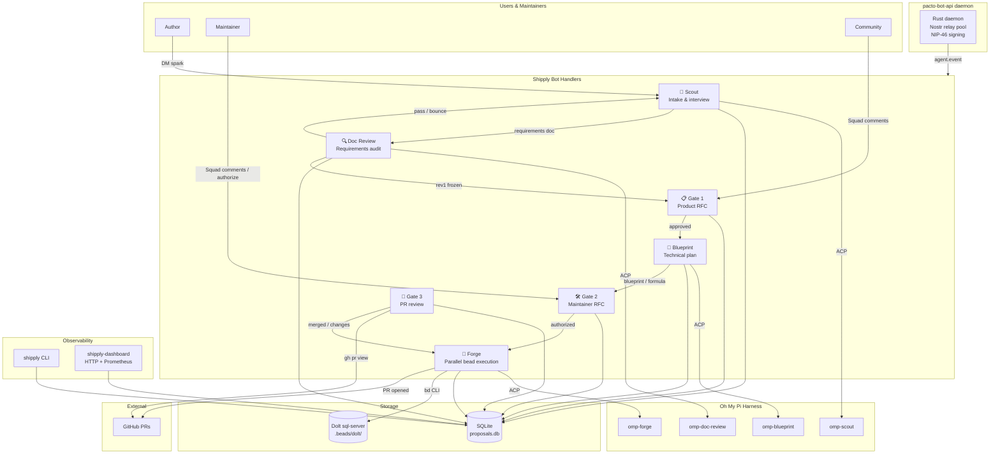

# Shipply

An AI-augmented product-lifecycle orchestration engine. Shipply coordinates a team of specialized bot personas through intake, requirements review, product RFC, technical blueprint, parallel bead execution, and final PR governance — all running as `pacto-bot-api` handlers and delegating agent work to Oh My Pi.

## What it provides

Shipply is the runtime behind the pipeline described in [`docs/architecture.md`](docs/architecture.md):

- **Seven specialized bot handlers** (`src/shipply/handlers/`) that receive Nostr DMs and MLS Squad messages via `pacto-bot-api` and advance proposals through a state machine.
- **An ACP harness** (`src/shipply/harness.py`) that spawns Oh My Pi (`omp acp`) over stdio, manages the JSON-RPC 2.0 session lifecycle, and returns structured results to each handler.
- **A proposal state machine** (`src/shipply/models.py`, `src/shipply/db.py`) persisted in SQLite, with immutable revision freezes at every gate boundary.
- **A Beads/Dolt task backend** (`src/shipply/backends/`) for Forge's parallel bead execution, dependency tracking, and conflict detection.
- **Observability** via a `shipply` CLI, a `shipply-dashboard` HTTP server, and Prometheus metrics.

## Architecture



## Proposal lifecycle

```
INTAKE ──► DOC_REVIEW ──► GATE_1 ──► BLUEPRINT ──► GATE_2 ──► FORGE ──► GATE_3 ──► CLOSED
  │             │            │            │            │           │           │
  │             │            │            │            │           │           │
  ▼             ▼            ▼            ▼            ▼           ▼           ▼
Scout        Doc Review    Product     Technical   Maintainer  Beads      PR
interview    audit         RFC         Blueprint   auth        execution  review
```

At every gate boundary the input artifact is frozen as a revision; late changes are routed to a follow-up proposal rather than mutating in-flight work.

## Components

| Path | Purpose |
|------|---------|
| `src/shipply/handlers/` | Seven `pacto_bot_sdk.Bot` handlers, one per pipeline stage |
| `src/shipply/harness.py` | ACP harness backend for Oh My Pi subprocess lifecycle and JSON-RPC |
| `src/shipply/protocols/acp.py` | Pydantic models for ACP messages |
| `src/shipply/models.py` | Proposal lifecycle state machine and data models |
| `src/shipply/db.py` | SQLite schema and async connection management |
| `src/shipply/backends/` | `TaskBackend` abstraction; default Beads/Dolt integration |
| `src/shipply/cli.py` | `shipply` CLI for in-flight status and event tails |
| `src/shipply/dashboard.py` | `shipply-dashboard` HTTP server with Prometheus metrics |
| `src/shipply/observability.py` | Event emitter and Prometheus registry |
| `src/shipply/config.py` | `shipply.toml` configuration loading and validation |
| `shipply-bots/` | Dockerized `pacto-bot-api` handler deployments (one per bot) |

## Quick start

### Prerequisites

Shipply delegates agent work to **Oh My Pi** (`omp`) over the Agent Client Protocol (ACP). In the Docker deployment `omp` is installed via `brew install can1357/tap/omp` and is available on the container's `PATH`. For local development, `omp` must be on your `$PATH` or configured per persona in `shipply.toml`:

```toml
[personas.scout]
model = "fast"
binary = "omp"          # or absolute path, e.g. "/opt/omp/bin/omp"
args = ["acp"]
```

### Run with Docker Compose

1. Copy the example configuration:
   ```bash
   cp shipply.toml.example shipply.toml
   ```

2. Install the package and bot handlers:
   ```bash
   pip install -e .
   cd shipply-bots
   docker compose up --build
   ```

3. Run the dashboard or CLI:
   ```bash
   shipply-dashboard --port 8080
   shipply status
   ```

See [`docs/architecture.md`](docs/architecture.md) and the plan in [`docs/plans/`](docs/plans/) for detailed design, requirements, and security decisions.

## Development

```bash
# Run tests
pytest

# Type check / lint (add your own tools to pyproject.toml)
python -m pytest tests/
```

## Status

This is the v1 orchestration engine implementation. The state machine, handlers, harness, and observability layer are implemented; see `docs/plans/2026-07-14-001-feat-shipply-orchestration-engine-plan.md` for remaining requirements and rollout metrics.
