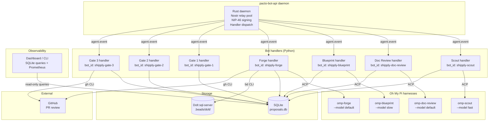
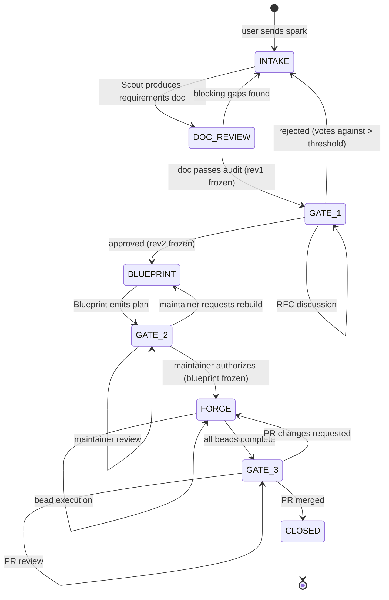

## Summary

Build the Shipply orchestration engine — seven Python bot handlers (Scout, Doc Review, Blueprint, Forge, Gate 1, Gate 2, Gate 3) running as pacto-bot-api handler processes, a centralized proposal state machine backed by SQLite, three MLS Squad governance gates, a harness interface that drives Oh My Pi via the Agent Client Protocol (ACP) over stdio, and an observability layer that emits events and exposes a dashboard/CLI for in-flight proposal and bead tracking. Beads (`bd`) with a self-hosted Dolt server provides the task backend for Forge's parallel bead execution. Model routing is handled by omp's own configuration — the handlers are pure relays.

---

## Success Metrics

- **Leading indicator:** Median time from spark to approved RFC (target: reduce by 50% compared to the current manual RFC process within 4 weeks of v1 deployment).
- **Quality indicator:** Gate 1 rejection rate due to missing requirements (target: < 20% of proposals rejected for incomplete requirements within the first month).
- **Operational indicator:** Percentage of beads that complete without human gate escalation (target: > 70% within the first month).
- **Adoption indicator:** Number of unique users who successfully complete a Scout interview and reach Gate 1 (target: > 5 active users within the first two weeks).
- **Observability indicator:** Dashboard coverage of in-flight proposals by stage and bead status, with p95 transition latency visible (target: 100% of active proposals and beads queryable within 5 seconds of the underlying event).

---

## Problem Frame

The architecture doc (`docs/architecture.md`) defines a six-stage AI-augmented product lifecycle pipeline: intake → requirements audit → product RFC → technical blueprint → parallel execution → PR review. Each stage is a bot persona communicating through Nostr events via pacto-bot-api. The pipeline needs a runtime — a state machine that tracks proposals across gates, bot handlers that relay messages between Squad threads and an agent harness, and a task backend that manages bead execution. This plan builds that runtime.

---

## Requirements

### State machine

- R1. A proposal progresses through a defined lifecycle: `INTAKE` → `DOC_REVIEW` → `GATE_1` → `BLUEPRINT` → `GATE_2` → `FORGE` → `GATE_3` → `CLOSED`.
- R2. Each gate transition freezes the input revision (immutability contract). Late-breaking comments on earlier threads are routed to follow-up proposals, not in-flight mutations.
- R3. The state machine is event-driven — each `agent.event` notification from pacto-bot-api advances state. No polling loop.
- R4. Proposal state is persisted in a dedicated SQLite database, separate from the pacto-bot-api daemon's own store.

### Bot handlers

- R5. Each bot persona (Scout, Doc Review, Blueprint, Forge) runs as an independent Python process using the `pacto_bot_sdk.Bot` class, with its own bot identity and Nostr profile.
- R6. Handlers register for `dm_received` and `mls_group_message_received` events and use `handler.response` actions (`ack`, `reply`, `defer`, `ignore`) to drive the state machine.
- R7. Each *agent* handler (Scout, Doc Review, Blueprint, Forge) delegates agent work to Oh My Pi via the Agent Client Protocol (ACP) over stdio. The handler is a relay, not an executor. Gate 1, Gate 2, and Gate 3 are governance handlers and do not invoke the harness.
- R7a. When a handler transitions a proposal's state, it sends a Nostr DM to the next handler's bot_id with the proposal ID, source state, and target state. Each handler registers for `dm_received` and filters incoming DMs by proposal state to discover when work is ready. This is the state-transition notification pattern — no handler polls SQLite for state changes. Read-only queries for Dependency Cards or reconciliation are allowed; they do not replace the DM notification pattern.

### Harness interface

- R8. The harness interface manages Oh My Pi subprocess lifecycle: start, send prompt, read structured result, terminate or reuse.
- R9. Prompts to the harness are structured JSON with a `task` field (e.g., `brainstorm`, `doc-review`, `plan`, `execute-bead`) and a `context` field containing the relevant document or bead spec.
- R10. Harness results are parsed as structured JSON with a `status` field (`success`, `needs_input`, `error`) and a `payload` field.

### Governance gates

- R11. Gate 1 (Product RFC) operates in an MLS Squad. Voting is tracked via emoji reactions or `/vote` commands. A configurable quorum threshold gates progression.
- R12. Gate 1 surfaces a Dependency Card — active proposals, open beads, and closed beads that the current proposal depends on.
- R13. Gate 2 (Technical RFC) operates in a maintainer-only MLS Squad. Maintainers comment to adjust Blueprint parameters; a maintainer authorization payload triggers Forge.
- R14. Gate 3 (PR Review) is triggered by a maintainer `/gate3 check` command in the Gate 2 Squad. The command queries the proposal's single PR status via `gh pr view`; merged → proposal closed, requested changes → transition back to `FORGE` for the affected bead. Automated webhook monitoring is deferred to v2.
- R31. Governance commands (`/vote`, `/authorize`, `/gate3 check`) are validated against a role matrix (squad membership, maintainer status, proposal sponsor) before acting.
- R32. Dependencies used by the Dependency Card are declared explicitly in the requirements doc or Blueprint (target area, affected components, or bead IDs); the card does not infer dependencies from free text.
- R33. The PR model for v1 is **one PR per proposal**. Rework from requested changes is scoped to the whole proposal (transition back to `FORGE`); the proposal closes when that single PR merges. The same model is used in the state machine, U6, U7, and the architecture doc.

### Beads task backend

- R15. Forge creates a Beads molecule from the frozen Blueprint. The primary path is: Blueprint emits a Beads formula (TOML/JSON) or a JSON plan graph; `bd cook` compiles the formula into a proto; `bd mol pour` instantiates the proto as a molecule (parent epic + child beads). The alternative path is `bd create --graph <plan.json>` for ad-hoc graphs.
- R16. Forge queries the claimable frontier within a molecule with `bd ready --mol <molecule-id>`, claims beads atomically with `bd update --claim` (or `bd ready --claim`), and closes them on success with `bd close`.
- R17. Forge implements a 2-retry self-healing cycle. On the second failure, it creates a `human` gate on the bead and posts a diagnostic alert to the Gate 2 Squad.
- R18. The Beads backend runs in server mode (`bd init --server`) against a self-hosted `dolt sql-server` for concurrent multi-agent access.
- R19. Bot-to-bot state-transition DMs are authenticated (sender bot_id verified) and authorized (only the handler that owns the source state may emit the next-state DM).
- R20. Nostr bot private keys (nsec) are generated, stored, and rotated through a secrets backend; handlers use NIP-46 remote-signer delegation where possible so they do not hold long-lived private keys.
- R21. User-facing Nostr messages (DMs and MLS group messages) are delimited and validated before being placed in harness prompt contexts; prompt-injection detection heuristics flag high-confidence injection attempts for human review.
- R22. Every state transition, vote, revision freeze, and maintainer authorization is appended to an immutable, signed log so that history cannot be silently altered.
- R23. The event-driven state machine uses idempotency keys and at-least-once delivery semantics; a periodic reconciliation sweep detects and recovers proposals stuck mid-transition.
- R24. Subprocess invocations of `omp`, `bd`, and `gh` pass arguments as a list (not a shell string), and all dynamic identifiers are validated against an allow-list before execution.
- R25. The self-hosted Dolt server requires authentication, TLS for SQL connections, and network restriction to the compose internal network.
- R26. Blueprint output (formula TOML, JSON plan graph, or harness-raw plan) is validated against a documented schema before Gate 2 authorization; invalid blueprints are rejected before Forge execution begins.
- R27. The Dependency Card filters results by the viewer's authorization scope and returns only the minimum required fields; it does not leak cross-proposal titles or owner details.
- R28. MLS Squad membership is governed by admin-approved invitations and a reconciled roster; quorum calculations use active members only.
- R29. Data sent to external model gateways (e.g., ngrok.ai) is classified before leaving the host; a configurable allow-list controls which data types may be transmitted externally.
- R30. Bead execution runs in a sandboxed environment (restricted network, no secrets, read-only root filesystem where possible) and bead specs are validated against a schema before the harness executes them.
- R34. The orchestration engine emits observable events and metrics for every proposal state transition, gate action, bead claim/close, and harness call so that in-flight work and bottlenecks can be monitored in real time.


---

## Key Technical Decisions

- **Python handlers over Rust/WASM.** The `pacto_bot_sdk` Python package exists and the python-llm bot template provides a proven handler scaffold. Rust handlers would require building a JSON-RPC client from scratch against the daemon's contract. WASM adds deployment complexity with no win for I/O-bound message relay handlers.

- **Agent Client Protocol (ACP) over custom NDJSON RPC mode.** ACP is a JSON-RPC 2.0 standard (`https://agentclientprotocol.com/`) designed for client-controls-agent-over-stdio. It gives us a proper session lifecycle (`initialize`, `session/new`, `session/load`, `session/resume`, `session/prompt`, `session/cancel`, `session/close`), explicit permission handling via `session/request_permission`, and structured streaming updates (`agent_thought_chunk`, `agent_message_chunk`, `tool_call`, `usage_update`, `session_info_update`). RPC mode is an internal NDJSON protocol with fewer lifecycle hooks and no clean permission boundary. ACP is more code up front but is the correct abstraction for a messaging-platform bot bridge. A single `HarnessBackend` abstraction isolates the ACP protocol details from the bot handlers; the number of long-running `omp` processes is a deployment choice (one shared or one per persona) and should be measured against startup cost and memory budget before v1 ships.

- **SQLite over Beads Dolt for proposal state.** The proposal registry is internal pipeline state, not shared work items. SQLite is zero-infrastructure, co-locates with the handlers, and avoids coupling the state machine to the task backend. Beads owns execution tasks; SQLite owns pipeline state. If four containerized writers contend on the SQLite WAL, route writes through a single state-manager process or move to PostgreSQL.

- **Self-hosted Dolt server over DoltHub for v1.** Keeps all infrastructure local during development. DoltHub is the upgrade path when multi-machine sync is needed. Server mode (`dolt sql-server`) supports concurrent connections, which embedded mode's file lock prevents. Wrap bead-claim operations in explicit transactions with retry logic and verify Dolt's isolation guarantees during the U6 spike.

---

## High-Level Technical Design

### Component topology



### Proposal state machine



### Harness protocol (Agent Client Protocol)

Each handler→harness interaction uses the Agent Client Protocol (ACP) over stdio. ACP is JSON-RPC 2.0: bidirectional, request/response plus notifications. Spawn with `omp acp` (equivalent to `omp --mode acp`). The verified contract is against omp v16.3.3; the spec lives at [zed-industries/agent-client-protocol](https://github.com/zed-industries/agent-client-protocol).

```
Handler                              omp (ACP)
  │                                        │
  │  {"jsonrpc":"2.0","id":1,              │  ← initialize
  │   "method":"initialize",                 │
  │   "params":{"protocolVersion":1}}      │
  │ ──────────────────────────────────────>│
  │  {"jsonrpc":"2.0","id":1,"result":{    │  ← protocolVersion, agentInfo,
  │   "protocolVersion":1,...}}             │     agentCapabilities, authMethods
  │ <──────────────────────────────────────│
  │                                        │
  │  {"jsonrpc":"2.0","id":2,              │  ← authenticate
  │   "method":"authenticate",               │
  │   "params":{"method":"agent"}}           │
  │ ──────────────────────────────────────>│
  │  {"jsonrpc":"2.0","id":2,"result":{    │  ← auth success
  │   ...}}                                  │
  │ <──────────────────────────────────────│
  │                                        │
  │  {"jsonrpc":"2.0","id":3,              │  ← session/new
  │   "method":"session/new",                │
  │   "params":{"cwd":"...","mcpServers":[]}}│
  │ ──────────────────────────────────────>│
  │  {"jsonrpc":"2.0","id":3,"result":{    │  ← sessionId, configOptions
  │   "sessionId":"...",...}}               │
  │ <──────────────────────────────────────│
  │                                        │
  │  {"jsonrpc":"2.0","id":4,              │  ← session/prompt
  │   "method":"session/prompt",             │
  │   "params":{"sessionId":"...",          │
  │    "prompt":[{"type":"text",            │
  │               "text":"<task context>"}]}}│
  │ ──────────────────────────────────────>│
  │                                        │  agent runs skills, subagents
  │  {"jsonrpc":"2.0","method":"session/     │  ← streaming notification
  │   update","params":{"sessionId":"...",   │     (agent_thought_chunk,
  │   "type":"agent_message_chunk",...}}    │     agent_message_chunk,
  │ <──────────────────────────────────────│     usage_update, etc.)
  │                                        │
  │  {"jsonrpc":"2.0","id":4,"result":{       │  ← prompt completion
  │   "stopReason":"end_turn",               │
  │   "usage":{...}}}                        │
  │ <──────────────────────────────────────│
```

Verified client → agent methods:

| Method | Params | Purpose |
|---|---|---|
| `initialize` | `{"protocolVersion":1}` | Capability exchange at startup. |
| `authenticate` | `{"method":"agent"}` or `{"method":"terminal"}` | Auth flow. For a headless bot, use `agent` (reuses provider keys and OAuth state under `~/.omp`). `terminal` launches the TUI and is not appropriate for a bot. |
| `session/new` | `{"cwd":"...","mcpServers":[]}` | Create a new session for a proposal or bead. |
| `session/load` | `{"sessionId":"..."}` | Resume an existing session. |
| `session/resume` | `{"sessionId":"..."}` | Alias/resume a session. |
| `session/prompt` | `{"sessionId":"...","prompt":[{"type":"text","text":"..."}]}` | Send a task to the agent. `prompt` is an array of content blocks, not a flat `message` string. |
| `session/cancel` | `{"sessionId":"..."}` | Cancel the current agent turn. Notification (no id). |
| `session/close` | `{"sessionId":"..."}` | Close the session. |

Verified agent → client methods (handler must implement or decline):

| Method | Purpose |
|---|---|
| `session/request_permission` | omp asks for permission before running a tool. The handler can turn this into a user-facing prompt in the messaging platform or auto-approve with policy. |
| `fs/read_text_file` | Agent requests file read. Decline or proxy depending on sandbox policy. |
| `fs/write_text_file` | Agent requests file write. Decline or proxy depending on sandbox policy. |
| `terminal/create` + `terminal/output` | Agent requests `bash` execution. Per-call client-side terminals; decline or proxy in a sandbox. |

Tool mapping (omp built-in → ACP method):

| omp tool | ACP method |
|---|---|
| `read` | `fs/read_text_file` |
| `write` | `fs/write_text_file` |
| `bash` | `terminal/create` + `terminal/output` |

`bash` calls and destructive `edit` operations are gated behind `session/request_permission` when the client supports it. The agent caches `allow_always` and `reject_always` per tool for the session’s lifetime.

Verified agent notifications (`session/update`):

- `agent_thought_chunk` — streaming reasoning
- `agent_message_chunk` — streaming final output
- `tool_call` / `tool_call_update` — tool invocation; updates carry `tool_call_update.locations` for multi-file edit tracking
- `usage_update` — token/cost usage
- `session_info_update` — session metadata changes
- `current_mode_update` — emitted after `session/set_mode` or `session/set_session_config_option("mode", ...)`
- `config_option_update` — emitted after `/model` or mode changes

Prompt completion response:

```json
{"stopReason": "end_turn", "usage": {...}}
```

Cancel notification:

```json
{"jsonrpc":"2.0","method":"session/cancel","params":{"sessionId":"..."}}
```

### Extension methods

omp exposes a small `_omp/*` namespace beyond stock ACP:

| Method | Purpose |
|---|---|
| `_omp/sessions/listAll` | Paginated cross-cwd session index. |
| `_omp/projects/list` | Discovered project cwds with session counts. |
| `_omp/chats/byCwd` | Sessions filtered by working directory. |
| `_omp/usage` | Token and cost rollup for active sessions. |
| `_omp/extensions` | List discovered extensions. |
| `_omp/extensions/toggle` | Enable or disable an extension. |

These are useful for session discovery and cost tracking but are not required for v1.

### ACP vs RPC mode trade-off

- **ACP:** JSON-RPC 2.0 standard, proper session lifecycle, explicit permission hook, structured streaming, interoperable with other ACP-speaking agents. More implementation code up front.
- **RPC mode:** Internal NDJSON protocol, fewer lifecycle hooks, no clean permission boundary. Lighter for simple "send message, get stream" use cases but wrong for a messaging-platform bridge.

For a Python relay from a messaging platform into omp, ACP is the correct choice.

### Result extraction (R10 → ACP mapping)

R10 requires harness results with `status` (`success`, `needs_input`, `error`) and `payload`. ACP does not return these directly; the structured result must be extracted from the streamed output.

**Contract:** The harness system prompt / skill instructs the agent to end every response with a fenced JSON block:

```json
{"status": "success", "payload": {...}}
```

Allowed `status` values: `success`, `needs_input`, `error`.

`HarnessBackend` implementation:
1. Collect all `agent_message_chunk` text during the `session/prompt` turn.
2. After receiving the `session/prompt` completion response (`stopReason`, `usage`), scan the collected text for the last fenced JSON code block.
3. Parse the JSON block and validate the `status` and `payload` fields.
4. Return the parsed object to the caller.
5. If no fenced JSON block is found:
   - If the full response contains a question-like heuristic, return `{"status": "needs_input", "payload": <full text>}`.
   - Otherwise return `{"status": "success", "payload": <full text>}`.
6. If JSON parsing fails, return `{"status": "error", "payload": {"message": "...", "raw": "..."}}`.

**Test scenarios:**
- Agent response ends with valid fenced JSON → status/payload extracted correctly.
- Agent response has no fenced JSON → fallback heuristic applies.
- Malformed fenced JSON → error status returned.
- `needs_input` responses are surfaced back to the originating Squad thread.

## Implementation Units

### U1. Project scaffold, configuration, and SQLite schema

- **Goal:** Establish the Python package structure, configuration loading, and proposal persistence layer.
- **Requirements:** R1, R4
- **Dependencies:** None
- **Files:**
  - `pyproject.toml` — package metadata, dependencies (`pacto-bot-sdk`, `pydantic`, `prometheus-client`)
  - `src/shipply/__init__.py`
  - `src/shipply/config.py` — load `shipply.toml`, validate persona→model mappings, gate thresholds
  - `src/shipply/db.py` — SQLite connection management, migration runner
  - `src/shipply/models.py` — Pydantic models for Proposal, Revision, BeadRef, GateState
  - `src/shipply/observability.py` — event emitter, Prometheus counters/gauges, and structured log helpers
  - `src/shipply/migrations/001_proposals.sql` — schema DDL for proposals, revisions, beads, gates, and audit events
  - `src/shipply/migrations/002_observability.sql` — schema DDL for in-flight metrics views
  - `tests/test_config.py`
  - `tests/test_db.py`
  - `tests/test_models.py`
  - `tests/test_observability.py`
- **Approach:** Single `shipply.toml` at the project root. SQLite file at `data/proposals.db` (configurable). Use `pydantic` for config and state models; `aiosqlite` for async DB access. Migrations are raw SQL files applied in order. On connection, enable WAL journal mode (`PRAGMA journal_mode=WAL`) for concurrent read+write across handler processes and set a busy timeout (`PRAGMA busy_timeout=5000`) so writers wait briefly instead of failing with `SQLITE_BUSY`. The fallback to a single `state-manager` writer process (or PostgreSQL) is triggered if `SQLITE_BUSY` errors exceed the operational threshold: more than 3 `SQLITE_BUSY` errors in a 5-minute window, or 2 consecutive `SQLITE_BUSY` errors on the same write, after retry. The schema includes an `events` table for the audit trail (R22) and materialized views for in-flight proposal and bead counts by stage. `observability.py` provides `emit(event_type, proposal_id, payload)` and Prometheus-compatible counters/gauges for handler events, harness calls, and bead lifecycle transitions.
- **Patterns to follow:** pacto-bot-api's TOML config convention (`pacto-bot-api.toml`), the python-llm template's project layout, Prometheus client naming conventions.
- **Test scenarios:**
  - Config loads from `shipply.toml` with all required fields; raises on missing persona config.
  - SQLite schema creates all tables on first run; idempotent on subsequent runs.
  - Proposal model round-trips through JSON serialization.
  - Proposal state transitions enforce valid from→to pairs; invalid transitions raise.
  - `emit` writes an event row and increments the matching Prometheus counter.
  - In-flight view returns current proposal and bead counts by stage.
  - Write contention: simulated concurrent writes do not produce `SQLITE_BUSY` under normal load; when forced above threshold, the single-writer fallback is activated.
- **Verification:** `pytest tests/` passes. Config file parses without errors. SQLite database is created with correct schema on first handler startup.

---

### U2. Harness interface

- **Goal:** Provide a `HarnessBackend` abstraction that manages the ACP subprocess lifecycle and JSON-RPC 2.0 protocol over stdio.
- **Requirements:** R8, R9, R10
- **Dependencies:** U1 (config for harness paths)
- **Files:**
  - `src/shipply/harness.py` — `HarnessBackend` class, subprocess management, ACP JSON-RPC protocol
  - `src/shipply/protocols/acp.py` — Pydantic models for ACP request/response/update types
  - `tests/test_harness.py`
- **Approach:** Implement `HarnessBackend` against the verified ACP contract. On startup, spawn `omp acp` (equivalent to `omp --mode acp`) and send `initialize` with `protocolVersion: 1`. Complete the `authenticate` flow using the `agent` auth method, which reuses provider keys and OAuth state under `~/.omp` (the `terminal` auth method launches the TUI and is not appropriate for a headless bot). After authentication, select a model. For each handler call: call `session/new` to create a session, then `session/prompt` with `prompt` as an array of content blocks (e.g. `[{"type":"text","text":"<task context>"}]`). Stream `session/update` notifications from the agent and yield structured events (`agent_thought_chunk`, `agent_message_chunk`, `tool_call`, `usage_update`, `session_info_update`). Wait for the `session/prompt` response, which contains `stopReason` and `usage`. Implement `steer(message)` as a follow-up `session/prompt` or `session/cancel` + new prompt depending on ACP semantics. `abort()` sends `session/cancel`. `close()` sends `session/close` and terminates the subprocess. Handle agent → client method calls: `session/request_permission` is turned into a user-facing prompt in the messaging platform or auto-approved by policy; `fs/read_text_file`, `fs/write_text_file`, and `terminal/*` are declined or proxied according to the sandbox policy. A `HarnessPool` manages one ACP subprocess per persona, reusing sessions where appropriate. Timeout handling: if a prompt exceeds a configurable timeout, send `session/cancel`; if the process is unresponsive, kill and restart it. The fallback to one-shot `omp -p` / `--mode=text` / `--mode=json` is retained only as a contingency if a future build breaks the ACP contract.
- **Patterns to follow:** Python's `asyncio.subprocess` for async I/O; JSON-RPC 2.0 request-id tracking; the `pacto_bot_sdk.Bot` class's transport abstraction pattern.
- **Test scenarios:**
  - `HarnessBackend` spawns `omp acp` and completes the `initialize` + `authenticate` handshake using the `agent` auth method.
  - After auth, model selection succeeds and a `session/new` call returns a `sessionId`.
  - `send` writes a `session/prompt` request with `prompt` as an array of content blocks; `session/update` events are yielded.
  - `steer` injects mid-flight context via a follow-up prompt; agent processes it without cancelling.
  - Agent tool permission request (`session/request_permission`) is surfaced to the user or auto-approved by policy.
  - `abort` sends `session/cancel`; the agent stops the current turn.
  - Timeout sends `session/cancel`; if unresponsive, subprocess is killed and restarted.
  - `HarnessPool` returns the correct backend per persona; reuses subprocesses across requests.
  - Agent response ends with valid fenced JSON block → `HarnessBackend` extracts `status` and `payload` correctly.
  - Agent response has no fenced JSON block → fallback heuristic assigns `needs_input` or `success`.
  - Malformed fenced JSON block → returned as `error` status with raw text preserved.
  - `needs_input` results are surfaced back to the originating Squad thread.
  - Subprocess crash mid-request is detected and surfaced as `HarnessError`.
- **Verification:** `pytest tests/test_harness.py` passes with a mock `omp` script that speaks ACP.

---

### U3. Scout handler + Doc Review handler

- **Goal:** Implement the intake pipeline — Scout conducts a multi-user interview, produces a requirements doc with Goals Statement, and Doc Review audits it before Gate 1.
- **Requirements:** R5, R6, R7, R9, R10
- **Dependencies:** U1 (state machine, models), U2 (harness)
- **Files:**
  - `src/shipply/handlers/scout.py` — Scout bot handler
  - `src/shipply/handlers/doc_review.py` — Doc Review bot handler
  - `src/shipply/handlers/__init__.py`
  - `tests/test_scout_handler.py`
  - `tests/test_doc_review_handler.py`
- **Approach:**
  - **Scout:** Registers for both `dm_received` and `mls_group_message_received` events. On first message from a user (DM or Squad channel), creates a new Proposal in `INTAKE` state. DMs are single-user; multi-user collaboration happens in an MLS Squad channel. Each subsequent message in the same thread is appended to the interview history. Scout calls the harness with `task: "brainstorm"` and the accumulated context. The harness runs ce-brainstorm skills internally. Scout relays harness questions to the user and user answers back to the harness. When the harness signals the interview is complete (gap-driven + confidence floor), Scout writes the requirements doc and transitions to `DOC_REVIEW`. Multi-user collaboration: any user in the Squad channel can contribute; Scout tracks contributors in the proposal model. A raw spark dropped in a design Squad triggers the same intake flow as a DM.
  - **Doc Review:** Registers for `dm_received` notifications for the `DOC_REVIEW` state transition DM (per R7a). Calls the harness with `task: "doc-review"` and the requirements doc. Parses the tiered findings report. `safe_auto` fixes are applied silently to the doc, then summarized in a follow-up message to the Scout thread before the proposal advances. Blocking gaps (`gated_auto`, `manual` at P0/P1) trigger a bounce-back: Doc Review posts the gap report to the Scout thread, transitions back to `INTAKE`, and Scout re-engages. Clean pass transitions to `GATE_1` and freezes `rev1`.
- **Patterns to follow:** `pacto_bot_sdk.Bot` decorator API (`@bot.command`, `@bot.default`), the joke_bot's `defer` pattern for async harness calls.
- **Test scenarios:**
  - Scout creates a proposal on first DM; subsequent DMs append to interview history.
  - Scout relays harness questions to the user; user replies are forwarded to harness.
  - Scout terminates interview when harness signals completion; writes requirements doc.
  - Multi-user: a second user's DM in the same thread is tracked as a contributor.
  - Doc Review calls harness with requirements doc; parses tiered findings.
  - Doc Review bounces proposal back to INTAKE on blocking gaps; posts gap report.
  - Doc Review transitions to GATE_1 on clean pass; freezes rev1.
  - Scout respects `/done` command for early termination with warning.
- **Verification:** `pytest tests/test_scout_handler.py tests/test_doc_review_handler.py` passes. Integration: a mock harness script simulates a full interview→audit→pass cycle.

---

### U4. Gate 1 handler (Product RFC)

- **Goal:** Manage the Product RFC Squad, voting mechanics, dependency surfacing, and gate transition.
- **Requirements:** R11, R12
- **Dependencies:** U1 (state machine)
- **Files:**
  - `src/shipply/handlers/gate1.py` — Gate 1 bot handler
  - `tests/test_gate1_handler.py`
- **Approach:**
  - On proposal entering `GATE_1`, Gate 1 handler posts the requirements doc to a pre-configured MLS Squad. pacto-bot-api MLS group send/receive support has been verified; dynamic Squad creation is still deferred to v2, so the Squad must be created and the handler invited ahead of time. Humans and other bots in the Squad discuss and vote.
  - Dependency Card: reads the proposal's declared dependencies (target area, affected files, or bead IDs from the requirements doc / Blueprint) and scans the proposal registry (SQLite) and Beads store (`bd list --json`) for active proposals, open beads, and closed beads that match those declared dependencies. Results are filtered by the viewer's authorization scope and returned with the minimum required fields only. Posts a structured Dependency Card message.
  - Voting: listens for `/vote approve` and `/vote reject` commands, or emoji reactions (👍/👎) on the pinned message. Tracks votes in the proposal state. Quorum and threshold from config. Only active MLS Squad members (per a reconciled roster) count toward quorum.
  - On approval: transitions to `BLUEPRINT`, freezes `rev2`. On rejection: transitions back to `INTAKE` with rejection reason.
- **Patterns to follow:** `agent.send_group_message` for Squad posts, `agent.is_squad_member` for vote validation.
- **Test scenarios:**
  - Gate 1 posts requirements doc to Squad on proposal entry.
  - `/vote approve` increments vote count; quorum reached triggers transition to BLUEPRINT.
  - `/vote reject` with majority against transitions back to INTAKE.
  - Non-member votes are rejected via `agent.is_squad_member` check.
  - Dependency Card lists active proposals and open beads from the registry.
  - Vote timeout (configurable) triggers a reminder message; no auto-close.
- **Verification:** `pytest tests/test_gate1_handler.py` passes. Mock Squad messages simulate a full voting cycle.

---

### U5. Blueprint handler + Gate 2 handler

- **Goal:** Generate a technical blueprint from approved requirements, and manage the maintainer review gate.
- **Requirements:** R13
- **Dependencies:** U1 (state machine), U2 (harness), U4 (Gate 1 approval)
- **Files:**
  - `src/shipply/handlers/blueprint.py` — Blueprint bot handler
  - `src/shipply/handlers/gate2.py` — Gate 2 bot handler
  - `src/shipply/schemas/blueprint.json` — Blueprint output schema (formula, graph, legacy)
  - `tests/test_blueprint_handler.py`
  - `tests/test_gate2_handler.py`
- **Approach:**
  - **Blueprint:** On proposal entering `BLUEPRINT`, calls harness with `task: "plan"` and the approved requirements doc (`rev2`). The harness runs ce-plan internally. Blueprint parses the resulting plan into a structured output and validates it against the documented Blueprint schema (R26) before transitioning. Output format is one of:
    - **Formula path (preferred):** a Beads formula file (TOML or JSON) with variables, steps, dependencies, and gates, saved to `.beads/formulas/shipply-<proposal-id>.formula.toml`.
    - **JSON plan graph path:** a JSON file consumable by `bd create --graph`, with nodes for beads and edges for dependencies.
    - **Harness-raw path:** the existing plan JSON (legacy). Transitions to `GATE_2`.
  - **Gate 2:** Posts the Blueprint output (formula, graph, or legacy JSON) to the maintainer-only Squad. Listens for threaded comments. Maintainers can request rebuilds (Blueprint re-runs with amended parameters and transitions the proposal back to `BLUEPRINT`). A maintainer `/authorize` command transitions to `FORGE` and freezes the blueprint.
- **Test scenarios:**
  - Blueprint calls harness with requirements doc; parses plan into a valid Beads formula (TOML/JSON) or JSON plan graph.
  - Blueprint output validates against the documented Blueprint schema (R26).
  - Blueprint output includes bead specs, file deltas, dependencies, and step ordering.
  - Gate 2 posts blueprint/formula to maintainer Squad.
  - Maintainer comment triggers Blueprint rebuild with amended parameters.
  - `/authorize` command transitions to FORGE; freezes blueprint/formula.
- **Verification:** `pytest tests/test_blueprint_handler.py tests/test_gate2_handler.py` passes.

---

### U6. Forge handler + Beads TaskBackend

- **Goal:** Execute the Blueprint plan as parallel beads, with self-healing retry and failure escape.
- **Requirements:** R15, R16, R17, R18
- **Dependencies:** U1 (state machine), U2 (harness), U5 (Gate 2 authorization)
- **Files:**
  - `src/shipply/handlers/forge.py` — Forge bot handler
  - `src/shipply/backends/__init__.py`
  - `src/shipply/backends/beads.py` — Beads TaskBackend implementation
  - `src/shipply/backends/beads_schema.py` — Pydantic models for verified Beads JSON objects (bead, gate, list responses, formula/proto/molecule output)
  - `src/shipply/backends/interface.py` — TaskBackend Protocol
  - `tests/test_forge_handler.py`
  - `tests/test_beads_backend.py`
- **Approach:**
  - **TaskBackend Protocol:** Python `Protocol` class defining `create_molecule`, `get_ready`, `claim`, `close`, `get_blocked`, `add_dependency`, `close_eligible_roots`, `sync`. Beads implementation wraps `bd` CLI via `asyncio.subprocess`, always passing `--json` for structured output. Use `BD_JSON_ENVELOPE=1` for the stable v2 envelope format; until then, support both legacy and envelope output by detecting the top-level `schema_version`+`data` shape. Use `--readonly` when running worker sandbox queries and `--sandbox` to prevent Dolt auto-push. Use `--actor` to attribute actions to the Forge bot identity in the audit trail. Pydantic models in `beads_schema.py` validate all `--json` output.
  - **Forge handler:** On proposal entering `FORGE`, the handler creates a Beads molecule from the frozen Blueprint. Primary path:
    1. If Blueprint produced a Beads formula: `bd cook <formula-file> --mode=runtime --var key=value ...` to produce a resolved proto, then `bd mol pour <proto-id> --assignee shipply-forge --json` to create the molecule (parent epic + child beads). Variables are proposal-specific values (feature name, PR number, etc.).
    2. If Blueprint produced a JSON plan graph: `bd create --graph <plan.json> --json` to create the epic and children in one call.
    3. Legacy path: `bd create` per bead spec (retained as fallback).
    Enters execution loop:
    1. `bd ready --mol <molecule-id> --json` → claimable steps (empty `[]` if none)
    2. For each ready step: `bd update <id> --claim --json`, then call harness with `task: "execute-bead"` and the step spec
    3. On harness success: `bd close <id> --json` (returns closed bead; status `closed`, `closed_at`, `close_reason`)
    4. When all children are closed, call `bd epic close-eligible --json` to close the molecule root
    5. On harness failure: retry up to 2 times with exponential backoff, jitter, and progressive context amendments (larger model or extended prompt). On second failure: `bd gate create --type=human --blocks <id> --json` (returns single gate object), collect the last harness log excerpt, the working-directory diff, and the bead ID, and post a diagnostic alert to the Gate 2 Squad via `agent.send_group_message`. Note: `bd gate resolve` returns plain text, not JSON, so the backend parses the text response when a human unblocks a gate.
    6. Loop until no ready steps and no in-progress steps
  - On all steps complete: Forge calls `bd epic close-eligible` to close the molecule root, records the resulting PR URL for the proposal, and transitions to `GATE_3`.
- **Patterns to follow:** `asyncio.subprocess` for `bd` CLI calls (same pattern as harness interface). Beads molecule lifecycle from the architecture doc.
- **Test scenarios:**
  - TaskBackend creates a molecule from a Blueprint formula (`bd cook` + `bd mol pour`) or JSON plan graph (`bd create --graph`); returns molecule root ID and child bead IDs.
  - `get_ready` with `--mol <molecule-id>` returns only unblocked steps within the molecule.
  - `claim` atomically assigns a step; second claim on same step fails.
  - `close` unblocks dependents; previously blocked step appears in `get_ready`.
  - `close_eligible_roots` closes molecule roots whose children are all complete.
  - Forge execution loop: claims ready steps, calls harness, closes on success.
  - Self-healing: first failure retries with backoff and progressive context; second failure creates human gate and posts alert.
  - Failure alert includes log excerpt, code diff, and bead ID.
  - All steps complete → close molecule root → transition to GATE_3.
  - Beads backend syncs via `bd dolt push` after each close only when a DoltHub remote is configured; otherwise sync is local.
- **Verification:** `pytest tests/test_forge_handler.py tests/test_beads_backend.py` passes. Integration: a mock `bd` script simulates the bead lifecycle.

---

### U7. Gate 3 handler (PR Review)

- **Goal:** Manage the final governance gate — on-demand PR status checks triggered by maintainer commands, and proposal closure when the single proposal PR is merged.
- **Requirements:** R14
- **Dependencies:** U1 (state machine), U6 (Forge completion)
- **Files:**
  - `src/shipply/handlers/gate3.py` — Gate 3 bot handler
  - `tests/test_gate3_handler.py`
- **Approach:**
  - On proposal entering `GATE_3`, Gate 3 posts the proposal's PR URL to the Gate 2 Squad with instructions: "Issue `/gate3 check` to verify PR status."
  - Gate 3 listens for `/gate3 check` commands in the Squad. On each command, it queries the proposal's single PR status using `gh pr view --json`.
  - PR with requested changes → posts summary to Gate 2 Squad, transitions back to `FORGE` for the affected bead.
  - No polling loop — Gate 3 is event-driven, triggered by maintainer commands via the pacto-bot-api event loop.
- **Patterns to follow:** `asyncio.subprocess` for `gh` CLI calls; same event-driven pattern as all other handlers.
- **Test scenarios:**
  - Gate 3 posts PR URL to Gate 2 Squad on proposal entry.
  - `/gate3 check` command queries PR status; merged → CLOSED.
  - `/gate3 check` with requested changes → transition back to FORGE.
  - Proposal closed: final status is posted to the Gate 2 Squad (optional cross-post to Gate 1 Squad if configured).

---

### U8. Docker Compose orchestration

- **Goal:** Package all components into a single `docker compose up` deployment.
- **Requirements:** R5, R18
- **Dependencies:** U1–U7 (all handlers implemented), U9 (observability dashboard and CLI)
- **Files:**
  - `docker-compose.yml`
  - `Dockerfile` — Shipply handler image (Python 3.12, installs shipply package)
  - `shipply.toml.example` — documented example config
  - `scripts/init-dolt.sh` — one-time Dolt server setup script
- **Approach:**
  - Extends the pacto-bot-api python-llm template's docker-compose structure.
  - The `Dockerfile` installs `omp` from a pinned release artifact or an internal package repository; document the exact source and version pin in the build instructions.
  - Services: `daemon` (pacto-bot-api), `dolt-server` (Dolt sql-server), `scout`, `doc-review`, `blueprint`, `forge`, `gate1`, `gate2`, `gate3` (one container per handler), `dashboard` (observability dashboard). Gate 1/2/3 may share a single container if they have no heavy dependencies; the compose file should make the split explicit.
  - Each handler container includes Oh My Pi (`omp`) installed in the image, so `asyncio.subprocess` calls to `omp acp` work within the container. The `Dockerfile` installs omp alongside the shipply package.
  - Each handler container runs `python -m shipply.handlers.<name>` with the bot ID and transport config.
  - Shared volume for the SQLite database (`data/`).
  - Dolt server uses the official `dolthub/dolt-sql-server` image.
  - Forge container receives a GitHub token via Docker secret or mounted file for `gh pr view` calls. Minimum scope: `repo:read` on target repositories. A fine-grained PAT or GitHub App installation token is preferred over a classic PAT. Document the secret path and token scope in `shipply.toml.example`.
- **Patterns to follow:** The python-llm template's `docker-compose.yml` structure, Unix socket volume sharing.
- **Test scenarios:**
  - `docker compose up` starts all services without errors.
  - Handlers register with the daemon and appear in `agent.list_handlers`.
  - SQLite database is created on first handler startup.
  - Dolt server is reachable from Forge container; `bd init --server` succeeds.
- **Verification:** `docker compose up` succeeds. `docker compose ps` shows all services healthy. A manual DM to the Scout bot creates a proposal in the SQLite database.

---

### U9. Observability dashboard and in-flight query CLI

- **Goal:** Provide real-time visibility into proposal and bead state, transition latency, and bottlenecks.
- **Requirements:** R34, R22 (audit events)
- **Dependencies:** U1 (schema, events table, observability emitter)
- **Files:**
  - `src/shipply/observability.py` — shared event emitter and metric registration (also listed in U1)
  - `src/shipply/dashboard.py` — lightweight async HTTP dashboard (`/proposals`, `/proposals/<id>`, `/metrics`, `/health`) or CLI (`shipply status`, `shipply tail <proposal_id>`)
  - `src/shipply/cli.py` — click/typer CLI entrypoint
  - `tests/test_dashboard.py`
  - `tests/test_cli.py`
- **Approach:**
  - Every handler calls `emit(event_type, proposal_id, payload, stage)` before and after state transitions, harness calls, gate actions, and bead lifecycle steps. Events are inserted into the `events` table with a monotonic sequence, timestamp, and JSON payload.
  - Materialized SQLite views (`v_proposals_in_flight`, `v_beads_in_flight`, `v_stage_latency`) expose current proposal counts by stage, bead counts by status, and p50/p95 transition latency over the last 24 hours.
  - The dashboard exposes:
    - `/proposals` — list of active proposals with stage, age, and last event
    - `/proposals/<id>` — full timeline of a single proposal (events, votes, bead statuses)
    - `/metrics` — Prometheus exposition format
    - `/health` — readiness check
  - The CLI supports `shipply status` (global in-flight summary) and `shipply tail <proposal_id>` (live event stream).
- **Patterns to follow:** Prometheus client conventions; structured JSON logging; read-only queries against the SQLite database.
- **Test scenarios:**
  - `emit` writes a row and increments a counter.
  - Dashboard `/proposals` returns the current in-flight set.
  - Dashboard `/metrics` returns Prometheus text with `shipply_proposals_in_stage` and `shipply_beads_in_status` gauges.
  - CLI `shipply status` prints stage counts and p95 transition latency.
  - `shipply tail <id>` streams new events as they arrive.
- **Verification:** `pytest tests/test_dashboard.py tests/test_cli.py` passes. A manual state transition updates the dashboard within 5 seconds.

---

## Scope Boundaries

### Deferred to Follow-Up Work

- Ticketing platform integration (GitHub Projects v2, Linear, GitLab) for Gate 1 auto-scheduling.
- Cross-proposal conflict detection runtime — the detection points are spec'd in the architecture doc; the registry that powers them is deferred.
- Blueprint schema formalization beyond the minimal v1 contract — richer step metadata, aspects, and bond points are deferred.
- DoltHub remote sync — v1 uses self-hosted Dolt server; DoltHub is the upgrade path.
- Webhook-based Gate 3 PR monitoring — manual `/gate3 check` command in v1; webhooks are v2.
- MLS Squad auto-creation — v1 uses pre-configured Squad IDs; dynamic Squad creation per proposal is v2.

### Outside v1 Scope

- The messaging platform itself (pacto-bot-api is an external dependency).
- The Beads CLI/tool (external dependency).
- Oh My Pi / compound-engineering skills (external dependency).
- ngrok.ai gateway (external service).
- A UI beyond bot messages in chat threads.

### Adoption & Rollout

- **Pilot scope:** Start with one Squad and one proposal type (e.g., small feature RFCs) for the first two weeks.
- **Onboarding:** Document the Scout DM command, the `/vote` and `/authorize` commands, and the `/gate3 check` command in the Squad topic or pinned message.
- **Migration:** Existing RFCs in flight are not retroactively imported; new proposals use the orchestration engine starting from the pilot date.
- **Training:** Run a 15-minute walkthrough for maintainers on Gate 2 authorization and bead-failure escalation before the first real proposal enters FORGE.

---

## Risks & Dependencies

| Risk | Impact | Mitigation |
|---|---|---|
| Oh My Pi ACP JSON-RPC contract mismatch | Harness interface blocked | **Resolved:** ACP is the better protocol choice for a messaging-platform bot bridge. Invocation: `omp acp` (or `omp --mode acp`). Verified flow: `initialize` → `authenticate` (use `agent` auth method; avoid `terminal` TUI method) → `session/new` → `session/prompt`. Verified callbacks: `session/request_permission`, `fs/read_text_file`, `fs/write_text_file`, `terminal/create` + `terminal/output`. Verified notifications: `session/update` with `agent_thought_chunk`, `agent_message_chunk`, `tool_call`, `tool_call_update`, `usage_update`, `session_info_update`, `current_mode_update`, `config_option_update`. Implement U2 against the ACP contract. If a future build breaks the contract, the fallback is one-shot `omp -p` or `--mode=json`. |
| pacto-bot-api MLS group send/receive support | Gate 1/2 Squads can't be created | **Resolved:** MLS group support is available and supports sending/receiving. Verify the specific API surface (`agent.send_group_message`, `agent.is_squad_member`, `mls_group_message_received` events, squad creation/invitation) against the deployed build before starting U4. |
| Beads CLI JSON output formats and molecule lifecycle (`bd cook`, `bd mol pour`, `bd ready --mol`, `bd update --claim`, `bd close`, `bd epic close-eligible`) | Forge can't parse bead lifecycle | **Resolved:** Command groups and JSON shapes are verified. Molecule workflow: formula → proto (`bd cook`) → molecule (`bd mol pour`). Ready steps filtered by `bd ready --mol <id>`. Steps claimed with `bd update --claim`, closed with `bd close`. Molecule root closed with `bd epic close-eligible`. Use `BD_JSON_ENVELOPE=1` for stable v2 envelope; until v2.0, support both legacy and envelope output. Use `--readonly` for sandbox queries, `--sandbox` to disable Dolt auto-push, `--actor` for audit trail. |
| SQLite WAL write contention under four handlers | State transitions fail or return `SQLITE_BUSY` | **Go/no-go threshold:** Implement `PRAGMA journal_mode=WAL` and `PRAGMA busy_timeout=5000`. If handlers observe >3 `SQLITE_BUSY` errors in 5 minutes, or 2 consecutive `SQLITE_BUSY` errors on the same write after retry, route writes through a single `state-manager` process or move to PostgreSQL. U1 should measure contention during the spike. |
| Harness subprocess memory growth over long sessions | OOM kills handler | Configurable max-requests-per-process; restart after threshold. Measure per-process memory and API spend before v1 ships. |

---

## Open Questions

- ACP is the right protocol for a messaging-platform bot bridge. Invocation: `omp acp` (equivalent to `omp --mode acp`). Verified flow: `initialize` → `authenticate` (use `agent` auth method; `terminal` launches the TUI and is not for headless bots) → `session/new` → `session/prompt`. Verified agent callbacks: `session/request_permission`, `fs/read_text_file`, `fs/write_text_file`, `terminal/create` + `terminal/output`. Verified notifications: `session/update` with `agent_thought_chunk`, `agent_message_chunk`, `tool_call`, `tool_call_update`, `usage_update`, `session_info_update`, `current_mode_update`, `config_option_update`. **Resolution:** Implement U2 against the ACP contract; the RPC-mode contract is no longer the primary target.
- pacto-bot-api MLS group support is available and supports sending/receiving messages. Verify the exact RPC/event surface (`agent.send_group_message`, `agent.is_squad_member`, `mls_group_message_received`, squad creation/invitation) against the deployed build before implementing U4. **Resolution:** No longer a blocker; design U4 against the verified MLS API.
- Beads CLI JSON output formats and molecule lifecycle are verified. Workflow: Blueprint emits a Beads formula (TOML/JSON) or JSON plan graph → `bd cook` → `bd mol pour` → molecule (parent epic + child beads). Steps are executed with `bd ready --mol`, `bd update --claim`, `bd close`. Molecule root closed with `bd epic close-eligible`. Use `BD_JSON_ENVELOPE=1` for the stable v2 envelope; until v2.0, support both legacy and envelope output. **Resolution:** Document verified schemas in `src/shipply/backends/beads_schema.py`; implement U6 against the formula-to-molecule workflow.
- PR model: **one PR per proposal**. Rework from requested changes is scoped to the whole proposal (transition back to `FORGE`); the proposal closes when the single PR merges. **Resolution:** Update R33, U6, U7, and the state-machine diagram to reflect the one-PR model.
- How do `status` and `payload` from R10 map onto the ACP `session/update` stream and `session/prompt` completion response? **Resolution:** The agent persona is instructed (via system prompt / skill) to end every response with a fenced JSON block containing `{"status": "success|needs_input|error", "payload": ...}`. `HarnessBackend` collects all `agent_message_chunk` text, extracts the last fenced JSON block, parses it, and returns it as the structured result. If no JSON block is found, the backend falls back to treating the full response as payload with `status=success` (or `needs_input` if heuristics detect a question). Malformed JSON is returned as `status=error`. Verified against `omp acp` live test. Document this contract in `src/shipply/harness.py` and enforce it in harness tests.
- What is the expected write-contention profile for the SQLite WAL with four containerized handlers? **Resolution:** The fallback is triggered by observed `SQLITE_BUSY` errors, not by a pre-modeled threshold. U1 configures `PRAGMA journal_mode=WAL` and `PRAGMA busy_timeout=5000`. The single-writer fallback (or move to PostgreSQL) is activated if handlers observe sustained `SQLITE_BUSY` errors that survive retry — operationally defined as more than 3 `SQLITE_BUSY` errors in a 5-minute window, or any 2 consecutive `SQLITE_BUSY` errors on the same write. U1 should measure write latency and contention under expected load during the spike; if the threshold is crossed, implement a single `state-manager` writer process.
- Blueprint output must be one of: a Beads formula (TOML/JSON), a JSON plan graph for `bd create --graph`, or the legacy harness-raw plan JSON. Document the schema in `.beads/formulas/shipply-<proposal-id>.formula.toml` / `src/shipply/schemas/blueprint.json` and validate before Gate 2 authorization (R26).

---

## Blueprint Output Formats

The Blueprint handler (U5) emits a machine-consumable plan. Gate 2 authorizes one of these formats; Forge (U6) consumes it.

### Option A: Beads formula (preferred)

A TOML or JSON file written to `.beads/formulas/shipply-<proposal-id>.formula.toml` (or `.formula.json`).

Minimal TOML example:

```toml
formula = "shipply-proposal-abc"
description = "Implement feature X"
version = 1
type = "workflow"

[vars.feature_name]
description = "Feature name"
required = true

[[steps]]
id = "design-doc"
title = "Write design doc for {{feature_name}}"
type = "task"
description = "..."

[[steps]]
id = "implement"
title = "Implement {{feature_name}}"
type = "task"
needs = ["design-doc"]
description = "..."

[[steps]]
id = "tests"
title = "Add tests for {{feature_name}}"
type = "task"
needs = ["implement"]
description = "..."
```

Execution in U6:

```bash
bd cook .beads/formulas/shipply-proposal-abc.formula.toml --mode=runtime --var feature_name="X"
bd mol pour shipply-proposal-abc --var feature_name="X" --assignee shipply-forge --json
```

### Option B: JSON plan graph

A JSON file consumable by `bd create --graph`. The schema matches the Beads graph import format. Useful when the harness output is already a dependency graph and does not map cleanly to a reusable formula.

```bash
bd create --graph /tmp/shipply-proposal-abc-plan.json --json
```

### Option C: Legacy harness-raw plan JSON

The existing plan JSON emitted by ce-plan. This is the fallback for v1 if the harness cannot yet produce a formula or graph. Forge walks the plan and creates beads with `bd create` per bead spec.

### Validation

Regardless of format, the output must validate against the Blueprint schema (R26) before Gate 2 authorization. The schema lives in `src/shipply/schemas/blueprint.json` and is enforced by `src/shipply/handlers/blueprint.py`.

These schemas are captured from the Beads documentation at `https://beads.gascity.com` and from a reference Beads workspace. `src/shipply/backends/beads_schema.py` validates all `--json` output.

### Output envelope

Beads supports two `--json` output shapes:

**Legacy mode (default until v2.0):**
- Object commands (`show`, `create`, `update`, `close`, `gate create`) emit a single JSON object with `schema_version` as a top-level field.
- List commands (`list`, `ready`, `gate list`) emit a raw JSON array.
- Errors emit JSON to stderr: `{"schema_version": 1, "error": "...", "code": "..."}`.

**Envelope mode (`BD_JSON_ENVELOPE=1`, default in v2.0):**
All commands wrap output as:

```json
{"schema_version": 1, "data": <original-payload>}
```

The `shipply` backend should detect both shapes: if the top level has `data`, unwrap it; otherwise parse the legacy shape directly.

### Molecule workflow

```
Formula (TOML/JSON template)
    ↓ bd cook
Proto (template epic)
    ↓ bd mol pour --var key=value
Molecule (parent epic + child beads)
    ↓ bd ready --mol <id>
Claimable steps
    ↓ bd update <id> --claim
In-progress step
    ↓ bd close <id>
Closed step
    ↓ (when all children closed)
Molecule root closed via bd epic close-eligible
```

Commands used by Forge:

| Command | Purpose |
|---|---|
| `bd cook <formula-file> --mode=runtime --var key=value` | Compile a formula into a resolved proto. |
| `bd mol pour <proto-id> --var key=value --assignee shipply-forge` | Instantiate the proto as a molecule. |
| `bd create --graph <plan.json>` | Alternative: create epic + children from a JSON plan graph. |
| `bd ready --mol <molecule-id> --json` | Claimable steps within the molecule. |
| `bd ready --claim --json` | Atomically claim the first ready issue. |
| `bd update <id> --claim --json` | Claim a specific step. |
| `bd close <id> --json` | Close a completed step. |
| `bd epic close-eligible --json` | Close molecule roots whose children are all complete. |
| `bd gate create --type=human --blocks <id> --json` | Create a human gate on a failed step. |
| `bd gate resolve <id> --json` | Plain-text response despite `--json`; parse text. |

### Issue types, priorities, statuses

| Issue types | Priority | Status |
|---|---|---|
| bug, feature, task, epic, chore, decision, spike, story, milestone, merge-request | 0-4 (0 = highest) | open, in_progress, closed, deferred |

### Bead object

`bd create`, `bd show`, `bd list`, `bd update`, and `bd close` return bead objects with these fields:

```json
{
  "id": "shipply-2po",
  "title": "Test bead for JSON shape discovery",
  "description": "Created by agent to inspect bd CLI output shapes.",
  "status": "open",
  "priority": 2,
  "issue_type": "task",
  "owner": "corey@logicminds.biz",
  "created_at": "2026-07-14T05:47:12Z",
  "created_by": "Corey Osman",
  "updated_at": "2026-07-14T05:47:12Z",
  "labels": ["agent", "test"],
  "dependent_count": 0,
  "dependency_count": 0,
  "comment_count": 0
}
```

After `bd update <id> --claim`:

```json
{
  "id": "shipply-2po",
  "title": "Test bead for JSON shape discovery",
  "description": "Created by agent to inspect bd CLI output shapes.",
  "status": "in_progress",
  "priority": 2,
  "issue_type": "task",
  "assignee": "Corey Osman",
  "owner": "corey@logicminds.biz",
  "created_at": "2026-07-14T05:47:12Z",
  "created_by": "Corey Osman",
  "updated_at": "2026-07-14T05:47:25Z",
  "started_at": "2026-07-14T05:47:25Z",
  "labels": ["agent", "test"]
}
```

After `bd close <id>`:

```json
{
  "id": "shipply-2po",
  "title": "Test bead for JSON shape discovery",
  "description": "Created by agent to inspect bd CLI output shapes.",
  "status": "closed",
  "priority": 2,
  "issue_type": "task",
  "assignee": "Corey Osman",
  "owner": "corey@logicminds.biz",
  "created_at": "2026-07-14T05:47:12Z",
  "created_by": "Corey Osman",
  "updated_at": "2026-07-14T05:47:43Z",
  "started_at": "2026-07-14T05:47:25Z",
  "closed_at": "2026-07-14T05:47:43Z",
  "close_reason": "Closed",
  "labels": ["agent", "test"]
}
```

### List and ready responses

`bd list --json --limit 10` and `bd ready --json` return an array of bead objects. When empty, they return `[]`.

`bd ready --mol <molecule-id> --json` returns only unblocked steps within the molecule.

`bd show <id> --json` returns a single bead object.

`bd update <id> --claim --json` and `bd close <id> --json` return the updated bead object.

### Gate object

`bd gate create --type=human --blocks <id> --json` returns a single gate object:

```json
{
  "await_type": "human",
  "created_at": "2026-07-14T05:47:24.807644Z",
  "created_by": "Corey Osman",
  "description": "Ad-hoc gate blocking shipply-2po",
  "id": "shipply-3yv",
  "issue_type": "gate",
  "owner": "corey@logicminds.biz",
  "priority": 2,
  "schema_version": 1,
  "status": "open",
  "title": "Gate: human",
  "updated_at": "2026-07-14T05:47:24.807644Z"
}
```

`bd gate list --json` returns `null` when no gates exist, otherwise an array of gate objects. `bd gate show <id> --json` returns a single gate object.

### Non-JSON responses

`bd gate resolve <id> --json` returns plain text (`✓ Gate resolved: <id>`) despite the `--json` flag. The backend must parse this text response.

### Error shape

`bd mol pour <nonexistent-proto> --json` exits 1 and writes to stderr:

```
Error: nonexistent-proto not found as formula or proto ID
```

Other commands may also exit non-zero with a plain-text error on stderr or a JSON error object when `--json` is active.
