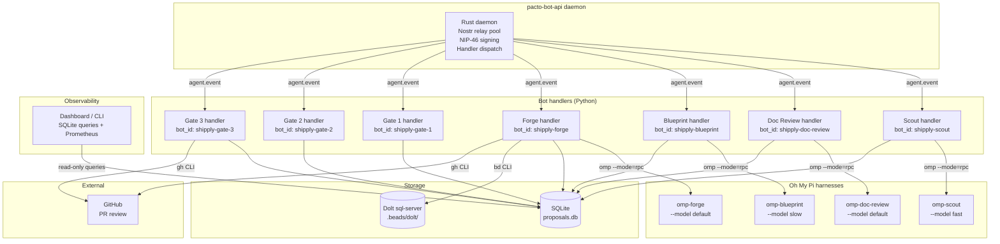
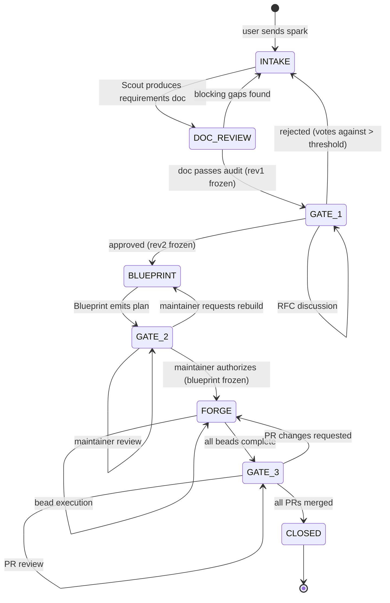

## Summary

Build the Shipply orchestration engine — seven Python bot handlers (Scout, Doc Review, Blueprint, Forge, Gate 1, Gate 2, Gate 3) running as pacto-bot-api handler processes, a centralized proposal state machine backed by SQLite, three MLS Squad governance gates, a harness interface that drives Oh My Pi via `--mode rpc` (NDJSON protocol over stdio), and an observability layer that emits events and exposes a dashboard/CLI for in-flight proposal and bead tracking. Beads (`bd`) with a self-hosted Dolt server provides the task backend for Forge's parallel bead execution. Model routing is handled by omp's own configuration — the handlers are pure relays.

---

## Success Metrics

- **Leading indicator:** Median time from spark to approved RFC (target: reduce by 50% compared to the current manual RFC process within 4 weeks of v1 deployment).
- **Quality indicator:** Gate 1 rejection rate due to missing requirements (target: < 20% of proposals rejected for incomplete requirements within the first month).
- **Operational indicator:** Percentage of beads that complete without human gate escalation (target: > 70% within the first month).
- **Adoption indicator:** Number of unique users who successfully complete a Scout interview and reach Gate 1 (target: > 5 active users within the first two weeks).
- **Observability indicator:** Dashboard coverage of in-flight proposals by stage and bead status, with p95 transition latency visible (target: 100% of active proposals and beads queryable within 5 seconds of the underlying event).

---

## Problem Frame

The architecture doc (`docs/architecture.md`) defines a six-stage AI-augmented product lifecycle pipeline: intake → requirements audit → product RFC → technical blueprint → parallel execution → PR review. Each stage is a bot persona communicating through Nostr events via pacto-bot-api. The pipeline needs a runtime — a state machine that tracks proposals across gates, bot handlers that relay messages between Squad threads and an agent harness, and a task backend that manages bead execution. This plan builds that runtime.

---

## Requirements

### State machine

- R1. A proposal progresses through a defined lifecycle: `INTAKE` → `DOC_REVIEW` → `GATE_1` → `BLUEPRINT` → `GATE_2` → `FORGE` → `GATE_3` → `CLOSED`.
- R2. Each gate transition freezes the input revision (immutability contract). Late-breaking comments on earlier threads are routed to follow-up proposals, not in-flight mutations.
- R3. The state machine is event-driven — each `agent.event` notification from pacto-bot-api advances state. No polling loop.
- R4. Proposal state is persisted in a dedicated SQLite database, separate from the pacto-bot-api daemon's own store.

### Bot handlers

- R5. Each bot persona (Scout, Doc Review, Blueprint, Forge) runs as an independent Python process using the `pacto_bot_sdk.Bot` class, with its own bot identity and Nostr profile.
- R6. Handlers register for `dm_received` and `mls_group_message_received` events and use `handler.response` actions (`ack`, `reply`, `defer`, `ignore`) to drive the state machine.
- R7. Each *agent* handler (Scout, Doc Review, Blueprint, Forge) delegates agent work to Oh My Pi via `omp --mode rpc` (persistent NDJSON session). The handler is a relay, not an executor. Gate 1, Gate 2, and Gate 3 are governance handlers and do not invoke the harness.
- R7a. When a handler transitions a proposal's state, it sends a Nostr DM to the next handler's bot_id with the proposal ID, source state, and target state. Each handler registers for `dm_received` and filters incoming DMs by proposal state to discover when work is ready. This is the state-transition notification pattern — no handler polls SQLite for state changes. Read-only queries for Dependency Cards or reconciliation are allowed; they do not replace the DM notification pattern.

### Harness interface

- R8. The harness interface manages Oh My Pi subprocess lifecycle: start, send prompt, read structured result, terminate or reuse.
- R9. Prompts to the harness are structured JSON with a `task` field (e.g., `brainstorm`, `doc-review`, `plan`, `execute-bead`) and a `context` field containing the relevant document or bead spec.
- R10. Harness results are parsed as structured JSON with a `status` field (`success`, `needs_input`, `error`) and a `payload` field.

### Governance gates

- R11. Gate 1 (Product RFC) operates in an MLS Squad. Voting is tracked via emoji reactions or `/vote` commands. A configurable quorum threshold gates progression.
- R12. Gate 1 surfaces a Dependency Card — active proposals, open beads, and closed beads that the current proposal depends on.
- R13. Gate 2 (Technical RFC) operates in a maintainer-only MLS Squad. Maintainers comment to adjust Blueprint parameters; a maintainer authorization payload triggers Forge.
- R14. Gate 3 (PR Review) is triggered by a maintainer `/gate3 check` command in the Gate 2 Squad. The command queries the proposal's PR status via `gh pr view`; merged → proposal closed, requested changes → transition back to `FORGE` for the affected bead. Automated webhook monitoring is deferred to v2.
- R31. Governance commands (`/vote`, `/authorize`, `/gate3 check`) are validated against a role matrix (squad membership, maintainer status, proposal sponsor) before acting.
- R32. Dependencies used by the Dependency Card are declared explicitly in the requirements doc or Blueprint (target area, affected components, or bead IDs); the card does not infer dependencies from free text.
- R33. The PR model is consistent: either one PR per proposal (and rework is scoped to the whole proposal) or one PR per bead (and the proposal closes when all bead PRs merge). The same model is used in the state machine, U6, U7, and the architecture doc.

### Beads task backend

- R15. Forge creates a Beads molecule from the Blueprint JSON spec using `bd mol pour`.
- R16. Forge queries the claimable frontier with `bd ready`, claims beads atomically with `bd update --claim`, and closes them on success with `bd close`.
- R17. Forge implements a 2-retry self-healing cycle. On the second failure, it creates a `human` gate on the bead and posts a diagnostic alert to the Gate 2 Squad.
- R18. The Beads backend runs in server mode (`bd init --server`) against a self-hosted `dolt sql-server` for concurrent multi-agent access.
- R19. Bot-to-bot state-transition DMs are authenticated (sender bot_id verified) and authorized (only the handler that owns the source state may emit the next-state DM).
- R20. Nostr bot private keys (nsec) are generated, stored, and rotated through a secrets backend; handlers use NIP-46 remote-signer delegation where possible so they do not hold long-lived private keys.
- R21. User-facing Nostr messages (DMs and MLS group messages) are delimited and validated before being placed in harness prompt contexts; prompt-injection detection heuristics flag high-confidence injection attempts for human review.
- R22. Every state transition, vote, revision freeze, and maintainer authorization is appended to an immutable, signed log so that history cannot be silently altered.
- R23. The event-driven state machine uses idempotency keys and at-least-once delivery semantics; a periodic reconciliation sweep detects and recovers proposals stuck mid-transition.
- R24. Subprocess invocations of `omp`, `bd`, and `gh` pass arguments as a list (not a shell string), and all dynamic identifiers are validated against an allow-list before execution.
- R25. The self-hosted Dolt server requires authentication, TLS for SQL connections, and network restriction to the compose internal network.
- R26. Blueprint JSON is validated against a documented schema before Gate 2 authorization; invalid blueprints are rejected before Forge execution begins.
- R27. The Dependency Card filters results by the viewer's authorization scope and returns only the minimum required fields; it does not leak cross-proposal titles or owner details.
- R28. MLS Squad membership is governed by admin-approved invitations and a reconciled roster; quorum calculations use active members only.
- R29. Data sent to external model gateways (e.g., ngrok.ai) is classified before leaving the host; a configurable allow-list controls which data types may be transmitted externally.
- R30. Bead execution runs in a sandboxed environment (restricted network, no secrets, read-only root filesystem where possible) and bead specs are validated against a schema before the harness executes them.
- R34. The orchestration engine emits observable events and metrics for every proposal state transition, gate action, bead claim/close, and harness call so that in-flight work and bottlenecks can be monitored in real time.


---

## Key Technical Decisions

- **Python handlers over Rust/WASM.** The `pacto_bot_sdk` Python package exists and the python-llm bot template provides a proven handler scaffold. Rust handlers would require building a JSON-RPC client from scratch against the daemon's contract. WASM adds deployment complexity with no win for I/O-bound message relay handlers.

- **Oh My Pi `--mode rpc` over `-p` one-shot.** `-p` spawns a new process per request, losing skill state and incurring cold-start overhead. `--mode rpc` runs a persistent agent session over NDJSON on stdio — the handlers send `prompt`/`steer`/`follow_up` commands, receive `agent_start`/`message_update`/`agent_end` events, and can hot-swap models mid-session via `set_model`. Session persistence means skills stay loaded across requests. The protocol also supports `set_todos` for pre-seeding plans, `set_host_tools` for registering custom tools, and `set_subagent_subscription` for subagent visibility — all useful for the bot personas. A single `HarnessBackend` abstraction isolates the RPC protocol details from the bot handlers; the number of long-running `omp` processes is a deployment choice (one shared or one per persona) and should be measured against startup cost and memory budget before v1 ships.

- **SQLite over Beads Dolt for proposal state.** The proposal registry is internal pipeline state, not shared work items. SQLite is zero-infrastructure, co-locates with the handlers, and avoids coupling the state machine to the task backend. Beads owns execution tasks; SQLite owns pipeline state. If four containerized writers contend on the SQLite WAL, route writes through a single state-manager process or move to PostgreSQL.

- **Self-hosted Dolt server over DoltHub for v1.** Keeps all infrastructure local during development. DoltHub is the upgrade path when multi-machine sync is needed. Server mode (`dolt sql-server`) supports concurrent connections, which embedded mode's file lock prevents. Wrap bead-claim operations in explicit transactions with retry logic and verify Dolt's isolation guarantees during the U6 spike.

---

## High-Level Technical Design

### Component topology



### Proposal state machine



### Harness protocol (omp --mode rpc)

Each handler→harness interaction uses the verified NDJSON RPC protocol over stdio (omp v16.3.3, `--mode=rpc`):

```
Handler                              omp --mode=rpc
  │                                        │
  │  {"type":"ready"}                      │  ← startup handshake
  │ <───────────────────────────────────── │
  │                                        │
  │  {"type":"prompt",                     │
  │   "message":"<task context>",           │
  │   "images":[]}                          │
  │ ──────────────────────────────────────> │
  │                                        │ agent runs skills, subagents
  │  {"type":"agent_start",...}            │
  │ <───────────────────────────────────── │
  │  {"type":"message_update",...}         │  ← streaming output
  │ <───────────────────────────────────── │
  │  {"type":"agent_end",...}              │
  │ <───────────────────────────────────── │
  │                                        │
  │  {"type":"steer",                      │  ← mid-flight steering
  │   "message":"<user reply>"}            │
  │ ──────────────────────────────────────> │
```

Verified input commands:

| Command | Schema | Purpose |
|---|---|---|
| `prompt` | `{"type":"prompt","message":"...","images":[]}` | Send a task to the agent (brainstorm, doc-review, plan, execute-bead). `images` is optional. |
| `steer` | `{"type":"steer","message":"...","images":[]}` | Inject mid-flight steering (user replies during interview). |
| `follow_up` | `{"type":"follow_up","message":"...","images":[]}` | Append context without interrupting the current turn. |
| `abort` | `{"type":"abort"}` (optional `reason`) | Cancel the current agent turn. |
| `set_model` | `{"type":"set_model","provider":"...","modelId":"..."}` | Hot-swap the model per persona. Use `provider` + `modelId`, not `model`. |
| `set_todos` | `{"type":"set_todos","phases":[{"name":"...","tasks":[{"content":"...","status":"..."}]}]}` | Pre-seed the todo list from a plan. Use `phases` containing `tasks`, not a flat `todos` list. |
| `get_state` | `{"type":"get_state"}` | Query session state (model, todo phases, steering mode, session id, context usage). |
| `new_session` | `{"type":"new_session"}` | Start a fresh session for a new proposal or bead. |
| `set_steering_mode` | `{"type":"set_steering_mode","mode":"..."}` | Extra command discovered in the binary; set steering mode. |
| `set_follow_up_mode` | `{"type":"set_follow_up_mode","mode":"..."}` | Extra command discovered in the binary; set follow-up mode. |

Verified event stream (NDJSON on stdout, stderr merged):

- `ready` — startup handshake
- `response` — command acknowledgments and results
- `agent_start` / `agent_end` — boundaries of an agent turn
- `turn_start` / `turn_end` — boundaries of a single response turn
- `message_start` / `message_end` — boundaries of a message
- `message_update` — streaming content; payload includes `assistantMessageEvent.type` ∈ `{thinking_start, thinking_delta, thinking_end, text_start, text_delta, text_end, toolcall_start, toolcall_delta, toolcall_end, done, error}`
- `session_info_update` / `config_update` — session and configuration changes
- `extension_ui_request` / `available_commands_update` — UI/extension events (can be ignored by headless handlers)

`--mode=rpc` is the correct mode for headless bot handlers. `rpc-ui` shares the same wire protocol but sets `hasUI = true` and `noPty = true`; it is semantically wrong for bots even though the emitted NDJSON is identical in this build.

---

## Implementation Units

### U1. Project scaffold, configuration, and SQLite schema

- **Goal:** Establish the Python package structure, configuration loading, and proposal persistence layer.
- **Requirements:** R1, R4
- **Dependencies:** None
- **Files:**
  - `pyproject.toml` — package metadata, dependencies (`pacto-bot-sdk`, `pydantic`, `prometheus-client`)
  - `src/shipply/__init__.py`
  - `src/shipply/config.py` — load `shipply.toml`, validate persona→model mappings, gate thresholds
  - `src/shipply/db.py` — SQLite connection management, migration runner
  - `src/shipply/models.py` — Pydantic models for Proposal, Revision, BeadRef, GateState
  - `src/shipply/observability.py` — event emitter, Prometheus counters/gauges, and structured log helpers
  - `src/shipply/migrations/001_proposals.sql` — schema DDL for proposals, revisions, beads, gates, and audit events
  - `src/shipply/migrations/002_observability.sql` — schema DDL for in-flight metrics views
  - `tests/test_config.py`
  - `tests/test_db.py`
  - `tests/test_models.py`
  - `tests/test_observability.py`
- **Approach:** Single `shipply.toml` at the project root. SQLite file at `data/proposals.db` (configurable). Use `pydantic` for config and state models; `aiosqlite` for async DB access. Migrations are raw SQL files applied in order. On connection, enable WAL journal mode (`PRAGMA journal_mode=WAL`) for concurrent read+write across handler processes and set a busy timeout (`PRAGMA busy_timeout=5000`) so writers wait briefly instead of failing with `SQLITE_BUSY`. The schema includes an `events` table for the audit trail (R22) and materialized views for in-flight proposal and bead counts by stage. `observability.py` provides `emit(event_type, proposal_id, payload)` and Prometheus-compatible counters/gauges for handler events, harness calls, and bead lifecycle transitions.
- **Patterns to follow:** pacto-bot-api's TOML config convention (`pacto-bot-api.toml`), the python-llm template's project layout, Prometheus client naming conventions.
- **Test scenarios:**
  - Config loads from `shipply.toml` with all required fields; raises on missing persona config.
  - SQLite schema creates all tables on first run; idempotent on subsequent runs.
  - Proposal model round-trips through JSON serialization.
  - Proposal state transitions enforce valid from→to pairs; invalid transitions raise.
  - `emit` writes an event row and increments the matching Prometheus counter.
  - In-flight view returns current proposal and bead counts by stage.
- **Verification:** `pytest tests/` passes. Config file parses without errors. SQLite database is created with correct schema on first handler startup.

---

### U2. Harness interface

- **Goal:** Provide a `HarnessBackend` abstraction that manages `omp --mode rpc` subprocess lifecycle and the NDJSON RPC protocol.
- **Requirements:** R8, R9, R10
- **Dependencies:** U1 (config for harness paths)
- **Files:**
  - `src/shipply/harness.py` — `HarnessBackend` class, subprocess management, NDJSON RPC protocol
  - `tests/test_harness.py`
- **Approach:** The `omp --mode=rpc` NDJSON contract has been verified against a reference build (omp v16.3.3). Implement `HarnessBackend` against the verified command and event schemas. `send(task, context)` serializes `task` and `context` into the `message` field of an NDJSON `prompt` frame and yields events from stdout. `steer(message)` writes a `steer` frame. `follow_up(message)` writes a `follow_up` frame. `abort()` writes an `abort` frame. `set_model(provider, model_id)` writes a `set_model` frame using `provider` and `modelId`. `set_todos(phases)` writes a `set_todos` frame using the `phases`/`tasks` schema. `get_state()` and `new_session()` query/control the session. The backend parses the verified event stream (`ready`, `response`, `agent_start`, `turn_start`, `message_start`/`message_end`, `message_update`, `turn_end`, `agent_end`, `session_info_update`, `config_update`). On `message_update`, surface the `assistantMessageEvent.type` deltas (`thinking_*`, `text_*`, `toolcall_*`, `done`, `error`). On exit, terminate the subprocess. A `HarnessPool` manages one RPC session per persona, reusing them across requests. Timeout handling: if a prompt exceeds a configurable timeout, `abort` is sent; if the process is unresponsive, it's killed and restarted. The fallback to one-shot `omp -p` / `--mode=text` / `--mode=json` is retained only as a contingency if a future build breaks the contract.
- **Patterns to follow:** Python's `asyncio.subprocess` for async I/O; the `pacto_bot_sdk.Bot` class's transport abstraction pattern.
- **Test scenarios:**
  - `HarnessBackend` spawns `omp --mode=rpc` and reads the `ready` handshake.
  - `send` writes a `prompt` command with `message` containing `task` and `context`; `agent_start`/`agent_end` events are yielded.
  - `steer` injects mid-flight steering; agent processes it without aborting.
  - `set_model` writes `provider` and `modelId`; subsequent prompts use the new model.
  - `set_todos` writes the `phases`/`tasks` schema.
  - `abort` cancels the current turn; `message_update` events with `type: error` are surfaced as `HarnessError`.
  - Timeout sends `abort`; if unresponsive, subprocess is killed and restarted.
  - `HarnessPool` returns the correct backend per persona; reuses across requests.
  - Subprocess crash mid-request is detected and surfaced as `HarnessError`.
- **Verification:** `pytest tests/test_harness.py` passes with a mock `omp` script that speaks the RPC protocol.

---

### U3. Scout handler + Doc Review handler

- **Goal:** Implement the intake pipeline — Scout conducts a multi-user interview, produces a requirements doc with Goals Statement, and Doc Review audits it before Gate 1.
- **Requirements:** R5, R6, R7, R9, R10
- **Dependencies:** U1 (state machine, models), U2 (harness)
- **Files:**
  - `src/shipply/handlers/scout.py` — Scout bot handler
  - `src/shipply/handlers/doc_review.py` — Doc Review bot handler
  - `src/shipply/handlers/__init__.py`
  - `tests/test_scout_handler.py`
  - `tests/test_doc_review_handler.py`
- **Approach:**
  - **Scout:** Registers for both `dm_received` and `mls_group_message_received` events. On first message from a user (DM or Squad channel), creates a new Proposal in `INTAKE` state. DMs are single-user; multi-user collaboration happens in an MLS Squad channel. Each subsequent message in the same thread is appended to the interview history. Scout calls the harness with `task: "brainstorm"` and the accumulated context. The harness runs ce-brainstorm skills internally. Scout relays harness questions to the user and user answers back to the harness. When the harness signals the interview is complete (gap-driven + confidence floor), Scout writes the requirements doc and transitions to `DOC_REVIEW`. Multi-user collaboration: any user in the Squad channel can contribute; Scout tracks contributors in the proposal model. A raw spark dropped in a design Squad triggers the same intake flow as a DM.
  - **Doc Review:** Registers for `dm_received` notifications for the `DOC_REVIEW` state transition DM (per R7a). Calls the harness with `task: "doc-review"` and the requirements doc. Parses the tiered findings report. `safe_auto` fixes are applied silently to the doc, then summarized in a follow-up message to the Scout thread before the proposal advances. Blocking gaps (`gated_auto`, `manual` at P0/P1) trigger a bounce-back: Doc Review posts the gap report to the Scout thread, transitions back to `INTAKE`, and Scout re-engages. Clean pass transitions to `GATE_1` and freezes `rev1`.
- **Patterns to follow:** `pacto_bot_sdk.Bot` decorator API (`@bot.command`, `@bot.default`), the joke_bot's `defer` pattern for async harness calls.
- **Test scenarios:**
  - Scout creates a proposal on first DM; subsequent DMs append to interview history.
  - Scout relays harness questions to the user; user replies are forwarded to harness.
  - Scout terminates interview when harness signals completion; writes requirements doc.
  - Multi-user: a second user's DM in the same thread is tracked as a contributor.
  - Doc Review calls harness with requirements doc; parses tiered findings.
  - Doc Review bounces proposal back to INTAKE on blocking gaps; posts gap report.
  - Doc Review transitions to GATE_1 on clean pass; freezes rev1.
  - Scout respects `/done` command for early termination with warning.
- **Verification:** `pytest tests/test_scout_handler.py tests/test_doc_review_handler.py` passes. Integration: a mock harness script simulates a full interview→audit→pass cycle.

---

### U4. Gate 1 handler (Product RFC)

- **Goal:** Manage the Product RFC Squad, voting mechanics, dependency surfacing, and gate transition.
- **Requirements:** R11, R12
- **Dependencies:** U1 (state machine)
- **Files:**
  - `src/shipply/handlers/gate1.py` — Gate 1 bot handler
  - `tests/test_gate1_handler.py`
- **Approach:**
  - On proposal entering `GATE_1`, Gate 1 handler posts the requirements doc to a pre-configured MLS Squad. pacto-bot-api MLS group send/receive support has been verified; dynamic Squad creation is still deferred to v2, so the Squad must be created and the handler invited ahead of time. Humans and other bots in the Squad discuss and vote.
  - Dependency Card: reads the proposal's declared dependencies (target area, affected files, or bead IDs from the requirements doc / Blueprint) and scans the proposal registry (SQLite) and Beads store (`bd list --json`) for active proposals, open beads, and closed beads that match those declared dependencies. Results are filtered by the viewer's authorization scope and returned with the minimum required fields only. Posts a structured Dependency Card message.
  - Voting: listens for `/vote approve` and `/vote reject` commands, or emoji reactions (👍/👎) on the pinned message. Tracks votes in the proposal state. Quorum and threshold from config. Only active MLS Squad members (per a reconciled roster) count toward quorum.
  - On approval: transitions to `BLUEPRINT`, freezes `rev2`. On rejection: transitions back to `INTAKE` with rejection reason.
- **Patterns to follow:** `agent.send_group_message` for Squad posts, `agent.is_squad_member` for vote validation.
- **Test scenarios:**
  - Gate 1 posts requirements doc to Squad on proposal entry.
  - `/vote approve` increments vote count; quorum reached triggers transition to BLUEPRINT.
  - `/vote reject` with majority against transitions back to INTAKE.
  - Non-member votes are rejected via `agent.is_squad_member` check.
  - Dependency Card lists active proposals and open beads from the registry.
  - Vote timeout (configurable) triggers a reminder message; no auto-close.
- **Verification:** `pytest tests/test_gate1_handler.py` passes. Mock Squad messages simulate a full voting cycle.

---

### U5. Blueprint handler + Gate 2 handler

- **Goal:** Generate a technical blueprint from approved requirements, and manage the maintainer review gate.
- **Requirements:** R13
- **Dependencies:** U1 (state machine), U2 (harness), U4 (Gate 1 approval)
- **Files:**
  - `src/shipply/handlers/blueprint.py` — Blueprint bot handler
  - `src/shipply/handlers/gate2.py` — Gate 2 bot handler
  - `tests/test_blueprint_handler.py`
  - `tests/test_gate2_handler.py`
- **Approach:**
  - **Blueprint:** On proposal entering `BLUEPRINT`, calls harness with `task: "plan"` and the approved requirements doc (`rev2`). The harness runs ce-plan internally. Blueprint parses the resulting plan into a structured JSON blueprint and validates it against the documented Blueprint JSON schema (R26) before transitioning. Transitions to `GATE_2`.
  - **Gate 2:** Posts the Blueprint JSON to the maintainer-only Squad. Listens for threaded comments. Maintainers can request rebuilds (Blueprint re-runs with amended parameters and transitions the proposal back to `BLUEPRINT`). A maintainer `/authorize` command transitions to `FORGE` and freezes the blueprint.
- **Test scenarios:**
  - Blueprint calls harness with requirements doc; parses plan into JSON blueprint.
  - Blueprint JSON includes file deltas, dependencies, and bead specs.
  - Gate 2 posts blueprint to maintainer Squad.
  - Maintainer comment triggers Blueprint rebuild with amended parameters.
  - `/authorize` command transitions to FORGE; freezes blueprint.
- **Verification:** `pytest tests/test_blueprint_handler.py tests/test_gate2_handler.py` passes.

---

### U6. Forge handler + Beads TaskBackend

- **Goal:** Execute the Blueprint plan as parallel beads, with self-healing retry and failure escape.
- **Requirements:** R15, R16, R17, R18
- **Dependencies:** U1 (state machine), U2 (harness), U5 (Gate 2 authorization)
- **Files:**
  - `src/shipply/handlers/forge.py` — Forge bot handler
  - `src/shipply/backends/__init__.py`
  - `src/shipply/backends/beads.py` — Beads TaskBackend implementation
  - `src/shipply/backends/interface.py` — TaskBackend Protocol
  - `tests/test_forge_handler.py`
  - `tests/test_beads_backend.py`
- **Approach:**
  - **TaskBackend Protocol:** Python `Protocol` class defining `create_molecule`, `get_ready`, `claim`, `close`, `get_blocked`, `add_dependency`, `sync`. Beads implementation wraps `bd` CLI via `asyncio.subprocess`, always passing `--json` for structured output. Use `--readonly` when running worker sandbox queries and `--sandbox` to prevent Dolt auto-push. Use `--actor` to attribute actions to the Forge bot identity in the audit trail.
  - **Forge handler:** On proposal entering `FORGE`, calls `TaskBackend.create_molecule()` with the frozen Blueprint JSON. Enters execution loop:
    1. `bd ready --mol <id> --json` → claimable beads
    2. For each ready bead: `bd update <id> --claim --json`, then call harness with `task: "execute-bead"` and the bead spec
    3. On harness success: `bd close <id> --json`
    4. On harness failure: retry up to 2 times with exponential backoff, jitter, and progressive context amendments (larger model or extended prompt). On second failure: `bd gate create --type=human --blocks <id> --json`, collect the last harness log excerpt, the working-directory diff, and the bead ID, and post a diagnostic alert to the Gate 2 Squad via `agent.send_group_message`
    5. Loop until no ready beads and no in-progress beads
  - On all beads complete: Forge records the resulting PR URL in the proposal state. The PR model follows R33: either one PR per proposal or one PR per bead, consistently with the architecture doc. Transitions to `GATE_3`.
- **Patterns to follow:** `asyncio.subprocess` for `bd` CLI calls (same pattern as harness interface). Beads molecule lifecycle from the architecture doc.
- **Test scenarios:**
  - TaskBackend creates a molecule from a Blueprint JSON spec; returns molecule ID.
  - `get_ready` returns only beads with no open blockers.
  - `claim` atomically assigns a bead; second claim on same bead fails.
  - `close` unblocks dependents; previously blocked bead appears in `get_ready`.
  - Forge execution loop: claims ready beads, calls harness, closes on success.
  - Self-healing: first failure retries with backoff and progressive context; second failure creates human gate and posts alert.
  - Failure alert includes log excerpt, code diff, and bead ID.
  - All beads complete → transition to GATE_3.
  - Beads backend syncs via `bd dolt push` after each close only when a DoltHub remote is configured; otherwise sync is local.
- **Verification:** `pytest tests/test_forge_handler.py tests/test_beads_backend.py` passes. Integration: a mock `bd` script simulates the bead lifecycle.

---

### U7. Gate 3 handler (PR Review)

- **Goal:** Manage the final governance gate — on-demand PR status checks triggered by maintainer commands, and proposal closure when all PRs are merged.
- **Requirements:** R14
- **Dependencies:** U1 (state machine), U6 (Forge completion)
- **Files:**
  - `src/shipply/handlers/gate3.py` — Gate 3 bot handler
  - `tests/test_gate3_handler.py`
- **Approach:**
  - On proposal entering `GATE_3`, Gate 3 posts the proposal's PR URL to the Gate 2 Squad with instructions: "Issue `/gate3 check` to verify PR status."
  - Gate 3 listens for `/gate3 check` commands in the Squad. On each command, it queries the proposal's PR status using `gh pr view --json`.
  - PR with requested changes → posts summary to Gate 2 Squad, transitions back to `FORGE` for the affected bead.
  - No polling loop — Gate 3 is event-driven, triggered by maintainer commands via the pacto-bot-api event loop.
- **Patterns to follow:** `asyncio.subprocess` for `gh` CLI calls; same event-driven pattern as all other handlers.
- **Test scenarios:**
  - Gate 3 posts PR URL to Gate 2 Squad on proposal entry.
  - `/gate3 check` command queries PR status; merged → CLOSED.
  - `/gate3 check` with requested changes → transition back to FORGE.
  - Proposal closed: final status is posted to the Gate 2 Squad (optional cross-post to Gate 1 Squad if configured).

---

### U8. Docker Compose orchestration

- **Goal:** Package all components into a single `docker compose up` deployment.
- **Requirements:** R5, R18
- **Dependencies:** U1–U7 (all handlers implemented), U9 (observability dashboard and CLI)
- **Files:**
  - `docker-compose.yml`
  - `Dockerfile` — Shipply handler image (Python 3.12, installs shipply package)
  - `shipply.toml.example` — documented example config
  - `scripts/init-dolt.sh` — one-time Dolt server setup script
- **Approach:**
  - Extends the pacto-bot-api python-llm template's docker-compose structure.
  - The `Dockerfile` installs `omp` from a pinned release artifact or an internal package repository; document the exact source and version pin in the build instructions.
  - Services: `daemon` (pacto-bot-api), `dolt-server` (Dolt sql-server), `scout`, `doc-review`, `blueprint`, `forge`, `gate1`, `gate2`, `gate3` (one container per handler), `dashboard` (observability dashboard). Gate 1/2/3 may share a single container if they have no heavy dependencies; the compose file should make the split explicit.
  - Each handler container includes Oh My Pi (`omp`) installed in the image, so `asyncio.subprocess` calls to `omp --mode rpc` work within the container. The `Dockerfile` installs omp alongside the shipply package.
  - Each handler container runs `python -m shipply.handlers.<name>` with the bot ID and transport config.
  - Shared volume for the SQLite database (`data/`).
  - Dolt server uses the official `dolthub/dolt-sql-server` image.
  - Forge container receives a GitHub token via Docker secret or mounted file for `gh pr view` calls. Minimum scope: `repo:read` on target repositories. A fine-grained PAT or GitHub App installation token is preferred over a classic PAT. Document the secret path and token scope in `shipply.toml.example`.
- **Patterns to follow:** The python-llm template's `docker-compose.yml` structure, Unix socket volume sharing.
- **Test scenarios:**
  - `docker compose up` starts all services without errors.
  - Handlers register with the daemon and appear in `agent.list_handlers`.
  - SQLite database is created on first handler startup.
  - Dolt server is reachable from Forge container; `bd init --server` succeeds.
- **Verification:** `docker compose up` succeeds. `docker compose ps` shows all services healthy. A manual DM to the Scout bot creates a proposal in the SQLite database.

---

### U9. Observability dashboard and in-flight query CLI

- **Goal:** Provide real-time visibility into proposal and bead state, transition latency, and bottlenecks.
- **Requirements:** R34, R22 (audit events)
- **Dependencies:** U1 (schema, events table, observability emitter)
- **Files:**
  - `src/shipply/observability.py` — shared event emitter and metric registration (also listed in U1)
  - `src/shipply/dashboard.py` — lightweight async HTTP dashboard (`/proposals`, `/proposals/<id>`, `/metrics`, `/health`) or CLI (`shipply status`, `shipply tail <proposal_id>`)
  - `src/shipply/cli.py` — click/typer CLI entrypoint
  - `tests/test_dashboard.py`
  - `tests/test_cli.py`
- **Approach:**
  - Every handler calls `emit(event_type, proposal_id, payload, stage)` before and after state transitions, harness calls, gate actions, and bead lifecycle steps. Events are inserted into the `events` table with a monotonic sequence, timestamp, and JSON payload.
  - Materialized SQLite views (`v_proposals_in_flight`, `v_beads_in_flight`, `v_stage_latency`) expose current proposal counts by stage, bead counts by status, and p50/p95 transition latency over the last 24 hours.
  - The dashboard exposes:
    - `/proposals` — list of active proposals with stage, age, and last event
    - `/proposals/<id>` — full timeline of a single proposal (events, votes, bead statuses)
    - `/metrics` — Prometheus exposition format
    - `/health` — readiness check
  - The CLI supports `shipply status` (global in-flight summary) and `shipply tail <proposal_id>` (live event stream).
- **Patterns to follow:** Prometheus client conventions; structured JSON logging; read-only queries against the SQLite database.
- **Test scenarios:**
  - `emit` writes a row and increments a counter.
  - Dashboard `/proposals` returns the current in-flight set.
  - Dashboard `/metrics` returns Prometheus text with `shipply_proposals_in_stage` and `shipply_beads_in_status` gauges.
  - CLI `shipply status` prints stage counts and p95 transition latency.
  - `shipply tail <id>` streams new events as they arrive.
- **Verification:** `pytest tests/test_dashboard.py tests/test_cli.py` passes. A manual state transition updates the dashboard within 5 seconds.

---

## Scope Boundaries

### Deferred to Follow-Up Work

- Ticketing platform integration (GitHub Projects v2, Linear, GitLab) for Gate 1 auto-scheduling.
- Cross-proposal conflict detection runtime — the detection points are spec'd in the architecture doc; the registry that powers them is deferred.
- Blueprint JSON schema formalization — v1 uses an ad-hoc structure derived from the harness output; a formal schema with validation is v2.
- DoltHub remote sync — v1 uses self-hosted Dolt server; DoltHub is the upgrade path.
- Webhook-based Gate 3 PR monitoring — manual `/gate3 check` command in v1; webhooks are v2.
- MLS Squad auto-creation — v1 uses pre-configured Squad IDs; dynamic Squad creation per proposal is v2.

### Outside v1 Scope

- The messaging platform itself (pacto-bot-api is an external dependency).
- The Beads CLI/tool (external dependency).
- Oh My Pi / compound-engineering skills (external dependency).
- ngrok.ai gateway (external service).
- A UI beyond bot messages in chat threads.

### Adoption & Rollout

- **Pilot scope:** Start with one Squad and one proposal type (e.g., small feature RFCs) for the first two weeks.
- **Onboarding:** Document the Scout DM command, the `/vote` and `/authorize` commands, and the `/gate3 check` command in the Squad topic or pinned message.
- **Migration:** Existing RFCs in flight are not retroactively imported; new proposals use the orchestration engine starting from the pilot date.
- **Training:** Run a 15-minute walkthrough for maintainers on Gate 2 authorization and bead-failure escalation before the first real proposal enters FORGE.

---

## Risks & Dependencies

| Risk | Impact | Mitigation |
|---|---|---|
| Oh My Pi `--mode=rpc` NDJSON contract mismatch | Harness interface blocked | **Resolved:** `omp --mode=rpc` exists and the verified NDJSON contract matches the plan's command set. Implement U2 against the verified schema; use `provider`/`modelId` in `set_model` and `phases`/`tasks` in `set_todos`. If a future build breaks the contract, the fallback is one-shot `omp -p` or `--mode=json`. |
| pacto-bot-api MLS group send/receive support | Gate 1/2 Squads can't be created | **Resolved:** MLS group support is available and supports sending/receiving. Verify the specific API surface (`agent.send_group_message`, `agent.is_squad_member`, `mls_group_message_received` events, squad creation/invitation) against the deployed build before starting U4. |
| Beads CLI JSON output formats (`bd mol --json`, `bd ready --json`, `bd update --json`, `bd close --json`, `bd gate --json`) | Forge can't parse bead lifecycle | **Go/no-go:** Command groups (`mol`, `ready`, `update`, `close`, `gate`) are confirmed in the `bd` CLI. Verify the exact JSON structure returned by each `--json` invocation before starting U6. Note useful flags: `--readonly` for sandboxed workers, `--sandbox` to disable Dolt auto-push, `--actor` for audit trail. |
| Harness subprocess memory growth over long sessions | OOM kills handler | Configurable max-requests-per-process; restart after threshold. Measure per-process memory and API spend before v1 ships. |

---

## Open Questions

- `omp --mode=rpc` exists and the NDJSON command/event contract has been verified against a reference build (omp v16.3.3). Verified commands: `new_session`, `get_state`, `prompt`, `steer`, `follow_up`, `abort`, `set_model`, `set_todos`; discovered commands `set_steering_mode`, `set_follow_up_mode`. Verified events: `ready`, `response`, `agent_start`, `turn_start`, `message_start`/`message_end`, `message_update` (with `assistantMessageEvent.type` deltas), `turn_end`, `agent_end`, `session_info_update`, `config_update`. `--mode=rpc` is the correct mode for headless bots; `rpc-ui` is structurally identical but sets UI flags. **Resolution:** No longer a blocker; implement U2 against the verified schema. Use `provider` + `modelId` for `set_model` and `phases` with `tasks` for `set_todos`.
- pacto-bot-api MLS group support is available and supports sending/receiving messages. Verify the exact RPC/event surface (`agent.send_group_message`, `agent.is_squad_member`, `mls_group_message_received`, squad creation/invitation) against the deployed build before implementing U4. **Resolution:** No longer a blocker; design U4 against the verified MLS API.
- What are the exact JSON output structures for `bd mol --json`, `bd ready --json`, `bd update --claim --json`, `bd close --json`, and `bd gate create --type=human --blocks <id> --json`? The TaskBackend parses these. The `bd` command groups (`mol`, `ready`, `update`, `close`, `gate`) are confirmed in the CLI; the remaining unknown is the schema returned by `--json`. **Resolution:** Run each command against a local Beads install with a test molecule and capture `--json` output; document the expected schema in `src/shipply/backends/beads_schema.py`.
- Which PR model does v1 use: one PR per proposal (simpler, larger reviews) or one PR per bead (finer granularity, aligns with the architecture doc's "parallel Pull Requests")? R33 requires consistency but the choice is not yet made.
- How do `status` and `payload` from R10 map onto the `agent_start`/`message_update`/`agent_end` streaming events in the NDJSON protocol? The harness interface needs an explicit parsing rule before U3–U7 can implement result handling.
- What is the expected write-contention profile for the SQLite WAL with four containerized handlers? If contention exceeds the busy-timeout budget, the fallback is a single writer process or PostgreSQL, but the threshold is not yet defined.
- Are `agent.send_group_message`, `agent.is_squad_member`, and the MLS group lifecycle APIs actually available in the current pacto-bot-api build? MLS support is listed as Phase 2; a DM-only fallback channel may be needed.
- Where does the Blueprint JSON schema live, and how does Forge know which fields are bead specs versus file deltas versus dependencies? A minimal schema contract must be documented before U5 and U6 are integrated.
