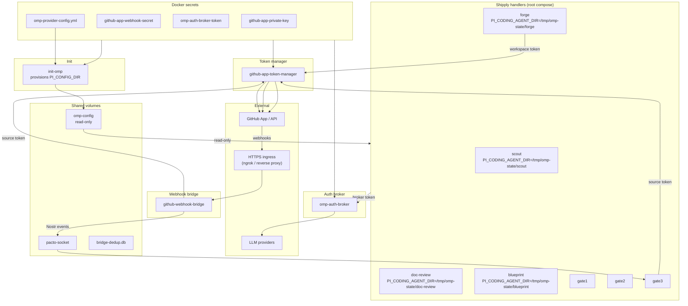
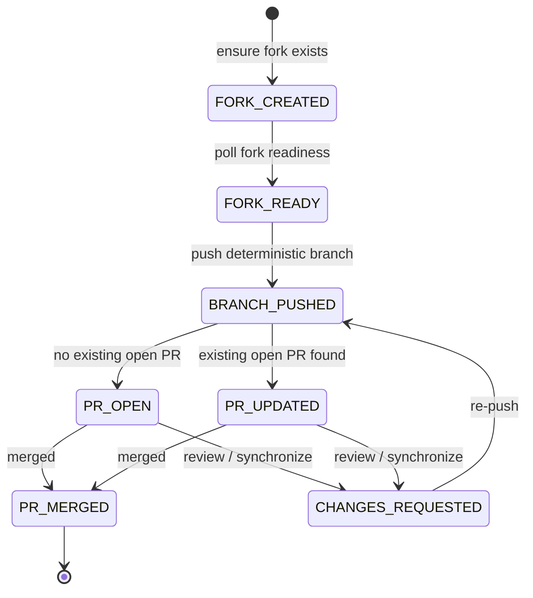

## Summary

Deploy a container-native credential and integration model for Shipply bots: a one-shot `init-omp` container provisions a read-only OMP environment into a shared Docker volume, and handlers consume it via `PI_CONFIG_DIR` while redirecting runtime state to `PI_CODING_AGENT_DIR`. Provider credentials are resolved at runtime through an OMP auth broker so they never enter the image. GitHub access moves from a PAT to an org-level GitHub App installed on both the source organization and a dedicated workspace organization, with fork-based PRs and a short-lived token manager. GitHub webhook events are validated by a bridge service in the root compose and published as Nostr events through the existing Pacto daemon.

---

## Problem Frame

Today the Shipply handlers spawn `omp acp` but the container has no runtime OMP configuration: the root compose does not mount `~/.omp` and the harness does not forward provider credentials or environment paths. GitHub access is also PAT-based, which limits scaling, cannot receive events, and cannot open PRs from forks. The deployment needs a credential model that works for many repos, supports event-driven PR monitoring, and keeps secrets out of images and host mounts.

---

## Requirements

### OMP environment

- R1. Handler containers must run `omp acp` without mounting the host `~/.omp` directory.
- R2. An `init-omp` service must provision the full OMP environment from Docker secrets and write it to a shared volume referenced by `PI_CONFIG_DIR`. Provisioning includes `config.yml`, `models.yml`, required plugins, and required skills. The service runs at deployment start and on secret rotation; it is idempotent or replaces the volume contents atomically.
- R3. The provisioned `PI_CONFIG_DIR` volume must be mounted read-only into every handler container. OMP runtime state must be redirected to a separate writable per-handler path by setting `PI_CODING_AGENT_DIR` to a different location.
- R4. The configuration must support the initial provider set: Ollama / Ollama Cloud, OpenRouter, Kimi Coding, and Claude. The model aliases in `shipply.toml` (`fast`, `default`, `slow`) map to OMP model roles as `fast` → `smol`, `default` → `default`, `slow` → `slow`. Actual provider/model IDs are declared in `models.yml` or `config.yml` under `modelRoles`. Plugins and skills must be installed and version-pinned from a tracked manifest.
- R5. Rotating a model alias, plugin version, or skill version must require only a Docker secret update and a container recreation, not an image rebuild. Rotating a provider key requires updating the auth broker (R16).
- R6. Before the init service is considered complete, it must verify that the OMP configuration is valid and that all required plugins and skills loaded successfully.

### GitHub access and PR workflow

- R7. The deployment must authenticate to GitHub using a single GitHub App installed on two accounts: the source organization and the workspace organization. A PAT is not acceptable.
- R8. The source-org installation must have repository permissions `contents:read`, `pull_requests:write`, and `metadata:read`, plus subscriptions to `pull_request` and `pull_request_review` events.
- R9. The workspace-org installation must have repository permissions `administration:write` (to create repositories) and `contents:write` (to push branches), and must be granted access to all repositories in the workspace org.
- R10. Code changes must be made on a fork of the source repo owned by the dedicated workspace organization, then proposed back to the source repo via a pull request.
- R11. The deployment must manage two short-lived installation tokens: one for the source org (used to create and update PR metadata on the source repo) and one for the workspace org (used to create the fork and push the execution branch). Tokens must be generated from the GitHub App private key, cached, and refreshed before expiry.
- R12. PR creation and update must be idempotent: branch names must be deterministic per proposal, and the system must check for an existing open PR before creating a new one.
- R13. A single Shipply deployment must be configurable to serve a subset of repos within one organization, and must drop events and API calls for out-of-scope repos.

### Secrets and operational model

- R14. GitHub long-lived credentials (GitHub App private key, GitHub App webhook secret) must be injected as Docker secrets. LLM provider credentials are resolved at runtime through the OMP auth broker; they are not injected as Docker secrets and are not written into the shared OMP volume. Environment variables may be used only for non-sensitive configuration values such as endpoints, org names, and log levels.
- R15. Credentials must not be committed to the repository or included in the container image layers. The build context must exclude `secrets/`, `.env*`, `*.pem`, and any local credential files.
- R16. The design must allow credential rotation without rebuilding the Shipply handler image. Rotating the GitHub App private key or webhook secret requires updating the corresponding Docker secret and restarting the affected containers. Rotating LLM provider credentials requires updating the auth broker.
- R17. The operator must be able to scope the GitHub App source-org installation to a subset of repos within the org.

### Webhook handling

- R18. GitHub webhook payloads must be validated using HMAC-SHA256 signature verification with the webhook secret, constant-time comparison, rejection of missing/invalid signatures, an allow-list of expected event types, and idempotency based on `X-GitHub-Delivery`.
- R19. The webhook endpoint must be served over HTTPS with a valid, trusted certificate. For development this can be a public ingress tunnel (e.g., ngrok); for production it should be a published app or reverse proxy.
- R20. Validated webhook events must be converted to Nostr events by a bridge service and published through the existing Pacto/Nostr infrastructure so that Gate 3 receives them as `dm_received` or `mls_group_message_received` events.
- R21. The webhook/Nostr bridge must be isolated from the handlers, but it may share the Pacto daemon and socket used by the rest of the deployment.
- R22. The deployment must include a fallback reconciliation mechanism that catches missed webhook events, because GitHub retries are time-bound and events can be lost during outages.

---

## Key Technical Decisions

- **KTD1. Model alias mapping.** `shipply.toml` model aliases map to OMP model roles as `fast` → `smol`, `default` → `default`, `slow` → `slow`. Actual provider/model IDs are declared in `models.yml` under `modelRoles`. This keeps the persona-facing config small and explicit while delegating provider specifics to the provisioned OMP tree. Rejected alternatives: dynamic mapping from provider names, aliasing inside `models.yml`, or a separate `model-aliases.yml` file. Trade-off: simple and explicit, but adding a new alias requires a config change. (see origin: R4, Key Decisions)

- **KTD2. Init container for OMP provisioning.** Use a one-shot `init-omp` service to render and verify config; handlers depend on it with `condition: service_completed_successfully` only when no prior valid config snapshot exists. If a prior valid config is present, a failed init raises an alert but does not block handler startup, preventing transient failures from stopping all bots. Rationale: this mirrors the existing `init-dolt` pattern and is simpler than a long-running sidecar for a service that only runs at startup and on secret rotation. Rejected alternatives: (a) long-running sidecar that watches for config changes, (b) per-handler self-provisioning on first start, (c) host bind-mount of `~/.omp`. Trade-offs: blocks all handlers until success, easy to reason about; requires an explicit container recreate for secret rotation, and init failure is a hard stop. Atomic swap is implemented by writing to a `staging/` directory on the same volume and renaming it over the active `PI_CONFIG_DIR` path (or updating a symlink). (see origin: R2, R6, D4)

- **KTD3. Read-only `PI_CONFIG_DIR` plus per-handler writable `PI_CODING_AGENT_DIR`.** Mount the provisioned OMP tree read-only at `PI_CONFIG_DIR` and redirect all OMP runtime writes (sessions, `agent.db`, caches) to a per-handler writable path such as `/tmp/omp-state/{service_name}`. This keeps the shared environment immutable while allowing `omp acp` to function. Rejected alternatives: read-write shared `PI_CONFIG_DIR`, host `~/.omp` bind-mount, per-handler copy-on-start. Trade-offs: immutability and no runtime drift vs. extra per-handler writable state management. (see origin: R3)

- **KTD4. Auth broker for provider credentials.** Provider keys are resolved at runtime through `OMP_AUTH_BROKER_URL` and `OMP_AUTH_BROKER_TOKEN`; no provider keys are written into the shared volume or injected as Docker secrets. Rejected alternatives: provider keys as Docker secrets rendered into `models.yml`, per-handler env vars per provider, inline API keys in `shipply.toml`. Trade-offs: credentials never persist in the deployment, but the deployment gains a runtime dependency on a trusted broker. The broker is operator-managed or runs as an `omp-auth-broker` service in the root compose; the broker token is the only provider-related Docker secret. `init-omp` verifies broker reachability but does not block config rendering if the broker is unreachable; handlers retry broker authentication with bounded exponential backoff at runtime. (see origin: Key Decisions, R14)

- **KTD5. Python token manager for GitHub App auth.** Replace the PAT-based `entrypoint-gh.sh` with a Python `GitHubAppTokenManager` that generates RS256 JWTs, exchanges them for installation tokens, and caches them with a refresh buffer. `PyJWT` + `cryptography` + `httpx` is the minimal dependency set and aligns with the existing async handler stack. Update `pyproject.toml` to add `pyjwt`, `cryptography`, `httpx`, and (for the webhook bridge in U6) `fastapi`/`starlette` and `uvicorn` under `[project.dependencies]`. Rejected alternatives: PAT-based `entrypoint-gh.sh` (current), `PyGithub` library, external token-issuing service. Trade-offs: minimal new dependencies and alignment with the async handler stack; but the project now owns JWT generation, expiry, caching, and concurrency control. Before production, the manager must pass a security audit covering these areas, or the team should evaluate a maintained library such as PyGithub. Cached JWTs and tokens are invalidated on GitHub 401/403, and private-key rotation requires container recreation because Docker secrets are not hot-reloaded. (see origin: R7, R11)

- **KTD5b. Token manager service.** Run `GitHubAppTokenManager` as a dedicated `github-app-token-manager` service in the root compose. Only this service mounts the `github-app-private-key` secret; Forge, Gate 3, and the webhook bridge request source and workspace tokens from it via an internal Unix socket or HTTP endpoint. This isolates the root credential from the handlers and the public-facing bridge.

- **KTD6. Workspace-org fork namespace.** PRs are opened from forks owned by the workspace org, not from branches inside the source org. Rejected alternatives: branch-based PRs pushed directly to the source repo, a machine-user account owning forks, mixed source-org branches. Trade-offs: minimizes source-org write permissions and avoids machine-user management; but cross-org private forks require the right GitHub plan and complicate fork creation. A deployment pre-flight must verify that the workspace org can create private forks from the source org and fail fast if not. (see origin: Key Decisions, R10)

- **KTD7. Deterministic proposal-scoped branch names.** Branch names are deterministic per proposal (e.g., `shipply/{proposal_id}`) to support idempotent PR creation and update. Rejected alternatives: non-deterministic names with timestamp/uuid, per-task branch names at the top level. Trade-offs: enables idempotent PR creation and the one-PR-per-proposal model; concurrent beads on the same proposal must coordinate via a branch lock or use per-bead branches merged through a defined strategy; the default single-branch model assumes sequential bead execution. (see R12; see orchestration plan `docs/plans/2026-07-14-001-feat-shipply-orchestration-engine-plan.md` R33)

- **KTD8. Custom FastAPI/Starlette webhook bridge as a root-compose service.** Implement a custom bridge service in the root `docker-compose.yml` alongside the handlers, sharing the Pacto socket volume. Rationale: the bridge needs repo allow-listing, HMAC validation, `X-GitHub-Delivery` deduplication, and source-token reconciliation that `getAlby/http-nostr` does not provide out of the box. Rejected alternatives: (a) default `getAlby/http-nostr` (deferred to a later integration), (b) embedding the bridge in Gate 3, (c) an external published app (e.g., Vercel) for v1. Trade-offs: isolated public ingress and direct Pacto integration; but it is an additional service to maintain. (see origin: R19-R21)

- **KTD9. SQLite-backed delivery deduplication with TTL.** Processed `X-GitHub-Delivery` IDs are persisted to a small SQLite table on a named volume with a configurable TTL (default 7 days), so bridge restarts do not replay events and the table survives longer outages. Rejected alternatives: in-memory set (lost on restart), Redis, relying solely on Pacto deduplication, no deduplication. Trade-offs: survives bridge restarts and is simple; but TTL cleanup must be implemented and the SQLite table is not shared across multiple bridge replicas. If the bridge is ever scaled horizontally, deduplication must be backed by a shared store or requests must be routed to the same replica. (see origin: R18, R22)

- **KTD11. Fallback reconciliation.** A periodic task (e.g., every 5 minutes) plus an on-demand `/reconcile` endpoint queries open PRs using the source-org token and emits Nostr events for any missed state changes. The `/reconcile` endpoint is bound to the internal Docker network and requires a shared `X-Reconcile-Token` header from a Docker secret; it is not exposed through the public HTTPS ingress. Rejected alternatives: relying solely on GitHub retries, event-sourcing entirely from the GitHub API. Trade-offs: catches missed events but adds API load and a delay. (see origin: R22)

- **KTD12. Bridge-to-Pacto authentication and event provenance.** The bridge authenticates to the Pacto daemon using `PACTO_SECRET_TOKEN` (or an equivalent Nostr key). Each published Nostr event includes the original `X-GitHub-Delivery` and a stable bridge sender identifier. Gate 3 verifies the sender before acting on the event, dropping events that do not originate from the authenticated bridge.

---

## High-Level Technical Design

### Component topology



### Token lifecycle

```mermaid
sequenceDiagram
    participant Client as forge / gate3 / bridge
    participant TM as github-app-token-manager
    participant GitHub as GitHub API

    Client->>TM: get_source_token() or get_workspace_token()
    TM->>TM: check cache; if near expiry
    TM->>TM: look up installation ID, generate App JWT (RS256, 10 min TTL)
    TM->>GitHub: POST /app/installations/{id}/access_tokens
    GitHub-->>TM: installation token + expires_at
    TM->>TM: cache token
    TM-->>Client: token
```

### PR lifecycle



---

## Scope Boundaries

### Deferred for later

- GitHub App Marketplace publishing.
- OAuth-based user authorization flows.
- Multi-organization deployments.
- Branch-based PRs (changes pushed directly to the source repo).
- Fine-grained per-handler credential scoping (e.g., only Forge gets GitHub keys).
- Disaster recovery for merged PRs and image rebuilds.
- Vercel/published-app ingress for the webhook bridge (ngrok is the v1 default).
- Live config reload without container recreation.

### Outside this product's identity

- Modifying source-repo branch protection rules or CI/CD pipelines.
- Acting as a human user rather than an automated bot identity.
- Managing a machine user account (bot user) for fork ownership.

### Deferred to follow-up work

- Migration path from the current PAT-based GitHub auth to the GitHub App model (Q7). The new model is a clean cutover: the existing `github-token` secret and `entrypoint-gh.sh` are removed. Any dual-auth coexistence is deferred to the follow-up migration plan.

---

## Implementation Units

### U1. OMP init service and shared volume provisioning

- **Goal:** Provision a read-only OMP environment from Docker secrets into a shared volume and verify it before any handler starts.
- **Requirements:** R1, R2, R3, R6
- **Dependencies:** U2 (config schema and model role mapping define what the script renders)
- **Files:**
  - `scripts/init-omp.sh` (new) — idempotent provisioning script
  - `docker-compose.yml` — add `init-omp` service, `omp-config` volume, and handler mounts
  - `Dockerfile` — ensure required tools (git, omp) are present and scripts are executable
  - `tests/test_omp_init.py` (new)
- **Approach:** Implement `scripts/init-omp.sh` as a one-shot container entrypoint. It reads non-sensitive provider configuration, model aliases, plugin manifest, and skill manifest from Docker secrets and env vars; renders `config.yml` and `models.yml` into a `staging/` directory under the shared volume; installs and pins plugins and skills; then atomically swaps the staging directory into the active `PI_CONFIG_DIR` path by renaming it on the same filesystem. Provider API keys are **not** read by the init service: they are resolved at runtime through the auth broker. Verification runs `omp config list`, `omp plugin list`, and a non-authenticating smoke invocation (provider keys are resolved at runtime via the broker, so end-to-end authentication is verified at handler startup); it exits non-zero on failure and the previous volume version remains intact. Handlers depend on `init-omp` with `condition: service_completed_successfully` when no prior valid config exists; if a prior valid config snapshot is present, a failed init raises an alert but does not block handler startup. On secret rotation, the operator recreates the `init-omp` container (e.g., `docker compose up --force-recreate init-omp`) and then recreates the handlers to pick up the new volume.
- **Execution note:** Start with a failing integration test that exercises the full provisioning path with a mock `omp` binary.
- **Patterns to follow:** The existing `init-dolt` service and `scripts/init-dolt.sh` pattern for one-shot init containers and `service_completed_successfully` dependency ordering.
- **Test scenarios:**
  - Happy path: init service renders `config.yml` and `models.yml`, installs plugins/skills, and exits 0 after verification succeeds.
  - Edge case: plugin manifest unchanged on second run; service skips install or verifies pinned versions without network calls.
  - Error path: malformed `models.yml` causes verification to fail and the service exits non-zero without swapping the active directory.
  - Error path: a required plugin fails to install; the previous volume remains intact.
  - Security path: provider API key values and the auth broker token are not written into the provisioned volume; only non-sensitive config and model metadata are present.
  - Rotation path: re-running `init-omp` with a new Docker secret re-renders the volume and verification succeeds without an image rebuild.
  - Integration scenario: a handler container started after `init-omp` completion sees the provisioned files at `PI_CONFIG_DIR`.
  - Read-only integration test: run each handler persona against a read-only `PI_CONFIG_DIR` and verify the full ACP handshake completes without writes to `PI_CONFIG_DIR`.
- **Verification:** `pytest tests/test_omp_init.py` passes. `docker compose up` starts `init-omp` before handlers and exits 0 when secrets are valid.

### U2. OMP config schema and model role mapping

- **Goal:** Define how `shipply.toml` model aliases translate into OMP `config.yml` `modelRoles` and `models.yml` provider entries.
- **Requirements:** R4, R5
- **Dependencies:** None
- **Files:**
  - `src/shipply/config.py` — add `[omp]` and `[github]` config sections and provider/model role mapping
  - `shipply.toml.example` — document `[omp]` and `[github]` sections
  - `scripts/init-omp.sh` — consume the new config and render OMP YAML
  - `tests/test_config.py` — add tests for model role mapping and GitHub config
- **Approach:** Extend `ShipplyConfig` with an `omp` section that declares `config_dir`, `coding_agent_dir`, `auth_broker_url`, and `model_roles`, plus a `github` section with source/workspace org names, App ID, installation IDs, and repo scope. The init service reads `shipply.toml` and renders `config.yml` with `modelRoles: { default: ..., smol: ..., slow: ... }` and `models.yml` with provider declarations for the initial provider set. Provider API keys are referenced by env-var name (e.g., `ANTHROPIC_API_KEY`) so the auth broker can resolve them at runtime; the actual values are not written to the shared volume. The alias mapping is hard-coded per the origin doc: `fast` → `smol`, `default` → `default`, `slow` → `slow`.
- **Patterns to follow:** Existing Pydantic config models in `src/shipply/config.py` and the TOML config convention used by pacto-bot-api.
- **Test scenarios:**
  - Happy path: `shipply.toml` with `fast`/`default`/`slow` aliases produces OMP `modelRoles` that map to `smol`/`default`/`slow` and valid provider entries.
  - Provider coverage: a `models.yml` containing all four initial providers (Ollama / Ollama Cloud, OpenRouter, Kimi Coding, Claude) passes verification.
  - Version pinning: a plugin/skill manifest with pinned versions is installed and recorded exactly as specified.
  - Edge case: unknown provider in `models.yml` is rejected during init verification.
  - Error path: a model alias in `shipply.toml` points to a missing `modelRoles` entry; verification fails with a clear error.
  - Security path: provider API key values are not present in generated `config.yml`/`models.yml`; only env-var names or broker references are written.
  - Integration scenario: `omp config list` parses the generated files and shows the expected role selectors.
- **Verification:** `pytest tests/test_config.py` passes and the generated YAML is accepted by `omp config list`.

### U3. Harness environment forwarding

- **Goal:** Ensure `omp acp` receives `PI_CONFIG_DIR`, `PI_CODING_AGENT_DIR`, `OMP_AUTH_BROKER_URL`, and `OMP_AUTH_BROKER_TOKEN` from the handler environment.
- **Requirements:** R1, R3, R14
- **Dependencies:** U1, U2
- **Files:**
  - `src/shipply/harness.py` — add `env` parameter to `HarnessBackend` and forward to subprocess
  - `tests/test_harness.py` — add env-forwarding tests
- **Approach:** The root `docker-compose.yml` sets `PI_CONFIG_DIR`, `PI_CODING_AGENT_DIR`, `OMP_AUTH_BROKER_URL`, and `OMP_AUTH_BROKER_TOKEN` on every handler service, so the handlers inherit them by default. Additionally, add an optional `env: dict[str, str] | None` to `HarnessBackend.__init__` and merge it with `os.environ` when spawning `asyncio.create_subprocess_exec`. This supports tests that need a controlled environment and allows per-persona overrides without changing the compose file. `HarnessPool` propagates the env dict per persona.
- **Patterns to follow:** The `BeadsBackend` env-merging pattern in `src/shipply/backends/beads.py:55-73`.
- **Test scenarios:**
  - Happy path: `HarnessBackend` spawns a mock `omp` and the subprocess sees `PI_CONFIG_DIR` and `OMP_AUTH_BROKER_URL`.
  - Edge case: per-persona env override (e.g., `PI_CODING_AGENT_DIR=/tmp/omp-state/forge`) is merged on top of `os.environ`.
  - Error path: `PI_CONFIG_DIR` is set but the directory is missing; the harness fails fast with a clear `HarnessError`.
  - Error path: missing `OMP_AUTH_BROKER_URL` or `OMP_AUTH_BROKER_TOKEN` causes `HarnessBackend.start()` to fail fast with a clear `HarnessError`.
  - Error path: a non-writable `PI_CODING_AGENT_DIR` is rejected before the ACP handshake.
  - Integration scenario: `omp acp` inside the handler container loads the read-only config and authenticates against the auth broker.
- **Verification:** `pytest tests/test_harness.py` passes with a mock subprocess that asserts the expected env vars.

### U4. GitHub App token manager

- **Goal:** Generate, cache, and refresh short-lived installation tokens for the source and workspace orgs without using a PAT.
- **Requirements:** R7, R8, R9, R11, R14
- **Dependencies:** U2 (configures the `[github]` App/installation IDs and org names)
- **Files:**
  - `src/shipply/github_app.py` (new) — `GitHubAppTokenManager`
  - `src/shipply/config.py` — add `[github]` config section with App IDs, installation IDs, and org names
  - `shipply.toml.example` — document the new `[github]` section
  - `tests/test_github_app.py` (new)
- **Approach:** Run `GitHubAppTokenManager` as a dedicated `github-app-token-manager` service in the root compose. It reads the App ID, private key, and org names from Docker secrets and the `[github]` config section, generates and caches tokens, and vends them to Forge, Gate 3, and the webhook bridge via an internal endpoint. It looks up installation IDs dynamically from the App ID and org login via `GET /app/installations`, then generates an RS256 JWT with a 10-minute TTL and exchanges it for a 1-hour installation token via `POST /app/installations/{id}/access_tokens`. Tokens are cached and refreshed with a 5-minute safety margin. An async lock prevents thundering refresh. Provide strongly typed accessors `get_source_token()` and `get_workspace_token()` so callers cannot mix orgs. On 401/403 from GitHub, invalidate all cached tokens and JWTs and re-fetch. On startup, the service performs a pre-flight check that queries the GitHub App installation for the required permissions and event subscriptions, failing fast with a clear, actionable error if any are missing.
- **Patterns to follow:** Async singleton pattern used by `HarnessPool` and the async subprocess patterns in the codebase.
- **Test scenarios:**
  - Happy path: first call generates JWT, exchanges it for an installation token, and returns it; subsequent calls return the cached token.
  - Edge case: token is refreshed before expiry when within the safety margin.
  - Edge case: token is refreshed before the safety margin when the system clock is behind GitHub's clock.
  - Error path: missing App ID, installation ID, or private key file raises a clear configuration error on first use.
  - Error path: invalid private key PEM raises a clear error on first use.
  - Error path: GitHub returns 404 for an org not covered by the App installation.
  - Error path: GitHub returns 401; manager invalidates cache and retries once.
  - Error path: concurrent callers do not generate duplicate tokens (async lock).
  - Integration scenario: `gh pr view` works when `GH_TOKEN` is set to the source-org installation token.
- **Verification:** `pytest tests/test_github_app.py` passes. A mock GitHub API verifies the JWT signature and returns a realistic token response.

### U5. Fork-based PR service

- **Goal:** Create or update PRs from a workspace-org fork using deterministic, proposal-scoped branch names.
- **Requirements:** R10, R12, R13
- **Dependencies:** U2 (repo scope list and org names), U4
- **Files:**
  - `src/shipply/github_pr.py` (new) — `ForkBasedPRService`
  - `src/shipply/handlers/forge.py` — create/update PR after bead execution and record the URL
  - `tests/test_github_pr.py` (new)
- **Approach:** Implement `ForkBasedPRService` that takes the token manager and the repo scope list from `ShipplyConfig`. For a given source repo and proposal ID, it checks whether the workspace-org fork exists and creates it if needed; fork creation must inherit the source repo's visibility, and for a private source repo the service confirms the fork is private before proceeding. It then polls for fork readiness. It pushes the deterministic branch `shipply/{proposal_id}` to the fork using the workspace-org token; beads may push task branches under `shipply/{proposal_id}/{task_id}`. Before creating a PR, it lists open PRs on the source repo with `head={workspace_org}:shipply/{proposal_id}`; if one exists, it updates the body/title; otherwise it creates a new PR using the source-org token. Out-of-scope repos are dropped before any API call. Fork creation failures are treated as retryable; missing source repos are treated as fatal.
- **Patterns to follow:** The existing `gh pr view` usage in `src/shipply/handlers/gate3.py` and the async subprocess patterns in `src/shipply/backends/beads.py`.
- **Test scenarios:**
  - Happy path: new proposal creates fork, pushes branch, and opens a PR on the source repo.
  - Happy path: existing open PR from the same branch is updated instead of duplicated.
  - Edge case: fork already exists from a previous proposal; it is reused.
  - Edge case: fork creation returns 202 but the repo is not yet ready; the service polls until ready or timeout.
  - Edge case: branch-name determinism: the same proposal ID always produces the same branch name.
  - Error path: out-of-scope repo is passed; service returns without calling GitHub.
  - Error path: closed PR from the same branch exists; service pushes to the same branch and creates a new PR.
  - Error path: branch push fails with a permission error and the service raises a clear exception.
  - Error path: fork creation remains in 202 / not ready past the timeout and the service fails with a timeout error.
  - Error path: source-org token lacks `pull_requests:write` and PR creation returns 403.
  - Error path: fork creation for a private source repo does not confirm a private fork; the service fails closed.
  - Integration scenario: Forge closes the molecule root, calls the PR service, and records the returned URL in the proposal state.
- **Verification:** `pytest tests/test_github_pr.py` passes. Mock GitHub API exercises fork, branch, and PR endpoints.

### U6. Webhook validation and Nostr bridge

- **Goal:** Receive and validate GitHub webhooks, deduplicate them, and publish Nostr events through the Pacto daemon.
- **Requirements:** R18, R19, R20, R21, R22
- **Dependencies:** U4 (source token for reconciliation)
- **Files:**
  - `src/shipply/webhook_bridge.py` (new) — small FastAPI/Starlette app
  - `src/shipply/handlers/gate3.py` — parse bridge payloads and resolve proposals by PR URL
  - `docker-compose.yml` — add `github-webhook-bridge` service
  - `tests/test_webhook_bridge.py` (new)
- **Approach:** Implement a lightweight ASGI app in `src/shipply/webhook_bridge.py` with three sub-components: (1) HMAC validation and allow-listing, (2) SQLite deduplication, and (3) Nostr publishing and reconciliation. It reads the raw request body, validates `X-Hub-Signature-256` with `hmac` and constant-time comparison, allow-lists event types and actions (`pull_request.opened`, `pull_request.synchronize`, `pull_request.closed`, `pull_request.reopened`, `pull_request_review.submitted`), checks `X-GitHub-Delivery` against a SQLite dedup table, and drops out-of-scope repos. Valid events are converted to a JSON payload and published as a Nostr DM or MLS group message to `shipply-gate-3` via the Pacto Unix socket using `PACTO_SECRET_TOKEN`. The payload includes the original `X-GitHub-Delivery` and a stable bridge sender identifier so Gate 3 can verify provenance. The bridge requests a source-org token from the `github-app-token-manager` service for reconciliation. The bridge also runs a periodic reconciliation task (every 5 minutes) and exposes an on-demand `/reconcile` endpoint that queries open PRs using the source-org token and emits events for any missed state changes. The dedup SQLite table is stored on a named volume; it survives restarts but is not shared across multiple bridge replicas, so the bridge must run as a single replica unless a shared dedup store is added later.
- **Patterns to follow:** The Pacto socket sharing pattern in `shipply-bots/docker-compose.yml` and the Nostr event consumption in `src/shipply/handlers/gate3.py`.
- **Test scenarios:**
  - Happy path: valid `pull_request` webhook is accepted and published as a Nostr event.
  - Edge case: duplicate `X-GitHub-Delivery` is ignored.
  - Edge case: event type not in the allow-list is dropped with 204.
  - Edge case: a delivery ID older than the 24-hour TTL is processed again and then re-deduplicated.
  - Error path: missing or invalid HMAC signature returns 401.
  - Error path: out-of-scope repo is dropped without publishing.
  - Error path: payload exceeds a maximum body size (e.g., 1 MB) and returns 413.
  - Error path: invalid JSON body returns 400 without publishing.
  - Error path: Nostr publish failure retries and surfaces a 5xx/health failure.
  - Integration scenario: reconcile task finds a merged PR that never produced a webhook and publishes the corresponding event.
  - Integration scenario: reconcile endpoint accepts an optional repo list and emits Nostr events for open PRs whose state changed since the last run.
- **Verification:** `pytest tests/test_webhook_bridge.py` passes. A mock Pacto socket or `pacto_bot_sdk` client verifies published events.

### U7. Gate 3 event-driven PR review update

- **Goal:** Consume webhook/Nostr events in Gate 3 to advance proposal state without relying on `/gate3 check` commands.
- **Requirements:** R13, R20, R22
- **Dependencies:** U6
- **Files:**
  - `src/shipply/handlers/gate3.py` — add bridge event handler and PR-URL-to-proposal lookup
  - `src/shipply/db.py` — add PR URL index if missing
  - `tests/test_gate3_handler.py` (extend existing) — add bridge event tests
- **Approach:** Extend Gate 3 to listen for a new DM/MLS payload type sent by the bridge. The payload contains the PR URL, state, review decision, and updated-at timestamp. Gate 3 resolves the proposal by PR URL from the `molecules` table, ignores events older than the last processed state for that PR, and transitions: `merged` → `CLOSED`, `CHANGES_REQUESTED` → `FORGE`, and `closed` without merge → `FORGE` (or an explicit failure state per operator policy). The existing `/gate3 check` command continues to work as a fallback and for manual reconciliation. Repo scope is enforced by dropping events for unconfigured repos before lookup.
- **Patterns to follow:** The existing `on_dm` / `on_group_message` handlers and `_transition_proposal` / `_notify_next_handler` patterns in `src/shipply/handlers/gate3.py`.
- **Test scenarios:**
  - Happy path: bridge event for merged PR transitions proposal to `CLOSED`.
  - Happy path: bridge event for `CHANGES_REQUESTED` transitions proposal back to `FORGE`.
  - Edge case: stale event with older timestamp than the last processed state is ignored.
  - Edge case: event for a PR not found in the local database is dropped.
  - Edge case: two events for the same PR arrive concurrently; the second event is idempotently handled after the first transaction commits.
  - Error path: event for out-of-scope repo is dropped.
  - Error path: malformed bridge payload is dropped and logged.
  - Error path: database write failure during transition leaves the proposal in a consistent prior state.
  - Integration scenario: `/gate3 check` and bridge events produce the same final state when the PR state is identical.
- **Verification:** `pytest tests/test_gate3_handler.py` passes. A mock Pacto event simulates bridge payloads.

### U8. Docker Compose deployment and secrets

- **Goal:** Wire the init service, handlers, bridge, auth broker, and token manager into the root compose with Docker secrets, read-only mounts, and writable runtime directories.
- **Requirements:** R1, R2, R3, R14, R15, R16, R17, R19
- **Dependencies:** U1, U2, U3, U4, U5, U6, U7
- **Files:**
  - `docker-compose.yml` — add services, secrets, volumes, env vars, and read-only flags
  - `Dockerfile` — no credential files copied; ensure `.dockerignore` is effective
  - `.dockerignore` — add `*.pem`, `.env*`, `secrets/`, `.omp/`
  - `.gitignore` — add `*.pem`, `.env*` if missing
  - `shipply.toml.example` — document new `[github]` and `[omp]` sections
  - `scripts/entrypoint-gh-app.sh` (new) — thin wrapper that exports the source-org installation token from `GitHubAppTokenManager` before exec'ing the handler
- **Approach:** Update `docker-compose.yml` to add the `init-omp`, `omp-auth-broker`, and `github-webhook-bridge` services; replace `github-token` with `github-app-private-key` and `github-app-webhook-secret`; add `omp-auth-broker-token` and `omp-provider-config.yml` secrets; and mount `omp-config` read-only into every handler. Set `PI_CONFIG_DIR=/opt/omp/config`, `PI_CODING_AGENT_DIR=/tmp/omp-state/{service_name}`, and broker env vars on agent handlers. Add a `tmpfs` for `/tmp` and dedicated writable volumes for per-handler runtime state and the bridge dedup DB. Set `read_only: true` on handler services; ensure the corresponding writable paths are explicitly mounted. Update `shipply.toml.example` with the new `[github]` and `[omp]` sections. Replace the PAT-based `entrypoint-gh.sh` with `scripts/entrypoint-gh-app.sh`, which reads `/run/secrets/omp-auth-broker-token` and exports `OMP_AUTH_BROKER_TOKEN` for the handler, then calls the `github-app-token-manager` service to export `GH_TOKEN` at startup. The bridge runs under uvicorn with `python -m uvicorn shipply.webhook_bridge:app --host 0.0.0.0 --port 8000`; the `omp-auth-broker` is declared as an external dependency by default, with an in-compose example left to operator configuration. The auth broker is either operator-managed or run as an `omp-auth-broker` service; if operator-managed, it is referenced as an external dependency in `docker-compose.yml`.
- **Patterns to follow:** The existing `init-dolt` service, `secrets` block, and volume patterns in `docker-compose.yml`.
- **Test scenarios:**
  - Happy path: `docker compose config` validates without errors.
  - Security path: a build-context scan confirms no `*.pem`, `.env*`, `secrets/`, or `shipply.toml` files enter the Docker build context.
  - Smoke path: `docker compose up` starts `init-omp` before handlers and the bridge, and handlers can read the provisioned OMP config.
  - Error path: `docker compose up` with a missing secret fails fast with a clear error.
- **Verification:** `docker compose config` is valid, `docker compose up` succeeds with valid secrets, and a local image-layer scan confirms no secrets are present.

---

## Risks & Dependencies

### Security risks

- **S1. Auth broker availability and broker-token compromise.** If the auth broker is down or misconfigured, handlers cannot authenticate and all LLM calls fail. If the `OMP_AUTH_BROKER_TOKEN` is leaked, an attacker can exfiltrate every provider credential. Mitigation: (a) verify broker reachability in `init-omp` and alert if the broker is unreachable, but do not block config rendering on broker failure; (b) have the harness retry `authenticate` with bounded exponential backoff and a clear fatal error on persistent failure; (c) inject `OMP_AUTH_BROKER_TOKEN` as a Docker secret, never as an environment variable or image layer; (d) restrict broker network exposure to the internal Docker network (or mTLS) and rotate the broker token on any suspected leak; (e) treat broker-token compromise as a full provider-key rotation event.

- **S2. GitHub App private key exposure.** The private key is the long-lived root credential for both org installations. If exfiltrated, an attacker can mint installation tokens. Mitigation: (a) only the `github-app-token-manager` service mounts the `github-app-private-key` secret; the webhook bridge and other handlers must not have it; (b) the manager never logs the private key or derived tokens; (c) rotate the key through GitHub’s key management and revoke the old key; (d) monitor GitHub audit logs for unexpected token requests; (e) run the token manager with a read-only root filesystem and minimal capabilities.

- **S3. GitHub App permission drift / installation misconfiguration.** Required permissions (`administration:write`, `contents:write`, `pull_requests:write`, `contents:read`, `metadata:read`) may be broader than some orgs allow, or an admin may change them after installation. Mitigation: (a) document the exact permission set, event subscriptions (`pull_request`, `pull_request_review`), and repo scoping in operator runbooks; (b) implement a startup pre-flight that queries the installation and fails fast with a clear, actionable error if any required permission is missing; (c) ensure the source-org installation is scoped to the configured repo subset and the workspace-org installation is granted access to all repositories.

- **S4. Cross-org private fork limitations and source-code leakage.** Private repo forks across organizations require the right GitHub plan and cross-org forking enabled. A misconfigured fork could also be created public, exposing source code. Mitigation: (a) document D7 as a hard dependency; (b) fork creation must inherit the source repo’s visibility (private → private); (c) restrict workspace-org membership to operators and the bot; (d) on fork creation failure, emit a clear error and do not retry indefinitely.

- **S5. Webhook HMAC validation and secret rotation.** Invalid or replayed webhooks can drive proposal state if HMAC validation is weak or the webhook secret is leaked. Rotating the secret without a grace period drops in-flight events. Mitigation: (a) validate `X-Hub-Signature-256` with constant-time `hmac.compare_digest` and reject missing/invalid signatures with 401 before any other processing; (b) inject the webhook secret as a Docker secret and never log it or the full payload; (c) support dual-secret validation for a configurable rotation window (e.g., 30 minutes) so in-flight events signed with the old secret are still accepted; (d) persist processed `X-GitHub-Delivery` IDs in the bridge SQLite dedup table so retries are idempotent.

- **S6. Nostr event spoofing / Pacto socket integrity.** The bridge and handlers share the Pacto socket. If any container can write arbitrary events, it can drive Gate 3 transitions. Mitigation: (a) the bridge authenticates to Pacto using `PACTO_SECRET_TOKEN` (or an equivalent Nostr key); (b) Gate 3 verifies the event sender and ignores bridge events that are not authenticated from the bridge; (c) include the original `X-GitHub-Delivery` in the Nostr payload so Gate 3 can correlate; (d) set filesystem permissions on the Pacto socket so only the bridge and handlers can connect.

- **S7. Build-time secret leakage.** The `Dockerfile` copies the entire build context; if `.dockerignore` is incomplete, secrets can be baked into image layers. Mitigation: (a) `.dockerignore` must exclude `secrets/`, `.env*`, `*.pem`, `.omp/`, and `shipply.toml`; (b) add CI checks that scan built images for high-entropy strings and secret patterns; (c) never copy a `shipply.toml` that contains secrets into the image.

- **S8. GitHub payload privacy and logging.** Webhook payloads may contain commit messages, usernames, emails, and other metadata. The bridge logs and Nostr events must not leak sensitive data. Mitigation: (a) log only event type, delivery ID, repo, and PR number; (b) redact the full payload from logs; (c) sanitize fields before publishing to Nostr; (d) set appropriate log retention.

### Operational risks

- **O1. Webhook bridge DoS and availability.** The public HTTPS endpoint is exposed to GitHub; malformed or large payloads can exhaust resources, and if the bridge is down, events are lost after GitHub’s retries. Mitigation: (a) enforce a maximum body size (e.g., 1 MB) and strict request timeout; (b) reject invalid signatures cheaply before heavy processing; (c) add rate limiting at the ingress/reverse proxy; (d) monitor bridge health and alert; (e) rely on the reconciliation mechanism (R22) to catch missed events.

- **O2. Webhook ingress URL management.** Development ngrok tunnels change on restart, and the GitHub App webhook URL must be updated. A stale URL means missed events. Mitigation: (a) use a persistent ngrok domain or a reverse proxy with a stable hostname in development; (b) document the runbook for updating the GitHub App webhook URL after restart; (c) for production, use a published app or reverse proxy with a stable DNS record.

- **O3. GitHub API rate limits and retries.** Many repos and webhooks can exhaust the GitHub App installation rate limits. Mitigation: (a) implement exponential backoff with jitter, respect `Retry-After` and `X-RateLimit-*` headers, and cap retries at a configurable maximum; (b) cache installation tokens; (c) batch reconciliation where possible; (d) alert when the rate-limit remaining falls below a threshold.

- **O4. Docker secrets at-rest security.** In Docker Compose without Swarm, secrets are bind-mounted files from the host. If the host filesystem is compromised, all secrets are exposed. Mitigation: (a) use Docker Swarm or an external secrets manager in production; (b) restrict host file permissions on `secrets/`; (c) never commit secrets to git.

- **O5. `init-omp` failure blocks all handlers.** If `init-omp` fails, no handler can start because of `service_completed_successfully`. Mitigation: (a) use an atomic staging-directory swap within the shared volume so a failed run does not corrupt the active config; (b) health-check and alert on `init-omp` failure; (c) provide a manual override runbook for emergency startup; (d) ensure that a failed init can be retried by recreating the container.

- **O6. Pacto daemon availability.** If Pacto is down, bridge events cannot be delivered; GitHub retries may expire before Pacto recovers. Mitigation: (a) monitor Pacto socket health; (b) the bridge should queue or backpressure and alert if a publish fails; (c) reconciliation catches up once Pacto recovers.

- **O7. Clock skew.** JWT generation and token caching depend on accurate clocks. Skew can cause spurious 401s or premature token expiry. Mitigation: (a) run NTP/chrony in the container host; (b) document clock sync as a deployment dependency.

### Failure-propagation risks

- **F1. Token expiry mid-operation.** A long-running push or PR update may outlast a cached installation token. Mitigation: (a) refresh tokens proactively with a 5-minute safety margin; (b) acquire a fresh token before any long-running operation; (c) on GitHub 401/403, invalidate the cache and retry once; (d) see O7 for clock sync.

- **F2. Reconciliation and event ordering.** Reconciliation can generate events for PRs whose webhooks already arrived, and webhooks can arrive out of order. Mitigation: (a) deduplicate by `X-GitHub-Delivery` in the bridge SQLite table with a 24-hour TTL; (b) Gate 3 ignores events older than the last processed state for that PR; (c) reconciliation uses idempotent state transitions.

- **F3. OMP read-only config vs. plugin write paths.** If OMP or its plugins expect writable directories under `PI_CONFIG_DIR`, the read-only mount may break. Mitigation: (a) verify the read-only configuration during `init-omp` with `omp config list`, `omp plugin list`, and a smoke invocation; (b) ensure `PI_CODING_AGENT_DIR` covers all runtime writes; (c) fix or pin any plugin that writes to `PI_CONFIG_DIR`.

- **F4. Dependency failures during PR creation.** Fork creation, branch push, and PR create are sequential; a failure at one step can leave a partial state (e.g., fork created but PR not opened). Mitigation: (a) make each step idempotent; (b) record proposal state after each step; (c) on retry, resume from the last completed step rather than restarting.

### Dependencies

- **D1–D8.** The assumptions in the origin doc remain in force: org App installation rights, workspace org creation, non-interactive OMP config, outbound network reachability, and HTTPS webhook ingress.
- **D9.** The GitHub App must be configured with the correct webhook URL, webhook secret, and event subscriptions (`pull_request`, `pull_request_review`).
- **D10.** The Pacto daemon must authenticate events published by the bridge, and Gate 3 must validate the bridge sender.
- **D11.** The operator must secure Docker secrets at rest, ideally using Docker Swarm or an external secrets manager.
- **D12.** Container host clocks must be synchronized for JWT and token expiry.

---

## Open Questions

### Resolved during planning

- **Q1. Exact schema of `config.yml`, `models.yml`, and the plugin/skill manifest.** Resolved by OMP framework docs: `config.yml` under `PI_CONFIG_DIR/agent/` contains `modelRoles`; `models.yml` contains provider declarations; plugins are installed via `omp plugin install` and tracked in `installed_plugins.json`; skills are Markdown directories under `agent/skills/<name>/SKILL.md`. The init service derives these from `shipply.toml` and verifies with `omp config list`, `omp plugin list`, and a smoke invocation.
- **Q2. Sidecar vs. init container for the OMP init service.** Resolved: use a one-shot init container that blocks handler startup, matching `init-dolt`.
- **Q3. Layout of `PI_CODING_AGENT_DIR` runtime state directories.** Resolved: use an ephemeral writable path per handler (e.g., `/tmp/omp-state`) and a dedicated writable volume for Forge's git workspace if needed.
- **Q4. Rate-limiting and retry strategy for GitHub API calls across many repos.** Resolved in O3: use exponential backoff with jitter, respect `Retry-After` and `X-RateLimit-*` headers, and cap retries at a configurable maximum.
- **Q6. Fork/branch cleanup policy and retention schedule.** Resolved: branches and worktrees are cleaned up automatically when their associated PR is merged; declined PRs are moved to a holding area for later revisiting instead of being deleted immediately. The LLM may also perform routine cleanup scans.
- **Q5. Bridge-to-Pacto authentication and event provenance.** Resolved by KTD12: the bridge authenticates to Pacto using `PACTO_SECRET_TOKEN`, includes the original `X-GitHub-Delivery` and a stable bridge sender identifier in the Nostr payload, and Gate 3 verifies the sender before acting on the event.
- **Q9. Fork visibility policy and workspace-org access controls.** Resolved: fork creation must inherit the source repo's visibility (private source → private fork); the workspace org is private and membership is restricted to operators and the bot identity.

### Deferred to implementation

- **Q7. Migration path from PAT-based GitHub auth to the GitHub App model.** Deferred to a follow-up plan; the new model is a clean cutover that removes the existing `github-token` secret and `entrypoint-gh.sh`. Any dual-auth coexistence is deferred to the follow-up migration plan.
- **Q8. Operational runbook for secret rotation.** Before production, document the exact steps and ordering for rotating the GitHub App private key, webhook secret, and OMP auth broker token. This is a release gate, not optional.

### Resolved from 2026-07-15 review

- **PAT replacement contradicts per-service coexistence** — Scope Boundaries / U4 / U8 (P1, coherence, confidence 100)

  Resolved: the plan now implements a clean GitHub App cutover and removes the PAT-based `github-token` secret and `entrypoint-gh.sh`; any dual-auth coexistence is deferred to the follow-up migration plan (Q7).

- **Private-key mount scope contradicts implementation** — S2 / U4 / U8 (P1, coherence, confidence 100)

  Resolved: the plan now runs `GitHubAppTokenManager` as a dedicated `github-app-token-manager` service, and only that service mounts the `github-app-private-key` secret.

### Resolved in shipcrew-3qf.9

- **Fork-based workspace org fallback decision** — Open Questions / Key Technical Decisions (shipcrew-3qf.9, confidence 100)

  Resolved: proceed with **fork-based PRs** from a dedicated workspace organization. The deployment runs a startup pre-flight check that verifies the source org is reachable, the workspace org is reachable, the workspace-org installation has `administration:write`, and a sample fork can be created (or already exists) with the correct visibility. If the pre-flight check fails, the deployment fails fast and the operator must fix the GitHub plan, organization forking policy, or App permissions before starting handlers. A branch-based fallback is explicitly deferred to a follow-up plan. Rationale: fork-based PRs minimize source-org write permissions, isolate bot branches from the source namespace, and align with the GitHub App auth model. The decision and setup steps are documented in `docs/runbooks/github-fork-workspace-setup.md`.

### Open from 2026-07-15 review

- **Fork-based workspace org is a one-way door with no fallback** — Key Technical Decisions / Risks & Dependencies (P1, product-lens, confidence 75)

  The entire PR workflow is predicated on cross-organization private forking. If the organization's GitHub plan or policy does not allow this, the plan has no branch-based fallback and the feature cannot ship.

- **Plan commits to high operational maintenance without capacity assessment** — Implementation Units / Risks & Dependencies (P1, product-lens, confidence 75)

  For an internal platform, every new component is a long-term commitment. The plan introduces an auth broker, a custom JWT/token manager, a public webhook bridge, SQLite deduplication, and a reconciliation loop. If the team does not have the operational capacity to own these, the feature will degrade and users will route around it.

- **Operator adoption friction is unexamined for an internal tool** — Dependencies / Open Questions (P1, product-lens, confidence 75)

  Internal tools cannot rely on user choice for adoption; complexity is friction that captive users cannot escape. The plan lists twelve dependencies, several unresolved open questions, and multiple runbook-level items without examining whether the intended operator can or will follow this setup.

---

## Sources / Research

- `docs/brainstorms/2026-07-14-shared-omp-config-and-github-app-requirements.md` — origin requirements, R1–R22, F1–F3, scope boundaries, and assumptions D1–D8.
- `docs/plans/2026-07-14-001-feat-shipply-orchestration-engine-plan.md` — orchestration engine v1 plan that this credential model feeds into.
- `src/shipply/harness.py` — `HarnessBackend` spawns `omp acp` without explicit env forwarding; U3 adds the `env` parameter.
- `src/shipply/config.py` — `PersonaConfig` defines abstract model aliases; U2 extends this with OMP-specific mapping.
- `src/shipply/handlers/forge.py` — reads PR URL from bead metadata; U5 moves PR creation into the Forge handler.
- `src/shipply/handlers/gate3.py` — currently polls PR status with `gh pr view`; U7 adds bridge event consumption.
- `docker-compose.yml` — existing init-container, secret, and volume patterns; U8 and U1 extend them.
- `scripts/entrypoint-gh.sh` — PAT entrypoint; U4 replaces this with a Python token manager.
- `shipply.toml.example` — current persona and GitHub token configuration; U2 and U8 extend it.
- `.dockerignore` and `.gitignore` — build-context exclusions; U8 hardens them.
- [OMP Environment variables](https://omp.sh/docs/env) — `PI_CONFIG_DIR`, `PI_CODING_AGENT_DIR`, `OMP_AUTH_BROKER_URL`, `OMP_AUTH_BROKER_TOKEN`.
- [OMP Secrets and auth](https://omp.sh/docs/secrets) — auth broker and credential resolution order.
- [OMP ACP](https://omp.sh/docs/acp) — `initialize` → `authenticate` (`agent` method) → `session/new` handshake.
- [OMP Model roles](https://omp.sh/docs/roles) — `smol`, `default`, `slow`, `plan` roles and `modelRoles` configuration.
- [OMP Providers](https://omp.sh/docs/providers) — `models.yml`, provider declarations, `apiKey` env-var names, and auth broker/gateway.
- [OMP Skills](https://omp.sh/docs/skills) — skill layout under `agent/skills/<name>/SKILL.md`.
- [OMP Plugins](https://omp.sh/docs/plugins) — `omp plugin install`, version pinning, and `installed_plugins.json`.
- GitHub Docs — GitHub App JWT generation and installation access token exchange.
- Docker Docs — using secrets in Compose and read-only container best practices.
