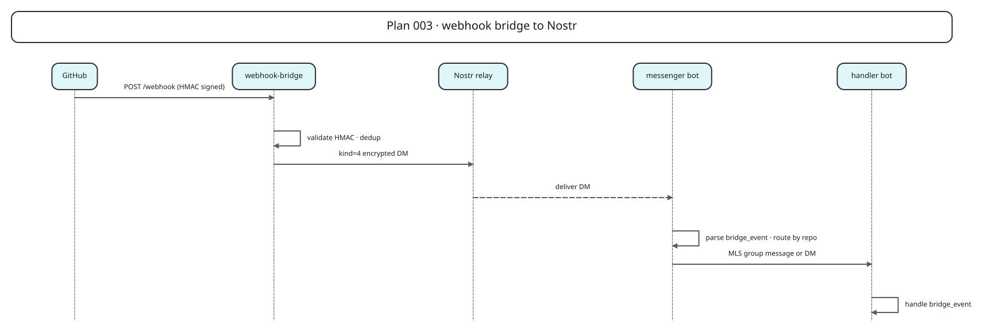

# Pacto-daemon-free GitHub webhook bridge

## Summary

Redesign the GitHub webhook bridge so it can run without a local Pacto daemon Unix socket. The bridge will validate signed webhooks, build the existing `shipply: bridge_event` JSON payload, and publish it as a Nostr `kind=4` encrypted DM. The bridge will support two signing modes: a direct `nsec` for development and simple deployments, and a NIP-46 bunker signer for production. A new `shipply-messenger` Pacto bot will receive the event and route it to an MLS group or to another handler bot via DM, based on repo-to-target routing in `shipply.toml`. Existing handlers such as Gate 3 continue to receive the same payload as an MLS group message or DM, unchanged. The bridge still uses a local SQLite deduplication store and a reconciliation loop by default; only the Pacto-daemon coupling is removed.

## Problem frame

The current `github-webhook-bridge` is a FastAPI service in `src/shipply/webhook_bridge.py` that publishes bridge events to the Pacto daemon over a Unix socket (`Pacto_SOCKET`). This forces the bridge to be co-located with the daemon, preventing deployment in Vercel, Railway, or GitHub Actions where the daemon is not available. The desired architecture decouples the bridge from the daemon by using standard Nostr relays and a Pacto bot that bridges Nostr events back into MLS groups.

## Scope boundaries

**In scope**
- Extending the existing `PactoPublisher` protocol with a Nostr-based publisher.
- Adding both direct `nsec` and NIP-46 bunker signing support to the bridge.
- Implementing a `shipply-messenger` Pacto bot to receive bridge events and route them to MLS groups or handler bot DMs.
- Adding `[bridge]` configuration to `shipply.toml` and `src/shipply/config.py`.
- Updating `docker-compose.yml` to add the messenger bot service and remove the bridge's daemon/socket dependency.
- Specifying test scenarios for signing, routing, deduplication, and end-to-end forwarding.

**Out of scope**
- Changing the shape of the `shipply: bridge_event` JSON payload consumed by handlers.
- Replacing the existing `UnixSocketPactoPublisher` (it is retained for backward compatibility).
- Adding new handler bots or changing gate business logic beyond routing.

**In scope for operations (must be available before production)**
- Operational deployment of NIP-46 bunker signer services and Nostr relays required for production signing.

**Deferred to follow-up work**
- Pluggable deduplication backend (e.g., Redis) for fully serverless deployments without a persistent filesystem.
- Switching the reconciliation loop from pull-based to a stateless GitHub webhook-only model.
- Operational runbook for relay failover and key rotation.

## Requirements

R1. The bridge must not require a local Pacto daemon Unix socket to publish bridge events.
R2. The bridge must sign and publish Nostr events using a direct `nsec` for development and simple deployments, and a NIP-46 bunker signer for production.
R3. The bridge must remain deployable in Vercel, Railway, and as a GitHub Action when configured in serverless mode (no persistent SQLite, no background reconciliation loop).
R4. The messenger bot must receive bridge events and forward the exact JSON content to the configured target(s) (MLS group or handler bot DM).
R5. Handler bots must continue receiving bridge events as MLS group messages or DMs with the same `shipply: bridge_event` JSON content.
R6. The existing `PactoPublisher` protocol must be extended, not replaced, with a `NostrPublisher` implementation.
R7. `shipply.toml` must support direct key, bunker URI, bridge pubkey, messenger bot pubkey, relay list, and repo-to-target routing.
R8. Docker Compose must add the `shipply-messenger` service and remove the bridge's Unix socket and Pacto secret dependencies.
R9. Webhook signature validation and reconciliation behavior must remain unchanged when the dedup store is enabled; in serverless mode the dedup store may be disabled and the bridge relies on handler-level idempotency.
R10. The GitHub webhook secret must be loaded from a secure secret store or file in serverless deployments, mirroring the bridge signer secret handling.

## Key technical decisions

- **KTD1. Nostr event kind as encrypted DM.** The bridge publishes a `kind=4` encrypted direct message addressed to the messenger bot's pubkey. Using a DM instead of a public note reduces relay spam and ensures the messenger bot receives the event without needing a global tag filter. In development and simple deployments the bridge may sign with a direct `nsec`; in production it must use a NIP-46 bunker signer so the bridge runtime never holds a private key.
- **KTD2. Keep the existing `PactoPublisher` protocol.** `NostrPublisher` implements the same async `publish(event: dict[str, Any]) -> None` interface as `UnixSocketPactoPublisher` and `InMemoryPactoPublisher`. This preserves the existing `WebhookBridge` and its tests. Signer selection (direct `nsec` or bunker) is injected into `NostrPublisher` so the bridge construction code does not change when the signer changes.
- **KTD3. Configuration via a new `[bridge]` table.** Direct key, bunker URI, bridge pubkey, relays, messenger bot pubkey, and repo-to-target routing live in a dedicated `bridge` section. The `bunker_uri` and `direct_key` fields are mutually exclusive; exactly one must be configured for the Nostr publisher. The bridge pubkey is required so the messenger bot can authorize incoming DMs. Repo routing supports both MLS group targets and DM targets so the messenger bot can route to groups or directly to another handler bot.
- **KTD4. SQLite deduplication remains the default for Docker-based deployments.** The existing `aiosqlite` dedup table is kept for Docker-based deployments. For serverless deployments without a persistent filesystem, the bridge runs in a serverless mode that disables the SQLite dedup store and the background reconciliation loop, relying on handler-level idempotency (e.g., Gate 3's bridge-event timestamp ordering). A future unit can make the store pluggable with Redis or an external backend.
- **KTD5. Messenger bot uses the same `pacto_bot_sdk` patterns as handlers.** It subscribes to `dm_received` events, parses the JSON content, looks up routing by repo, and forwards to either an MLS group via `bot.send_group_message` or directly to another handler bot via `bot.send_dm`. Routing is configured as a list of targets per repo, where each target is either `group:<group_id>` or `dm:<npub>`.

## High-level technical design

*Source: [docs/diagrams/plan-003-webhook-bridge.excalidraw](../diagrams/plan-003-webhook-bridge.excalidraw)*

The bridge remains a FastAPI/ASGI application. The only runtime change is the publisher implementation: instead of opening a Unix socket, it opens a WebSocket to the configured Nostr relay and publishes an encrypted event. The messenger bot is a long-running Pacto bot, similar to `scout.py` or `gate3.py`, that runs in the Docker Compose network alongside the other handlers.

## Deployment topology

- The bridge is stateless from the Pacto daemon and can run serverlessly (e.g., Vercel, Railway, GitHub Actions) when configured in serverless mode.
- The messenger bot is a long-running, daemon-connected service. It still requires the Pacto daemon socket and secret token because it bridges Nostr DMs back into MLS groups and handler DMs. End-to-end delivery therefore requires at least one host running the messenger bot alongside the Pacto daemon.
- Before the messenger bot starts, register its identity with the Pacto daemon (e.g., `pacto-bot-admin new --scaffold shipply-messenger`) and provision the bot's Nostr key via the daemon's secret/backend mechanism.

## Implementation units

### U1. Nostr publisher with nsec and bunker signing

**Goal:** Add a `NostrPublisher` implementation of the existing `PactoPublisher` protocol that serializes a bridge event and publishes it as a Nostr DM signed by either a direct `nsec` or a NIP-46 bunker.

**Requirements:** R1, R2, R6

**Dependencies:** None

**Files:**
- `src/shipply/webhook_bridge.py`
- `tests/test_webhook_bridge.py`

**Approach:**
- Implement `NostrPublisher` with a `publish(event: dict[str, Any]) -> None` method that:
  - Serializes the event dict to JSON for the DM `content`.
  - Builds a `kind=4` Nostr event with a `p` tag set to the messenger bot pubkey.
  - Signs the event either with a direct `nsec` or via a NIP-46 bunker signer, using a vetted Nostr library (e.g., `python-nostr`) for secp256k1/Schnorr, SHA-256 event IDs, and NIP-04/NIP-44 encryption.
  - Publishes the signed event to a configured Nostr relay over WebSocket.
- For direct `nsec` signing, encrypt the DM content locally and sign the event directly.
- For bunker signing, construct the unsigned event, send a NIP-46 `sign_event` request through the bunker's relay, attach the returned signature, and publish the fully signed event. Use a vetted NIP-46 client library rather than a one-shot RPC over the DM relay list.
- Provide a `NostrSigner` protocol with `NsecSigner` and `BunkerSigner` implementations so the bridge publisher does not change when the signer changes.
- Raise `PactoPublishError` on relay connection, signing, or bunker failures, preserving the existing error contract.

**Patterns to follow:** Mirror the existing `UnixSocketPactoPublisher` and `InMemoryPactoPublisher` class structure in `src/shipply/webhook_bridge.py`. Add `python-nostr` (or equivalent) and `websockets` to `pyproject.toml` dependencies; use the library for all cryptography rather than implementing primitives from scratch.

**Test scenarios:**
- **Happy path:** `publish` serializes the payload, sets the correct `kind` and `p` tag, and records the event on a mocked relay connection.
- **Direct key signing:** `publish` signs the event with a deterministic `nsec` and produces a valid `id`/`sig` pair.
- **Bunker signing:** `publish` constructs an unsigned event, establishes a NIP-46 session (connect, get_public_key, sign_event), attaches the returned signature, and publishes the signed event.
- **Relay failure:** `publish` raises `PactoPublishError` when the configured relay is unreachable.
- **Missing signer:** `publish` raises `PactoPublishError` when neither `direct_key` nor `bunker_uri` is configured.
- **Invalid direct key:** `publish` raises `PactoPublishError` when the configured `direct_key` is not a valid `nsec`.

**Verification:** The publisher tests pass and the new publisher can be swapped into `WebhookBridge` without changing the bridge's core logic.

### U2. Bridge configuration model

**Goal:** Add a `[bridge]` configuration table to `shipply.toml` and the corresponding Pydantic model in `src/shipply/config.py`.

**Requirements:** R7

**Dependencies:** None

**Files:**
- `src/shipply/config.py`
- `shipply.toml`
- `shipply.toml.example`
- `tests/test_config.py`

**Approach:**
- Add `BridgeConfig` Pydantic model with fields:
  - `bridge_pubkey: str | None` — public key of the bridge; required when the messenger bot authorizes incoming DMs.
  - `direct_key: str | None` — local `nsec` for development. Mutually exclusive with `bunker_uri`.
  - `bunker_uri: str | None` — NIP-46 bunker connection URI (e.g., `bunker://...`). Mutually exclusive with `direct_key`.
  - `relays: list[str]` — WebSocket URLs for Nostr relays.
  - `messenger_bot_pubkey: str | None` — public key of the messenger bot.
  - `repo_routing: dict[str, list[str]]` — mapping from repo full name to target list. Each target is `group:<group_id>` or `dm:<npub>`.
- Add `bridge: BridgeConfig = Field(default_factory=BridgeConfig)` to `ShipplyConfig`.
- Provide env-var/file fallbacks for `direct_key`, `bunker_uri`, and `messenger_bot_pubkey` in `webhook_bridge.py` settings construction, not in the Pydantic model, to keep the config file non-secret.
- Provide a `BridgeConfig.targets_for_repo(repo: str) -> tuple[list[str], list[str]]` helper that splits configured targets into group IDs and DM pubkeys, returning empty lists when no routing is configured.
- Update `shipply.toml.example` with an example `[bridge]` section that uses env-var references for both signer options.

**Patterns to follow:** Follow `GitHubConfig`, `OMPConfig`, and `SquadsConfig` in `src/shipply/config.py` for field types and defaults.

**Test scenarios:**
- **Happy path:** `load_config` parses a `shipply.toml` with a full `[bridge]` section and exposes all fields.
- **Defaults:** A config without `[bridge]` loads with empty defaults and does not fail.
- **Routing lookup:** `BridgeConfig.targets_for_repo("owner/repo")` returns the configured group IDs and DM pubkeys, or empty lists when no routing is configured.
- **Direct vs. bunker exclusivity:** A config with both `direct_key` and `bunker_uri` is rejected.
- **Invalid direct key:** `publish` raises `PactoPublishError` when the configured `direct_key` is not a valid `nsec`.

**Verification:** `pytest tests/test_config.py` passes and the example `shipply.toml` validates.

### U3. Wire Nostr publisher into bridge settings and construction

**Goal:** Update `WebhookBridge` default construction so it uses the Nostr publisher when `[bridge]` is configured, while preserving the Unix socket publisher as a fallback.

**Requirements:** R1, R2, R3, R6

**Dependencies:** U1, U2

**Files:**
- `src/shipply/webhook_bridge.py`
- `tests/test_webhook_bridge.py`

**Approach:**
- Extend `BridgeSettings` to carry `BridgeConfig` and expose the bridge environment variables.
- Update `_default_settings()` to read `BRIDGE_DIRECT_KEY`, `BRIDGE_DIRECT_KEY_FILE`, `BRIDGE_BUNKER_URI`, `BRIDGE_BUNKER_URI_FILE`, `BRIDGE_RELAYS`, `BRIDGE_MESSENGER_PUBKEY`, and `BRIDGE_MESSENGER_PUBKEY_FILE` from environment variables/files, falling back to `config.bridge` values where appropriate.
- Update `_create_default_bridge()` to choose:
  - `NostrPublisher` with `NsecSigner` if `direct_key` is configured (development only).
  - `NostrPublisher` with `BunkerSigner` if `bunker_uri` is configured.
  - `UnixSocketPactoPublisher` otherwise (backward compatibility).
- Add a `SHIPPLY_BRIDGE_SERVERLESS` (or equivalent) boolean flag that disables the SQLite dedup store and the background reconciliation loop; default to False for Docker-based deployments. When serverless is enabled, use a writable temporary DB path (e.g., `/tmp/shipply-bridge-dedup.db`) or a no-op dedup store and rely on handler-level idempotency; document which handlers are idempotent under duplicate bridge events.
- Remove the `PACTO_SOCKET` and `PACTO_SECRET_TOKEN` fields from the active bridge settings when a Nostr publisher is selected; keep them only on the `UnixSocketPactoPublisher` fallback path so there is no dead configuration surface in the Nostr path.

**Patterns to follow:** Reuse the existing `_load_secret_from_env_or_file` helper and the `HttpTokenManagerClient`/`EnvTokenProvider` pattern for secrets.

**Test scenarios:**
- **Nostr config selected:** When `BRIDGE_DIRECT_KEY` is set, `_create_default_bridge` returns a `NostrPublisher`.
- **Fallback socket:** When neither `direct_key` nor `bunker_uri` is configured, `_create_default_bridge` returns a `UnixSocketPactoPublisher`.
- **Missing messenger pubkey:** Configuration with a direct key but no `messenger_bot_pubkey` raises `ConfigurationError`.
- **Bunker selected:** When `BRIDGE_BUNKER_URI` is set, `_create_default_bridge` returns a `NostrPublisher` with a `BunkerSigner`.
- **Exclusive signer config:** Configuration with both `direct_key` and `bunker_uri` raises `ConfigurationError`.
- **Serverless mode:** When `SHIPPLY_BRIDGE_SERVERLESS=true`, the bridge uses a writable temporary DB path and disables the reconciliation loop.
- **Bunker URI file secret:** `BRIDGE_BUNKER_URI_FILE` is read and resolved.

**Verification:** `tests/test_webhook_bridge.py` passes and the new construction paths are covered.

### U4. Implement shipply-messenger bot

**Goal:** Create a Pacto bot that receives bridge events as Nostr DMs and routes the original JSON payload to configured targets, either an MLS group or another handler bot via DM.

**Requirements:** R4, R5

**Dependencies:** U2

**Files:**
- `src/shipply/handlers/messenger.py` (new)
- `tests/test_messenger_handler.py` (new)

**Approach:**
- Create `src/shipply/handlers/messenger.py` using `pacto-bot-admin new --scaffold shipply-messenger` as the starting point, then customize with:
  - `bot = Bot(bot_id="shipply-messenger", event_types=["dm_received"])`.
  - A `_config()` helper to load `shipply.toml`.
  - A `_parse_targets(targets: list[str]) -> tuple[list[str], list[str]]` helper that splits `group:<id>` and `dm:<npub>` targets.
  - A `_route_repo(repo: str) -> tuple[list[str], list[str]]` helper that reads `config.bridge.repo_routing` and returns group IDs and DM pubkeys.
  - A `@bot.dm` handler that verifies the DM sender's pubkey matches `config.bridge.bridge_pubkey`, parses the DM content as JSON, verifies `shipply: bridge_event`, extracts `repo`, looks up targets, and calls `bot.send_group_message(group_id, json.dumps(payload))` for each group and `bot.send_dm(recipient, json.dumps(payload))` for each DM target.
- Drop events with no routing configuration with a logged warning.
- Add a small deduplication store keyed on Nostr event id (or bridge delivery id) so the bot does not forward the same DM multiple times when relays redeliver or the bridge republishes.
- The forwarded content must be the exact JSON string from the DM so downstream handlers see the same bytes.

- **Patterns to follow:** Mirror the `gate3.py` `@bot.dm` and `@bot.event("mls_group_message_received")` handler structure, the `AgentEventParams` parsing, and the `send_group_message` call pattern used in `gate1.py`, `gate2.py`, and `gate3.py`.
- **Handler DM authorization:** Handler bots that receive events via `dm:<npub>` routing must authorize DMs from the messenger bot's pubkey. Document this prerequisite in the repo_routing configuration.

**Test scenarios:**
- **Happy path:** A DM containing a valid `bridge_event` payload is forwarded to every configured group for the repo.
- **DM routing:** A repo mapped to a `dm:<npub>` target receives a `send_dm` call with the bridge payload.
- **Mixed routing:** A repo mapped to both a group and a DM target receives both `send_group_message` and `send_dm` calls.
- **No routing:** A DM for a repo not in `repo_routing` is dropped and logged.
- **Unauthorized sender:** A DM from a pubkey other than the configured bridge pubkey is ignored.
- **Malformed JSON:** A DM with non-JSON content is ignored.
- **Non-bridge event:** A DM containing valid JSON but without `shipply: bridge_event` is ignored.
- **Missing repo:** A bridge payload without a `repo` field is dropped and logged.

**Verification:** `pytest tests/test_messenger_handler.py` passes and a Gate 3 integration test with a messenger-forwarded group message succeeds.

### U5. Docker Compose service changes

**Goal:** Add the `shipply-messenger` service and remove the bridge's co-location requirements with the Pacto daemon.

**Requirements:** R3, R8

**Dependencies:** U3, U4

**Files:**
- `docker-compose.yml`
- `tests/test_compose_deployment.py`

**Approach:**
- Add a `shipply-messenger` service modeled after the handler services:
  - `command: ["python", "-m", "shipply.handlers.messenger"]`.
  - Environment variables `SHIPPLY_CONFIG`, `PACTO_TRANSPORT`, `PACTO_SOCKET`, `PI_CONFIG_DIR`, OMP auth broker credentials, and `PACTO_SECRET_TOKEN_FILE`.
  - Volume mounts for `shipply.toml`, `omp-config`, and the usual `read_only`/`tmpfs` settings.
  - `depends_on` for `init-omp`.
- Update the `github-webhook-bridge` service:
  - Remove `PACTO_TRANSPORT`, `PACTO_SOCKET`, `PACTO_SECRET_TOKEN`, `PACTO_SECRET_TOKEN_FILE`.
  - Remove the `pacto-bot-api-data` volume mount and the `pacto-secret-token` secret.
  - Add `BRIDGE_RELAYS`, `BRIDGE_MESSENGER_PUBKEY` (and file variants), and `BRIDGE_DIRECT_KEY_FILE` as a secret.
  - Keep `BRIDGE_DB_PATH` and `RECONCILE_TOKEN_FILE` for existing bridge behavior.

**Patterns to follow:** Use the existing handler service boilerplate (scout, gate3) for the messenger service. Follow the existing `github-webhook-bridge` environment variable conventions for new bridge variables.

**Test scenarios:**
- **Service presence:** The parsed compose config includes `shipply-messenger`.
- **Bridge decoupled:** The `github-webhook-bridge` service no longer references `PACTO_SOCKET`, `PACTO_SECRET_TOKEN`, or the `pacto-bot-api-data` volume.
- **Messenger configured:** The `shipply-messenger` service uses the correct module path and has the required environment variables.
- **Secrets:** Only the required secrets are mounted on each service.

**Verification:** `tests/test_compose_deployment.py` passes and `docker compose config` validates the file.

### U6. Handler compatibility and end-to-end validation

**Goal:** Confirm that existing handler bots receive the same `shipply: bridge_event` JSON content after the messenger bot forwards it, and that the new path does not break existing tests.

**Requirements:** R5, R9

**Dependencies:** U1, U4

**Files:**
- `src/shipply/handlers/gate3.py`
- `tests/test_gate3_handler.py`
- `tests/test_webhook_bridge.py`

**Approach:**
- No production code change is required in `gate3.py` because it already parses group messages for `shipply: bridge_event` and uses the same `parse_bridge_payload` function.
- Add an end-to-end test that simulates the messenger bot forwarding a bridge event to the Gate 3 group and asserts the handler transitions the proposal correctly.
- Update `tests/test_webhook_bridge.py` to verify that the Nostr publisher emits the exact JSON that the messenger bot would forward, ensuring no serialization drift between the bridge and the handlers.

**Patterns to follow:** Reuse the `make_event` fixture and `mock_bot` fixture patterns from `tests/test_gate3_handler.py` and `tests/test_messenger_handler.py`.

**Test scenarios:**
- **End-to-end forwarding:** A bridge event published by the bridge, received by the messenger bot as a DM, and re-emitted as a group message is accepted by `gate3._handle_bridge_message` and triggers the expected state transition.
- **Content preservation:** The JSON string forwarded by the messenger bot matches the JSON string built by `_build_bridge_payload`.
- **No regression:** Existing `tests/test_gate3_handler.py` tests for `mls_group_message_received` bridge events continue to pass without modification.
- **Deduplication preserved:** Webhook deduplication and reconcile behavior in `tests/test_webhook_bridge.py` continue to pass with both socket and Nostr publishers.

**Verification:** All bridge, handler, and messenger tests pass and the compose deployment validates.

## Risks and dependencies

| Risk | Impact | Mitigation |
|------|--------|------------|
| Direct `nsec` used in production | High | Prohibit direct `nsec` in production; require NIP-46 bunker signing. Keep direct `nsec` behind a development-only flag. |
| NIP-46 bunker availability | Medium | Operate redundant bunker signer instances; do not fall back to direct `nsec`. |
| Nostr cryptographic library not yet in project | Low | Add a vetted library such as `python-nostr` to `pyproject.toml` dependencies; do not implement secp256k1/Schnorr from scratch. |
| Handler state ordering depends on event timestamps | Medium | Keep existing bridge-event timestamp handling in `gate3.py`; messenger bot forwards timestamps unchanged. |
| Deduplication in serverless environments | Medium | Add a serverless run mode that disables SQLite and relies on handler idempotency; keep the pluggable Redis/external-store backend as a follow-up. |

## Sources and research

- Current bridge implementation: `src/shipply/webhook_bridge.py` (HMAC validation, `PactoPublisher` protocol, `UnixSocketPactoPublisher`, `_build_bridge_payload`, `WebhookBridge`).
- Configuration model: `src/shipply/config.py` (`GitHubConfig`, `OMPConfig`, `ShipplyConfig`, `SquadsConfig`).
- Handler SDK patterns: `src/shipply/handlers/gate3.py` (`Bot`, `AgentEventParams`, `send_group_message`, bridge payload parsing), `src/shipply/handlers/gate1.py`, `src/shipply/handlers/gate2.py`.
- Docker Compose layout: `docker-compose.yml` (`github-webhook-bridge`, `scout`, `gate3`, `init-omp` services).
- Existing tests: `tests/test_webhook_bridge.py`, `tests/test_gate3_handler.py`, `tests/test_config.py`, `tests/test_compose_deployment.py`.
- Project dependencies: `pyproject.toml`.

## Deferred / Open Questions

### From 2026-07-15 review

- **Bunker signer required for production but deployment is out of scope** — Scope boundaries / Key technical decision KTD1 (P0, product-lens, confidence 100)

  KTD1 says a NIP-46 bunker signer must be supported for production so the runtime never holds a private key. However, operational deployment of bunker signer services is explicitly listed as out of scope. The result is a plan that can be code-complete but cannot be safely operated in production, leaving only the risky direct-nsec path.

- **Bunker fallback contradicts direct-key exclusivity** — Key technical decisions / Risks and dependencies (P0, adversarial, confidence 100)

  If the configuration model makes direct_key and bunker_uri mutually exclusive, the risk-table mitigation to fall back to a direct nsec signer when the bunker is unreachable cannot be implemented. Implementers will either build a fallback that violates the config model or remove the fallback without updating the risk table, leaving the bunker unavailability risk unmitigated.

- **Messenger bot lacks bridge sender authorization** — Key technical decisions / Implementation Unit 4 (P0, security-lens, confidence 100)

  Any Nostr user can send a kind=4 DM to the messenger bot; if the bot decrypts the payload and forwards it to MLS groups or handler DMs, unauthorized actors can inject fake shipply bridge events. The plan must require the messenger bot to whitelist the authorized bridge pubkey before routing.

- **No Nostr cryptographic library dependency declared** — Key Technical Decisions / U1 (P0, feasibility, confidence 100)

  The plan requires the bridge to build kind=4 encrypted DMs, derive Schnorr signatures from nsec, and perform NIP-46 bunker signing, but the project only lists adding a WebSocket dependency. WebSocket transport alone cannot create valid Nostr events; the implementer also needs secp256k1/Schnorr, SHA-256 event IDs, and NIP-04/NIP-44 encryption. Without choosing a vetted Nostr library, U1 cannot ship and the bridge will publish invalid events that relays reject.

- **Messenger bot does not authenticate DM sender** — Implementation Unit 4 / Key technical decisions (P0, adversarial, confidence 100)

  Any Nostr user can send a DM to the messenger bot. If the DM content matches the bridge_event JSON shape, the bot will forward it to configured MLS groups or handler DMs, spoofing bridge events and potentially causing unauthorized state transitions or notifications.

- **Bridge pubkey missing from messenger bot config** — Implementation Unit 2 / Implementation Unit 4 (P0, adversarial, confidence 100)

  Sender authentication requires the messenger bot to know the bridge's public key, but the proposed BridgeConfig only stores the messenger bot's pubkey. There is no field to hold the bridge pubkey, so the bot cannot implement a sender filter even if it tries.

- **Serverless deployability conflicts with unchanged deduplication** — Requirements R3 / R9 / KTD4 (P1, product-lens, confidence 100)

  R3 requires the bridge to run on Vercel, Railway, and GitHub Actions, where a persistent filesystem is unavailable. R9 requires deduplication behavior to remain unchanged. The plan resolves the tension by disabling the dedup store in those environments and relying on handler idempotency, which changes the bridge's deduplication behavior and risks duplicate webhook processing exactly where R3 claims to add value.

- **R9 dedup unchanged conflicts with KTD4 disable** — Requirements R9 / Key technical decisions KTD4 (P1, adversarial, confidence 100)

  R9 says webhook deduplication must remain unchanged, but KTD4 explicitly allows disabling the dedup store in serverless deployments. Disabling dedup changes the bridge's deduplication behavior, so the two statements are contradictory and will confuse implementers about which requirement wins.

- **GitHub Action target is incoherent for webhook receiver** — Requirements R3 / Problem frame (P1, adversarial, confidence 100)

  GitHub Actions are event-driven CI runners, not persistent HTTP services. A webhook bridge requires a public endpoint to receive GitHub webhooks, which an Action cannot provide. Keeping this target in R3 will lead to an unimplementable requirement or a misleading deployment claim.

- **NIP-46 bunker signing protocol is oversimplified** — U1 Approach (P1, feasibility, confidence 100)

  The plan describes bunker signing as a single 'sign_event' request sent through relays. NIP-46 is actually a request-response protocol over encrypted Nostr DMs with client identification, challenge-response, and response correlation; it is not a one-shot RPC over a relay WebSocket. Implementers following this description will build a non-standard client that fails against real bunkers.

- **Serverless targets conflict with SQLite dedup and reconcile loop** — Requirements / KTD4 / U3 (P1, feasibility, confidence 100)

  R3 requires deployment on Vercel, Railway, and GitHub Actions, yet KTD4 and U3 keep the SQLite-backed deduplication table and the background reconciliation loop. Serverless functions are ephemeral; the reconcile loop cannot run between requests, and a SQLite file on a tmpfs or /tmp is lost when the instance is recycled. This undermines R9's claim that reconciliation behavior remains unchanged and means the bridge will reprocess deliveries or miss reconciled events in serverless environments.

- **R9 and R3 conflict on serverless deduplication** — Requirements (P1, scope-guardian, confidence 75)

  R9 requires unchanged deduplication behavior, but R3 requires serverless deployments where the SQLite dedup store cannot run. The plan's workaround is to disable dedup, which directly contradicts 'remain unchanged' and leaves implementers without guidance on when the change is acceptable.

- **R9 unchanged-dedup claim conflicts with KTD4 disable option** — Requirements R9 / Key Technical Decision KTD4 (P1, coherence, confidence 75)

  If the dedup store can be disabled in serverless deployments, the deduplication behavior is not 'unchanged' there. Testers and operators will disagree on whether R9 applies to all configurations or only the SQLite-enabled path, leading to inconsistent acceptance criteria.

- **Vercel serverless conflicts with SQLite and WebSocket** — Requirements R3 / Key technical decisions KTD4 (P1, adversarial, confidence 75)

  Vercel serverless functions have ephemeral filesystems and short execution limits, so the SQLite dedup store will not persist across invocations and long-lived WebSocket connections to Nostr relays are not supported. The plan defers pluggable dedup, leaving R3 unachievable on Vercel without violating R9.

- **RelaysPublisher helper adds unrequired multi-relay complexity** — U1 (P1, scope-guardian, confidence 75)

  Implementers will build and test best-effort multi-relay failover logic that no requirement asks for, diverting effort from the core signer and DM publishing work. R2 only requires publishing Nostr events, and R7 lists a relay list without mandating all-relay broadcast with all-fail error semantics.

- **kind=4 NIP-04 may not match SDK** — Key technical decisions KTD1 (P1, adversarial, confidence 75)

  NIP-04 is deprecated in the Nostr ecosystem and has known encryption weaknesses. Modern Nostr clients and the Pacto SDK may use NIP-44 or NIP-17. If the SDK expects a different DM standard, the messenger bot will be unable to decrypt kind=4 messages from the bridge.

- **Direct nsec mitigation gives false security** — Risks and dependencies (P1, adversarial, confidence 75)

  Moving the nsec from a config file to an environment variable or Docker secret does not remove the key from the bridge runtime. A compromised bridge process can still extract the key. The mitigation suggests the risk is lowered when it is merely relocated.

- **No production mandate against direct nsec signing** — Key technical decisions / Risks and dependencies (P1, security-lens, confidence 100)

  The plan prefers bunker signing in production but permits direct nsec and even recommends falling back to nsec when the bunker is unreachable. A DoS against the bunker can downgrade the bridge to holding a private key, defeating the production control. The plan should require bunker-only in production and make nsec a development-only option.

- **NIP-46 signer identity and event pubkey undefined** — Implementation Unit 1 (P1, security-lens, confidence 100)

  A NIP-46 bunker signs with its own keypair, so the published event's pubkey will be the bunker's, not the bridge's. The plan does not specify whose pubkey appears in the event or how the messenger bot authorizes it, leading to mismatched expectations and a broken authorization model.

- **No alternative to Nostr evaluated before committing** — Problem frame / Key technical decisions KTD1 (P1, product-lens, confidence 75)

  The plan treats Nostr relays and encrypted DMs as the chosen decoupling layer without evaluating simpler alternatives such as an HTTPS callback to the Pacto daemon or a managed message queue. This commits the product to key management, relay availability, and NIP-46 bunker complexity that may be larger than the problem warrants, increasing opportunity cost and operational surface area.

- **R3 serverless deployability lacks implementation unit** — Scope boundaries (P1, scope-guardian, confidence 75)

  The requirement claims Vercel, Railway, and GitHub Actions deployability, but the implementation units only update Docker Compose and defer the pluggable dedup backend. Without a unit covering serverless packaging, environment variables, and filesystem constraints, the requirement is not verifiable.

- **R3 serverless deployability not satisfied by current plan** — Requirements R3 / Key Technical Decision KTD4 / Deferred work (P1, coherence, confidence 75)

  The requirement claims the bridge is deployable in Vercel, Railway, and GitHub Actions, but the current plan keeps SQLite as the default dedup store and only offers disabling dedup or deferring a pluggable store. Without a concrete disable mechanism, R3 cannot be verified for the serverless path.

- **kind=4 NIP-04 encryption is deprecated and leaks metadata** — Key technical decisions (P1, security-lens, confidence 75)

  NIP-04 (kind=4) is deprecated and provides weak encryption; relays still observe sender and recipient pubkeys, timestamps, and event IDs. Using it for production bridge events exposes metadata and may not meet security expectations. The plan should consider NIP-17 or NIP-44 sealed-sender alternatives.

- **Messenger bot keeps the Pacto-daemon coupling** — Problem frame / Implementation unit U4 (P1, product-lens, confidence 75)

  The problem frame promises a daemon-free, serverless-ready bridge, but the new shipply-messenger bot is a long-running Pacto bot that still needs the Pacto daemon socket and secret token. This creates a hidden deployment dependency: the bridge can run serverless, but end-to-end delivery still requires a daemon-connected host, which the plan never acknowledges.

- **Bridge success response no longer means delivery** — High-level technical design / Implementation Unit 1 (P1, adversarial, confidence 75)

  The bridge returns 202 after publishing to relays, but the messenger bot may be offline, relays may drop messages, or the event may expire before delivery. The plan does not specify delivery confirmation, retries, or observability, so GitHub can see success while handlers never process the event.

- **NIP-46 bunker signing flow is underspecified** — Implementation Unit 1 (P1, adversarial, confidence 75)

  NIP-46 requires session setup, connection approval, and a public key for the signing identity. The plan does not say how the bridge obtains its own event pubkey, how it authenticates bunker responses, or whether bunker communication uses the DM relays or the URI-specified relay. This makes the bunker implementation unimplementable without guessing.

- **Direct nsec remains an equal production option** — Requirements R2 / Key technical decision KTD1 / Risks (P2, product-lens, confidence 75)

  R2 and KTD1 keep direct nsec signing as a first-class option alongside the bunker signer. The risk table acknowledges direct nsec storage in production as high-impact, but the mitigation is only a recommendation. Without a guardrail, teams can still configure production with a raw private key, undermining the security story the plan claims to support.

- **U1 bundles two signing modes into one oversized unit** — U1 (P2, scope-guardian, confidence 75)

  The unit must implement local nsec encryption plus a full NIP-46 sign_event protocol with signature reassembly, multiplying failure modes and test scenarios. Splitting the two signers into separate units lets the team ship the simpler nsec path first and add bunker signing as a focused increment.

- **Bunker fallback mitigation is not implemented by the design** — Risks and dependencies / Implementation Unit U1 (P2, coherence, confidence 75)

  The risk table claims the system can fall back to a direct nsec signer if the bunker is unreachable, but the design injects exactly one signer at construction time and provides no runtime fallback from BunkerSigner to NsecSigner. The mitigation does not exist in the plan, so the availability risk remains unaddressed.

- **Handler idempotency assumed but not verified** — Key technical decisions KTD4 (P2, adversarial, confidence 75)

  The plan proposes disabling dedup in serverless deployments and relying on handler-level idempotency, but only Gate 3 has documented timestamp ordering. Other handlers may not be idempotent, so duplicate webhook deliveries or retries could cause duplicate state transitions or notifications.

- **U2 direct_key accepts hex but U3 test expects nsec only** — Implementation Unit U2 / Implementation Unit U3 (P2, coherence, confidence 75)

  The configuration model says direct_key can be either an nsec or a hex secret, but the U3 test scenario rejects any key that is not a valid nsec. Implementers will not know which representation to accept and may write tests that conflict with the model definition.

- **U3 keeps unused PACTO_SOCKET fields when Nostr selected** — U3 (P2, scope-guardian, confidence 75)

  Removing defaults but keeping the socket-path fields for the Nostr path leaves dead configuration surface in the settings model. Implementers may set these fields expecting them to matter, only to discover they are ignored when a Nostr signer is configured.

- **U3 PACTO_SOCKET removal wording is ambiguous** — Implementation Unit U3 / Implementation Unit U5 (P2, coherence, confidence 75)

  The phrase 'Remove the PACTO_SOCKET/PACTO_SECRET_TOKEN defaults ... but keep the fields for the socket path' is unclear about whether the attributes still read from env/config when UnixSocket is selected, or whether they are unset. Combined with U5 removing these env vars from Docker Compose, implementers may accidentally break the UnixSocket fallback path.

- **Bunker-to-nsec fallback is unplanned scope** — Risks and dependencies (P2, scope-guardian, confidence 75)

  The risk mitigation proposes a runtime fallback from bunker to direct nsec that appears in no requirement or implementation unit. If implemented, it introduces a security regression by bringing a private key into a runtime that was supposed to avoid one; if omitted, the mitigation is false.

- **GitHub webhook secret management in serverless is unspecified** — Requirements / Scope boundaries (P2, security-lens, confidence 75)

  The bridge remains deployable in Vercel, Railway, and GitHub Actions, and R9 requires signature validation. Serverless environments still need the GitHub webhook secret to validate HMAC. Without a secret-management plan, operators may hardcode the secret in environment variables or platform configs, increasing leak risk.

- **No key rotation or compromise response procedure** — Risks and dependencies / Scope boundaries (P2, security-lens, confidence 75)

  If the bridge nsec, bunker token, or messenger bot key is compromised, the plan provides no mechanism to rotate keys or revoke the bridge's authority. Key rotation is deferred to follow-up work, leaving production incident response undefined.

- **Handler idempotency for serverless dedup is only assumed** — Key technical decision KTD4 / Risks (P2, product-lens, confidence 75)

  When deduplication is disabled for serverless deployments, the plan relies on handler-level idempotency to prevent duplicate processing. It only cites Gate 3 timestamp ordering as an example. Other handlers may not be idempotent, so duplicate bridge events could silently corrupt state without an explicit inventory of which handlers are safe.

- **Messenger bot has no replay protection** — Implementation Unit 4 / Key technical decisions (P2, security-lens, confidence 75)

  If the bridge or a relay replays a kind=4 DM, the messenger bot will forward it again to the same targets. For serverless deployments the bridge may disable its dedup store, and the messenger bot has no dedup of its own, risking duplicate handler actions even when handlers have timestamp ordering.

- **Multiple-relay publishing will duplicate deliveries to handlers** — U1 RelaysPublisher (P2, feasibility, confidence 75)

  The RelaysPublisher publishes best-effort to all configured relays. If more than one relay delivers the kind=4 DM to the messenger bot, the bot will forward the bridge payload multiple times for the same GitHub delivery. Gate 3 has timestamp-based dedup, but other DM-routed handlers may not, and group members will see repeated messages.

- **U2 omits targets_for_repo method required by tests** — Implementation Unit U2 (P2, coherence, confidence 75)

  The U2 test scenario expects a targets_for_repo method on BridgeConfig, but the implementation approach only lists fields. Implementers will not know whether this method is required, leading to a test gap unless they notice it in the test scenarios.

- **U2 does not specify env-var fallback for messenger pubkey** — Implementation Unit U2 / Implementation Unit U3 (P2, coherence, confidence 75)

  U2 only requires env-var fallbacks for direct_key and bunker_uri, but U3 lists BRIDGE_MESSENGER_PUBKEY and BRIDGE_MESSENGER_PUBKEY_FILE as environment variables that must be read. This leaves a gap between the configuration model and the bridge construction code.

- **Default database path is not serverless-writable** — U3 / Lifespan (P2, feasibility, confidence 75)

  The bridge defaults to BRIDGE_DB_PATH=/var/lib/shipply-bridge/dedup.db and the current compose file mounts a tmpfs there. Vercel and Railway serverless functions do not have /var/lib/shipply-bridge; the first database write will fail with a path error unless the operator discovers and sets the environment variable.

- **Messenger bot daemon identity registration is unspecified** — U4 / Docker Compose (P2, feasibility, confidence 75)

  The new shipply-messenger bot needs a Nostr identity (nsec or bunker) registered in the external Pacto daemon before it can receive kind=4 DMs and publish MLS/DM messages. The plan describes creating the handler file but never specifies how the bot identity is provisioned in the daemon, and docker-compose.yml does not add a new secret or registration step.

- **No trust model or TLS requirements for Nostr relays** — Risks and dependencies / Implementation Unit 1 (P2, security-lens, confidence 75)

  Relays are third-party infrastructure that can censor, correlate traffic, or observe metadata. Without relay selection criteria, TLS enforcement, or authentication requirements, the bridge may publish to untrusted relays. The plan should specify how relays are vetted and whether wss:// is required.

- **Handler DM targets lack sender authorization** — Implementation Unit 4 (P2, security-lens, confidence 75)

  Routing a repo to a dm:<npub> target causes the messenger bot to send a DM to the handler. If the handler bot accepts DMs from any Nostr pubkey, bypassing the messenger bot would still allow direct injection of bridge events. The plan assumes DM targets are a security boundary without verifying handler authorization.

- **Bunker URI secret lacks file-based loading** — Implementation Unit 2 / Implementation Unit 3 (P2, security-lens, confidence 75)

  A NIP-46 bunker URI contains a connection token that is equivalent to a signing capability. The plan supports loading the direct nsec from a file (BRIDGE_DIRECT_KEY_FILE) but only mentions BRIDGE_BUNKER_URI as an environment variable. Storing the bunker URI in a plain env var exposes it to process listings, logs, and shell dumps.

- **Forwarded bridge payload lacks inner attestation** — Implementation Unit 4 / Implementation Unit 6 (P2, security-lens, confidence 75)

  The messenger bot forwards the exact JSON string from the DM, but handlers receive only the JSON content and cannot independently verify it originated from the legitimate bridge. If the Nostr key is compromised, the forged payload is indistinguishable from a legitimate one to handlers.

- **No replay protection for Nostr DMs** — Implementation Unit 4 (P2, adversarial, confidence 75)

  Nostr relays can redeliver old events, and an attacker can republish a captured DM. The messenger bot forwards the same JSON every time, and Gate 3's timestamp ordering only rejects older events, not exact replays. Without event-id deduplication, replays can re-trigger handler actions.
