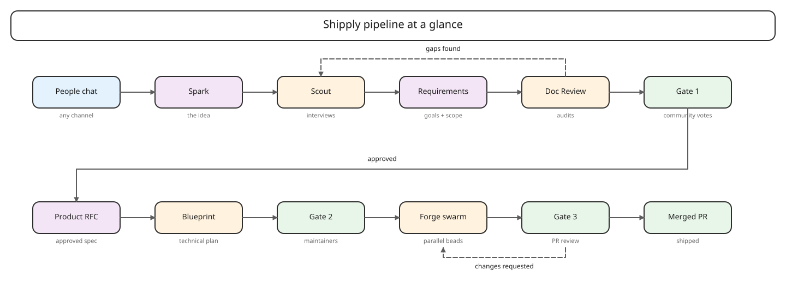
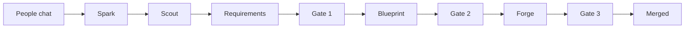
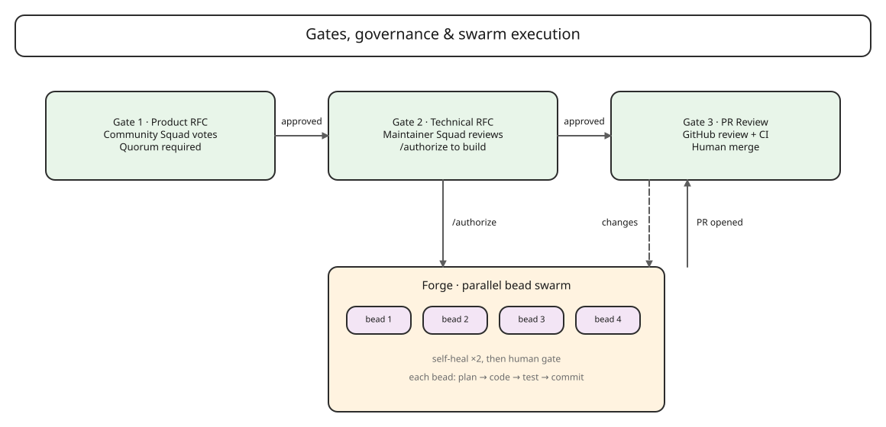
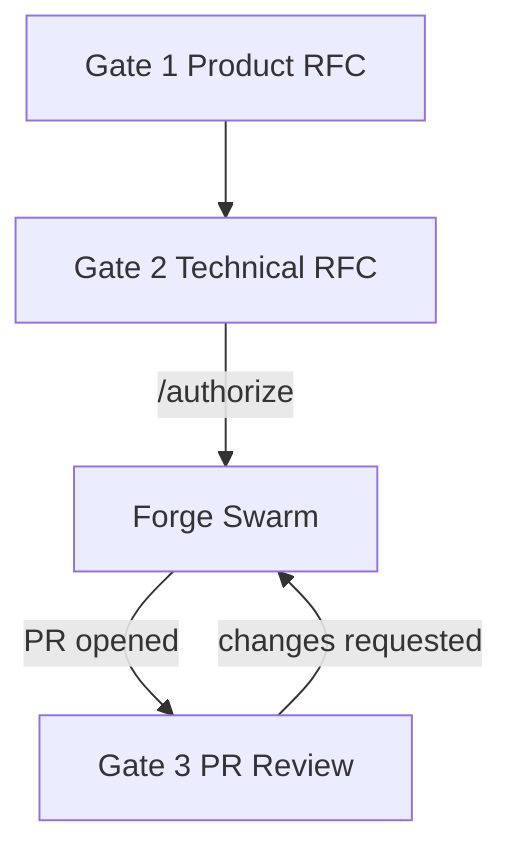
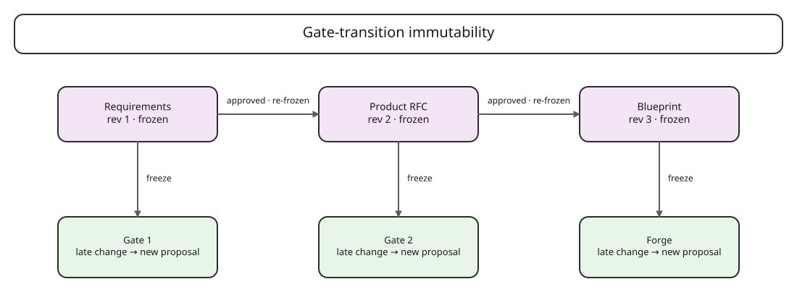
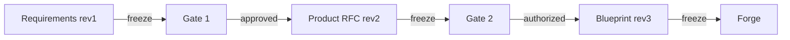
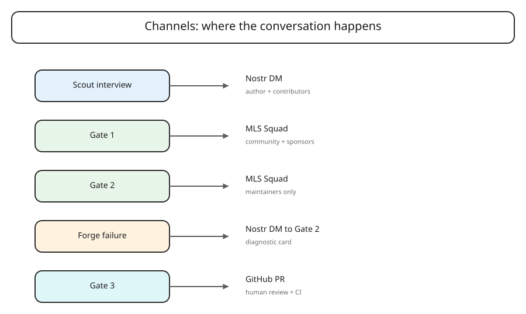
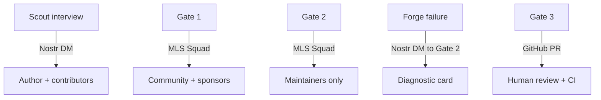

# Shipply Visual Guide

This guide uses [Excalidraw](https://excalidraw.com) diagrams to explain the Shipply
pipeline in two ways: one for people who want the human-level flow, and one for
people who want the technical wiring. Each diagram is editable — open the
`.excalidraw` file in Excalidraw (or any compatible editor) and change it as the
system evolves.

> **Quick start:** The diagrams live in [`docs/diagrams/`](./diagrams/). Open
them in Excalidraw, or read the Mermaid fallbacks below if you just need a quick
ASCII reference.

---

## 1. Shipply pipeline at a glance

**Source / edit in Excalidraw:** [`docs/diagrams/shipply-pipeline-at-a-glance.excalidraw`](./diagrams/shipply-pipeline-at-a-glance.excalidraw)

### For non-developers
A team member drops a half-formed idea in chat. Shipply's **Scout** interviews
the group, turns the conversation into a requirements document, and moves it
through three checkpoints:

1. **Gate 1** — does the community want this?
2. **Gate 2** — do the maintainers approve the technical plan?
3. **Gate 3** — does the resulting code pass human review?

If the idea clears all three gates, it is merged into the codebase.

### For developers
The same flow is a Nostr/MLS event-driven state machine. Each box is a
`pacto_bot_sdk.Bot` handler. The Scout, Doc Review, Blueprint, and Forge
handlers delegate agent work to **Oh My Pi** via the Agent Client Protocol (ACP)
over stdio. Gate 1, Gate 2, and Gate 3 are governance handlers that do not call
an LLM; they count votes, authorize execution, and check the PR status.

---

## 2. Governance and swarm execution

**Source / edit in Excalidraw:** [`docs/diagrams/governance-and-swarm-execution.excalidraw`](./diagrams/governance-and-swarm-execution.excalidraw)

### For non-developers
After Gate 1 approves a proposal, a **Blueprint** bot writes the technical plan.
Maintainers review that plan in Gate 2 and authorize execution with a command.
At that point, **Forge** spins up a swarm of parallel tasks (called *beads*),
implements them, opens a single GitHub pull request, and hands the result back
to humans for final review.

If a bead fails automated checks, Forge tries to fix it twice. If it still
fails, Forge posts a diagnostic card to the maintainer channel and stops.

### For developers
Gate 1 operates in an MLS Squad with community membership; Gate 2 is a
maintainer-only MLS Squad. Gate 2's `/authorize` command freezes the Blueprint and
transitions the proposal from `GATE_2` to `FORGE`. Forge creates a Beads
molecule (`bd cook` / `bd mol pour`), claims the ready frontier (`bd ready
--claim`), executes each bead through the ACP harness, and opens a PR from a
workspace-org fork. Gate 3 receives PR events via the GitHub → Nostr bridge and
closes the proposal or returns it to `FORGE` for rework.

---

## 3. Gate-transition immutability

**Source / edit in Excalidraw:** [`docs/diagrams/gate-transition-immutability.excalidraw`](./diagrams/gate-transition-immutability.excalidraw)

### For non-developers
Once a document passes a gate, it is **frozen**. If someone has a new idea or a
late change, it does not rewrite the work already in progress. Instead, it starts
a follow-up proposal. This prevents last-minute comments from breaking code that
is already being written.

### For developers
Every gate boundary writes an immutable revision. The SQLite state machine
stores frozen revisions as separate records; late-breaking MLS/DM comments are
routed to a new `proposal_id` rather than mutating the current one. This is the
core mechanism that makes parallel bead execution safe.

---

## 4. Channel topology

**Source / edit in Excalidraw:** [`docs/diagrams/channel-topology.excalidraw`](./diagrams/channel-topology.excalidraw)

### For non-developers
Different conversations happen in different channels:

- **Scout interview** — private 1:1 or small group chat where the idea is
  shaped.
- **Gate 1** — public-ish community discussion and voting.
- **Gate 2** — maintainer-only technical review.
- **Forge failure** — a diagnostic card posted back to the maintainer channel.
- **Gate 3** — standard GitHub pull request review.

### For developers
The transport layer is the Nostr protocol delivered by `pacto-bot-api`.
Handlers subscribe to `dm_received` and `mls_group_message_received` events.
Gate 3 uses a GitHub webhook → Nostr bridge (`getAlby/http-nostr` by default) so
that PR events enter the same event pipeline as bot messages. This keeps the
state machine purely event-driven with no polling loops.

---

## How to edit these diagrams

1. Open [excalidraw.com](https://excalidraw.com).
2. Choose **Open** → **Load file** and select the `.excalidraw` file from
   `docs/diagrams/`.
3. Edit the diagram.
4. Save the file back to the same path and commit it.

Excalidraw files are JSON. They are safe to diff and review like any other
code artifact, though large edits are easier to review visually.

---

## See also

- [`docs/architecture.md`](./architecture.md) — the full architectural
  description.
- [`docs/plans/2026-07-14-001-feat-shipply-orchestration-engine-plan.md`](./plans/2026-07-14-001-feat-shipply-orchestration-engine-plan.md) —
  detailed requirements and implementation plan.
- [`README.md`](../README.md) — project overview and quick start.
